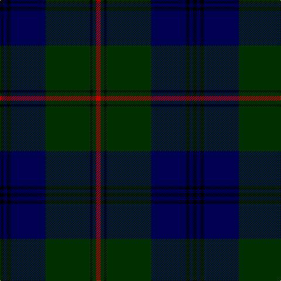

In pattern [KBKBGKGR](/patterns/kbkbgkgr/).

This was sourced from weddslist.  It is a [8 stripes tartan](/stripes/stripes8/).

Original link http://www.weddslist.com/cgi-bin/tartans/pg.pl?source=sts

## Thread count
K/6 DB6 K6 DB60 DG76 K4 DG6 R/8

## Palette
Each colour and its ΔE from the base-6 reference it is a variant of.

| Colour | Shade | Base | ΔE (OKLab) |
|---|---|---|---|
| DB | <code style="background-color:#000050;">#000050</code> `#000050` | B <code style="background-color:#2A418A;">#2A418A</code> | 0.21 |
| DG | <code style="background-color:#003000;">#003000</code> `#003000` | G <code style="background-color:#006100;">#006100</code> | 0.17 |
| K | <code style="background-color:#000000;">#000000</code> `#000000` | K <code style="background-color:#000000;">#000000</code> | 0.00 |
| R | <code style="background-color:#C00000;">#C00000</code> `#C00000` | R <code style="background-color:#CC0000;">#CC0000</code> | 0.03 |

# Sample pattern

## Nearest tartans

The nearest existing variants by ΔTartan distance.

1. [Patriot, The (Fashion)](/setts/s7/k20b8k68ba4k4ba60w6-b1c0070-ba2c3c44-k101010-we0e0e0/) — ΔT 1.21
1. [Johnston](/setts/s8/y6g4k2g60b48k4b4k4-b000052-g11450d-k000000-yaaaa00/) — ΔT 1.31
1. [Scottish Chieftain (Universal)](/setts/s8/k40r2g6k16g4k4g40w4-g003820-k101010-rc80000-we0e0e0/) — ΔT 1.31
1. [Stephen-Mathieson](/setts/s12/b64g4b4g4b4k48g4b4g4b4g24ba8-b202060-ba6c0070-g006818-k101010/) — ΔT 1.33
1. [Oliphant](/setts/s6/b8k8b48g64y2g4-b000052-g11450d-k000000-yaaaaaa/) — ΔT 1.35
1. [Jones (Welsh Name)](/setts/s10/b6ba3b3ba15g7b7g5b17g46ga4-b202060-ba5c8ca8-g003820-ga285800/) — ΔT 1.38
1. [Pinehurst Resort](/setts/s7/k16r4k16r4g56b4g4-b505050-g0c5454-k000034-r8c0000/) — ΔT 1.41
1. [Trotter (Personal)](/setts/s9/b46k4b4k4b4k56r4k8ba4-b344454-ba305060-k00002c-r880000/) — ΔT 1.43
1. [Durie](/setts/s9/k48r4k4r4k4r16g48y4g8-g003000-k000030-r800000-yf0c000/) — ΔT 1.43
1. [Harley (Leslie), Robert](/setts/s8/g8k12y4k12g8b32g64k4-b000048-g005020-k101010-yffe600/) — ΔT 1.44

## Neighbour map

Every grey dot is one of 15726 variants placed by the first two principal components of the ΔTartan feature space (44% of its variance). Red is this tartan; blue dots are its nearest — click one to open its page.

<svg viewBox="0 0 640 380" role="img" style="max-width:100%;height:auto;border:1px solid #e0e0e0;border-radius:4px;display:block" xmlns="http://www.w3.org/2000/svg"><image href="/nn/cloud.v1.png" width="640" height="380"/><a href="/setts/s7/k20b8k68ba4k4ba60w6-b1c0070-ba2c3c44-k101010-we0e0e0/"><circle cx="385.0" cy="204.0" r="4" fill="#3465a4"><title>Patriot, The (Fashion)</title></circle></a><a href="/setts/s8/y6g4k2g60b48k4b4k4-b000052-g11450d-k000000-yaaaa00/"><circle cx="349.2" cy="150.4" r="4" fill="#3465a4"><title>Johnston</title></circle></a><a href="/setts/s8/k40r2g6k16g4k4g40w4-g003820-k101010-rc80000-we0e0e0/"><circle cx="389.1" cy="198.1" r="4" fill="#3465a4"><title>Scottish Chieftain (Universal)</title></circle></a><a href="/setts/s12/b64g4b4g4b4k48g4b4g4b4g24ba8-b202060-ba6c0070-g006818-k101010/"><circle cx="322.7" cy="165.0" r="4" fill="#3465a4"><title>Stephen-Mathieson</title></circle></a><a href="/setts/s6/b8k8b48g64y2g4-b000052-g11450d-k000000-yaaaaaa/"><circle cx="385.0" cy="184.2" r="4" fill="#3465a4"><title>Oliphant</title></circle></a><a href="/setts/s10/b6ba3b3ba15g7b7g5b17g46ga4-b202060-ba5c8ca8-g003820-ga285800/"><circle cx="344.6" cy="190.0" r="4" fill="#3465a4"><title>Jones (Welsh Name)</title></circle></a><a href="/setts/s7/k16r4k16r4g56b4g4-b505050-g0c5454-k000034-r8c0000/"><circle cx="389.4" cy="200.5" r="4" fill="#3465a4"><title>Pinehurst Resort</title></circle></a><a href="/setts/s9/b46k4b4k4b4k56r4k8ba4-b344454-ba305060-k00002c-r880000/"><circle cx="399.8" cy="190.9" r="4" fill="#3465a4"><title>Trotter (Personal)</title></circle></a><a href="/setts/s9/k48r4k4r4k4r16g48y4g8-g003000-k000030-r800000-yf0c000/"><circle cx="271.0" cy="186.9" r="4" fill="#3465a4"><title>Durie</title></circle></a><a href="/setts/s8/g8k12y4k12g8b32g64k4-b000048-g005020-k101010-yffe600/"><circle cx="342.0" cy="190.5" r="4" fill="#3465a4"><title>Harley (Leslie), Robert</title></circle></a><circle cx="353.2" cy="183.2" r="5" fill="#c00000"/></svg>

ID: /setts/s8/r8g6k4g76b60k6b6k6-b000050-g003000-k000000-rc00000/
