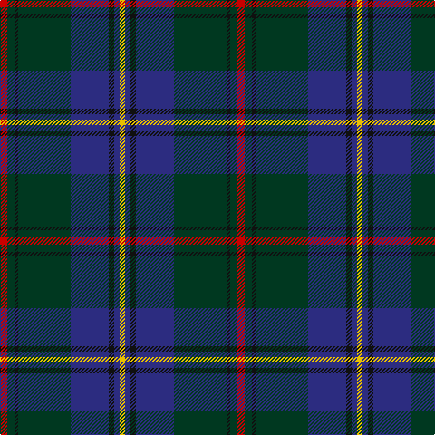

In pattern [RGKGBKBY](/patterns/rgkgbkby/).

This was sourced from tartans-authority.  It is a [8 stripes tartan](/stripes/stripes8/).

Original link http://www.tartansauthority.com/tartan-ferret/display/5507/

## Thread count
R/8 DG8 K4 DG58 DB42 K6 DB6 Y/6

## Palette
Each colour and its ΔE from the base-6 reference it is a variant of.

| Colour | Shade | Base | ΔE (OKLab) |
|---|---|---|---|
| DB | <code style="background-color:#2C2C80;">#2C2C80</code> `#2C2C80` | B <code style="background-color:#2A418A;">#2A418A</code> | 0.06 |
| DG | <code style="background-color:#003820;">#003820</code> `#003820` | G <code style="background-color:#006100;">#006100</code> | 0.15 |
| K | <code style="background-color:#101010;">#101010</code> `#101010` | K <code style="background-color:#000000;">#000000</code> | 0.17 |
| R | <code style="background-color:#C80000;">#C80000</code> `#C80000` | R <code style="background-color:#CC0000;">#CC0000</code> | 0.01 |
| Y | <code style="background-color:#E8C000;">#E8C000</code> `#E8C000` | Y <code style="background-color:#F2BF00;">#F2BF00</code> | 0.02 |

# Sample pattern

## Nearest tartans

The nearest existing variants by ΔTartan distance.

1. [Kilkenny, County (District)](/setts/s7/b8g54r4ba50y10g6r6-b480800-ba202060-g003820-rb84c00-ybc8c00/) — ΔT 0.79
1. [Edinburgh Crystal Corporate Tartan Tartan Number: 2307. Earliest known date: pre 1997 Designed by Sandra Campbell an employee of Edinburgh Crystal. See products available Copyright © Blair Urquhart, Comrie, 2015](/setts/s8/b120w8k24ba12r12ba12k24w8-b14283c-ba2c2c80-k101010-rc80000-wc0c0c0/) — ΔT 0.89
1. [Dollar Academy (1999)](/setts/s8/w8b76k16b16k16g36ba8k4-b003c64-ba1c0070-g006818-k101010-wc0c0c0/) — ΔT 0.89
1. [Fraser Gathering, Green (1997)](/setts/s9/r4b24g4ga22g8b10ga4g48w4-b1c0070-g003820-ga006818-rc80000-wfcfcfc/) — ΔT 0.94
1. [Scotland 2000 (Commemorative)](/setts/s8/w8b76g12ba4g12ba72y4ba6-b003c64-ba4c0000-g006818-wc0c0c0-yd09800/) — ΔT 1.00
1. [Laurie Clan Tartan Tartan Number: 3201. Earliest known date: 2000 One of a set of three similar designs for Laurie, Lawrie and Lowry, designed by Peter MacDonald for Iain Laurie. See products available Copyright © Blair Urquhart, Comrie, 2015](/setts/s7/b12r4b2g50ba32k4ba8-b440044-ba2c2c80-g006818-k101010-rc80000/) — ΔT 1.04
1. [Sverker](/setts/s10/w4b16ba32g6b40g6b6g6ba8wa4-b14283c-ba496f81-g503c14-w82cffd-waf8f8f8/) — ΔT 1.04
1. [Lowry](/setts/s7/b12y4b2g50ba32k4ba8-b440044-ba282878-g006438-k101010-yd8b000/) — ΔT 1.06
1. [Manroth (Personal)](/setts/s9/g30b40k4r8k4b40g30k4y4-b202060-g285800-k101010-rc80000-ye8c000/) — ΔT 1.07
1. [Lawrie Clan Tartan Tartan Number: 3202. Earliest known date: 2000 One of a set of three similar designs for Laurie, Lawrie and Lowry, designed by Peter MacDonald for Iain Laurie. See products available Copyright © Blair Urquhart, Comrie, 2015](/setts/s7/b12r4b2g50ba32k4ba8-b440044-ba2c2c80-g006818-k101010-r945008/) — ΔT 1.09

## Neighbour map

Every grey dot is one of 15726 variants placed by the first two principal components of the ΔTartan feature space (44% of its variance). Red is this tartan; blue dots are its nearest — click one to open its page.

<svg viewBox="0 0 640 380" role="img" style="max-width:100%;height:auto;border:1px solid #e0e0e0;border-radius:4px;display:block" xmlns="http://www.w3.org/2000/svg"><image href="/nn/cloud.v1.png" width="640" height="380"/><a href="/setts/s7/b8g54r4ba50y10g6r6-b480800-ba202060-g003820-rb84c00-ybc8c00/"><circle cx="278.2" cy="188.4" r="4" fill="#3465a4"><title>Kilkenny, County (District)</title></circle></a><a href="/setts/s8/b120w8k24ba12r12ba12k24w8-b14283c-ba2c2c80-k101010-rc80000-wc0c0c0/"><circle cx="326.2" cy="159.1" r="4" fill="#3465a4"><title>Edinburgh Crystal Corporate Tartan Tartan Number: 2307. Earliest known date: pre 1997 Designed by Sandra Campbell an employee of Edinburgh Crystal. See products available Copyright © Blair Urquhart, Comrie, 2015</title></circle></a><a href="/setts/s8/w8b76k16b16k16g36ba8k4-b003c64-ba1c0070-g006818-k101010-wc0c0c0/"><circle cx="301.1" cy="175.5" r="4" fill="#3465a4"><title>Dollar Academy (1999)</title></circle></a><a href="/setts/s9/r4b24g4ga22g8b10ga4g48w4-b1c0070-g003820-ga006818-rc80000-wfcfcfc/"><circle cx="246.2" cy="177.8" r="4" fill="#3465a4"><title>Fraser Gathering, Green (1997)</title></circle></a><a href="/setts/s8/w8b76g12ba4g12ba72y4ba6-b003c64-ba4c0000-g006818-wc0c0c0-yd09800/"><circle cx="288.4" cy="151.9" r="4" fill="#3465a4"><title>Scotland 2000 (Commemorative)</title></circle></a><a href="/setts/s7/b12r4b2g50ba32k4ba8-b440044-ba2c2c80-g006818-k101010-rc80000/"><circle cx="294.7" cy="160.4" r="4" fill="#3465a4"><title>Laurie Clan Tartan Tartan Number: 3201. Earliest known date: 2000 One of a set of three similar designs for Laurie, Lawrie and Lowry, designed by Peter MacDonald for Iain Laurie. See products available Copyright © Blair Urquhart, Comrie, 2015</title></circle></a><a href="/setts/s10/w4b16ba32g6b40g6b6g6ba8wa4-b14283c-ba496f81-g503c14-w82cffd-waf8f8f8/"><circle cx="251.3" cy="179.1" r="4" fill="#3465a4"><title>Sverker</title></circle></a><a href="/setts/s7/b12y4b2g50ba32k4ba8-b440044-ba282878-g006438-k101010-yd8b000/"><circle cx="298.8" cy="163.2" r="4" fill="#3465a4"><title>Lowry</title></circle></a><a href="/setts/s9/g30b40k4r8k4b40g30k4y4-b202060-g285800-k101010-rc80000-ye8c000/"><circle cx="266.7" cy="197.6" r="4" fill="#3465a4"><title>Manroth (Personal)</title></circle></a><a href="/setts/s7/b12r4b2g50ba32k4ba8-b440044-ba2c2c80-g006818-k101010-r945008/"><circle cx="299.5" cy="163.5" r="4" fill="#3465a4"><title>Lawrie Clan Tartan Tartan Number: 3202. Earliest known date: 2000 One of a set of three similar designs for Laurie, Lawrie and Lowry, designed by Peter MacDonald for Iain Laurie. See products available Copyright © Blair Urquhart, Comrie, 2015</title></circle></a><circle cx="292.8" cy="170.7" r="5" fill="#c00000"/></svg>

ID: /setts/s8/r8g8k4g58b42k6b6y6-b2c2c80-g003820-k101010-rc80000-ye8c000/
