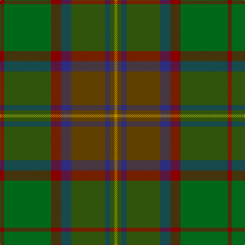

In pattern [RGRBGBGY](/patterns/rgrbgbgy/).

This was sourced from tartans-authority.  It is a [8 stripes tartan](/stripes/stripes8/).

Original link http://www.tartansauthority.com/tartan-ferret/display/8637/

## Thread count
DR/8 G92 DR20 DB20 T66 DB10 T8 DY/6

## Palette
Each colour and its ΔE from the base-6 reference it is a variant of.

| Colour | Shade | Base | ΔE (OKLab) |
|---|---|---|---|
| DB | <code style="background-color:#2C2C80;">#2C2C80</code> `#2C2C80` | B <code style="background-color:#2A418A;">#2A418A</code> | 0.06 |
| DR | <code style="background-color:#880000;">#880000</code> `#880000` | R <code style="background-color:#CC0000;">#CC0000</code> | 0.15 |
| DY | <code style="background-color:#BC8C00;">#BC8C00</code> `#BC8C00` | Y <code style="background-color:#F2BF00;">#F2BF00</code> | 0.16 |
| G | <code style="background-color:#006818;">#006818</code> `#006818` | G <code style="background-color:#006100;">#006100</code> | 0.02 |
| T | <code style="background-color:#604000;">#604000</code> `#604000` | G <code style="background-color:#006100;">#006100</code> | 0.14 |

# Sample pattern

## Nearest tartans

The nearest existing variants by ΔTartan distance.

1. [John Muir Way](/setts/s8/g70ga38r6gb16r6ga16r6b6-b5f749c-g604000-ga003c14-gb767e52-rc80000/) — ΔT 0.73
1. [John Muir Way](/setts/s8/g70ga38r6gb16r6ga16r6b6-b2c2c80-g603800-ga003820-gb408060-rc80000/) — ΔT 0.81
1. [Scottish Crofting Foundation](/setts/s9/b12y6b36g4b4g20ga56r4ga8-b441800-g604000-ga5c6428-r880000-ya0b8a4/) — ΔT 0.84
1. [Ramsay (Green Fashion)](/setts/s7/g4r28g28b8r4ga60w4-b5c5c5c-g006818-ga285800-r880000-wc0c0c0/) — ΔT 0.93
1. [Bennett, John Paul (Personal)](/setts/s7/g4ga62k41b6k4b38r4-b5b5758-g715937-ga1a4014-k101010-rb93e5a/) — ΔT 1.05
1. [Eastern Western Motor Group, Dalbraith](/setts/s8/g56ga4g8b36ga46b4ga6y8-b202060-g604000-ga006818-ya08858/) — ΔT 1.07
1. [Telfer Green (Name)](/setts/s8/g14y4g10ga74b12r32b10ba4-b1c1c50-ba1870a4-g006818-ga004c2c-r880000-ybc8c00/) — ΔT 1.21
1. [Cozumel](/setts/s9/g28k4ga4r4k4r28ga60k4y4-g604000-ga003820-k101010-ra00000-yd09800/) — ΔT 1.22
1. [Methven](/setts/s11/r4g6ga36r4ga4r42gb12g4gb4g48y4-g003820-ga503c14-gb5c6428-rb03000-yc88c00/) — ΔT 1.26
1. [Henry, W. A.](/setts/s9/g64r64y12ga64ra8r4ra8g24r8-g484800-ga004c00-r9c0030-ra9c8000-yb0b0b0/) — ΔT 1.27

## Neighbour map

Every grey dot is one of 15726 variants placed by the first two principal components of the ΔTartan feature space (44% of its variance). Red is this tartan; blue dots are its nearest — click one to open its page.

<svg viewBox="0 0 640 380" role="img" style="max-width:100%;height:auto;border:1px solid #e0e0e0;border-radius:4px;display:block" xmlns="http://www.w3.org/2000/svg"><image href="/nn/cloud.v1.png" width="640" height="380"/><a href="/setts/s8/g70ga38r6gb16r6ga16r6b6-b5f749c-g604000-ga003c14-gb767e52-rc80000/"><circle cx="298.3" cy="197.6" r="4" fill="#3465a4"><title>John Muir Way</title></circle></a><a href="/setts/s8/g70ga38r6gb16r6ga16r6b6-b2c2c80-g603800-ga003820-gb408060-rc80000/"><circle cx="296.6" cy="197.1" r="4" fill="#3465a4"><title>John Muir Way</title></circle></a><a href="/setts/s9/b12y6b36g4b4g20ga56r4ga8-b441800-g604000-ga5c6428-r880000-ya0b8a4/"><circle cx="306.2" cy="186.1" r="4" fill="#3465a4"><title>Scottish Crofting Foundation</title></circle></a><a href="/setts/s7/g4r28g28b8r4ga60w4-b5c5c5c-g006818-ga285800-r880000-wc0c0c0/"><circle cx="310.3" cy="202.7" r="4" fill="#3465a4"><title>Ramsay (Green Fashion)</title></circle></a><a href="/setts/s7/g4ga62k41b6k4b38r4-b5b5758-g715937-ga1a4014-k101010-rb93e5a/"><circle cx="286.6" cy="202.3" r="4" fill="#3465a4"><title>Bennett, John Paul (Personal)</title></circle></a><a href="/setts/s8/g56ga4g8b36ga46b4ga6y8-b202060-g604000-ga006818-ya08858/"><circle cx="285.3" cy="210.8" r="4" fill="#3465a4"><title>Eastern Western Motor Group, Dalbraith</title></circle></a><a href="/setts/s8/g14y4g10ga74b12r32b10ba4-b1c1c50-ba1870a4-g006818-ga004c2c-r880000-ybc8c00/"><circle cx="289.2" cy="160.3" r="4" fill="#3465a4"><title>Telfer Green (Name)</title></circle></a><a href="/setts/s9/g28k4ga4r4k4r28ga60k4y4-g604000-ga003820-k101010-ra00000-yd09800/"><circle cx="305.3" cy="167.0" r="4" fill="#3465a4"><title>Cozumel</title></circle></a><a href="/setts/s11/r4g6ga36r4ga4r42gb12g4gb4g48y4-g003820-ga503c14-gb5c6428-rb03000-yc88c00/"><circle cx="247.1" cy="171.9" r="4" fill="#3465a4"><title>Methven</title></circle></a><a href="/setts/s9/g64r64y12ga64ra8r4ra8g24r8-g484800-ga004c00-r9c0030-ra9c8000-yb0b0b0/"><circle cx="234.3" cy="176.5" r="4" fill="#3465a4"><title>Henry, W. A.</title></circle></a><circle cx="284.9" cy="186.4" r="5" fill="#c00000"/></svg>

ID: /setts/s8/r8g92r20b20ga66b10ga8y6-b2c2c80-g006818-ga604000-r880000-ybc8c00/
