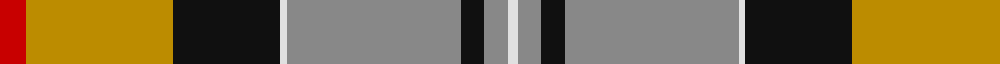
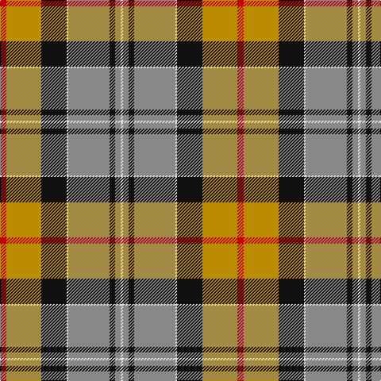

**Bands:** [RYKWRKRW](/stripes/rykwrkrw/) · **Stripes:** [R LO K W O K O W](/stripes/stripes8/) R LO K W O K O W

This was sourced from tartans-authority.  It is a [8 band tartan](/bands/bands8/).

Original link http://www.tartansauthority.com/tartan-ferret/display/8955/

## Thread count
R/8 DY44 K32 LN2 N52 K7 N7 LN/3

## Palette
Each colour and its ΔE from the base-6 reference it is a variant of.

| Colour | Shade | Base | ΔE (OKLab) |
|---|---|---|---|
| DY | <code style="background-color:#BC8C00;">#BC8C00</code> `#BC8C00` | Y <code style="background-color:#F2BF00;">#F2BF00</code> | 0.16 |
| K | <code style="background-color:#101010;">#101010</code> `#101010` | K <code style="background-color:#000000;">#000000</code> | 0.17 |
| LN | <code style="background-color:#E0E0E0;">#E0E0E0</code> `#E0E0E0` | W <code style="background-color:#F7F7F7;">#F7F7F7</code> | 0.07 |
| N | <code style="background-color:#888888;">#888888</code> `#888888` | R <code style="background-color:#CC0000;">#CC0000</code> | 0.24 |
| R | <code style="background-color:#C80000;">#C80000</code> `#C80000` | R <code style="background-color:#CC0000;">#CC0000</code> | 0.01 |

# Sample pattern

## Nearest tartans

The nearest existing variants by ΔTartan distance.

1. [Ford & Etal](/setts/s8/k3w1r16k1g21b9k6w1~x4/) — ΔT 0.76
1. [Forrester / Foster](/setts/s9/w4db6w1db15r23g15ly1g6ly4~x2/) — ΔT 0.82
1. [St Lawrence Trade](/setts/s8/dg2dr13dg11ly5dr1o21dg2o1~x2/) — ΔT 0.86
1. [Forrester (Clan)](/setts/s9/w3dt4w1dt15r24dg15ly1dg4ly3~x4/) — ΔT 0.89
1. [Dalveen (Fashion)](/setts/s8/k3g2k21w11g1y21g2y3~x2/) — ΔT 1.11
1. [Bannockbane Green](/setts/s8/dt3lo2dt30lo1w18lg30lo2lg3~x2/) — ΔT 1.12
1. [Norwegian Migration Period](/setts/s8/o30ly4dt9lb2dt1o6dt8r8~x4/) — ΔT 1.15
1. [Elystan Glodrydd (Name)](/setts/s9/w2dg27ly1lo7t5ly5r17ly6t1~x2/) — ΔT 1.17
1. [(1) Stewart, modern](/setts/s9/g44db2g4db2g6k16m40db2ly11/) — ΔT 1.17
1. [Harding Personal Tartan Tartan Number: 6796. Earliest known date: 2005 The tartan is part of a personal design project bringing together textile, silver and jewelry design and leatherworking, all inspired by the richness of the Scottish design and craft heritage. See products available Copyright © Blair Urquhart, Comrie, 2015](/setts/s8/g30db2o7r14o7r7w1db14~x2/) — ΔT 1.18

## Neighbour map

Every grey dot is one of 14299 variants placed by the first two principal components of the ΔTartan feature space (44% of its variance). Red is this tartan; blue dots are its nearest — click one to open its page.

<svg viewBox="0 0 640 380" role="img" style="max-width:100%;height:auto;border:1px solid #e0e0e0;border-radius:4px;display:block" xmlns="http://www.w3.org/2000/svg"><image href="/nn/cloud.v1.png" width="640" height="380"/><a href="/setts/s8/k3w1r16k1g21b9k6w1~x4/"><circle cx="191.3" cy="135.4" r="4" fill="#3465a4"><title>Ford &amp; Etal</title></circle></a><a href="/setts/s9/w4db6w1db15r23g15ly1g6ly4~x2/"><circle cx="161.5" cy="132.1" r="4" fill="#3465a4"><title>Forrester / Foster</title></circle></a><a href="/setts/s8/dg2dr13dg11ly5dr1o21dg2o1~x2/"><circle cx="208.2" cy="140.5" r="4" fill="#3465a4"><title>St Lawrence Trade</title></circle></a><a href="/setts/s9/w3dt4w1dt15r24dg15ly1dg4ly3~x4/"><circle cx="200.1" cy="124.3" r="4" fill="#3465a4"><title>Forrester (Clan)</title></circle></a><a href="/setts/s8/k3g2k21w11g1y21g2y3~x2/"><circle cx="198.4" cy="130.7" r="4" fill="#3465a4"><title>Dalveen (Fashion)</title></circle></a><a href="/setts/s8/dt3lo2dt30lo1w18lg30lo2lg3~x2/"><circle cx="203.1" cy="104.8" r="4" fill="#3465a4"><title>Bannockbane Green</title></circle></a><a href="/setts/s8/o30ly4dt9lb2dt1o6dt8r8~x4/"><circle cx="228.7" cy="105.8" r="4" fill="#3465a4"><title>Norwegian Migration Period</title></circle></a><a href="/setts/s9/w2dg27ly1lo7t5ly5r17ly6t1~x2/"><circle cx="172.6" cy="91.5" r="4" fill="#3465a4"><title>Elystan Glodrydd (Name)</title></circle></a><a href="/setts/s9/g44db2g4db2g6k16m40db2ly11/"><circle cx="215.3" cy="112.8" r="4" fill="#3465a4"><title>(1) Stewart, modern</title></circle></a><a href="/setts/s8/g30db2o7r14o7r7w1db14~x2/"><circle cx="217.8" cy="145.1" r="4" fill="#3465a4"><title>Harding Personal Tartan Tartan Number: 6796. Earliest known date: 2005 The tartan is part of a personal design project bringing together textile, silver and jewelry design and leatherworking, all inspired by the richness of the Scottish design and craft heritage. See products available Copyright © Blair Urquhart, Comrie, 2015</title></circle></a><circle cx="208.4" cy="123.7" r="5" fill="#c00000"/></svg>

ID: /setts/s8/r8lo44k32w2o52k7o7w3/
