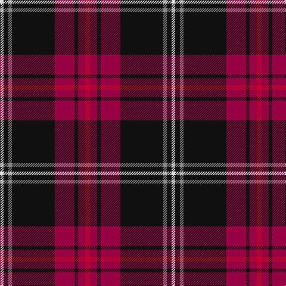

In pattern [RRKRKRKW](/stripes/rrkrkrkw/).

This was sourced from tartans-authority.  It is a [8 stripe tartan](/stripes/stripes8/).

Original link http://www.tartansauthority.com/tartan-ferret/display/8272/

## Thread count
Ra/8 R12 K6 R33 K72 N6 K8 LN/6

## Palette
Each colour and the base-6 reference it is a variant of.

| Colour | Shade | Base |
|---|---|---|
| K | <code style="background-color:#101010;">#101010</code> `oklch(17.3% 0.000 89.9)` <small>#101010</small> | K <code style="background-color:#000000;">#000000</code> |
| LN | <code style="background-color:#E0E0E0;">#E0E0E0</code> `oklch(90.7% 0.000 89.9)` <small>#E0E0E0</small> | W <code style="background-color:#F7F7F7;">#F7F7F7</code> |
| N | <code style="background-color:#888888;">#888888</code> `oklch(62.7% 0.000 89.9)` <small>#888888</small> | R <code style="background-color:#CC0000;">#CC0000</code> |
| R | <code style="background-color:#980044;">#980044</code> `oklch(43.7% 0.175 5.3)` <small>#980044</small> | R <code style="background-color:#CC0000;">#CC0000</code> |
| Ra | <code style="background-color:#C8002C;">#C8002C</code> `oklch(52.6% 0.212 22.0)` <small>#C8002C</small> | R <code style="background-color:#CC0000;">#CC0000</code> |

# Sample pattern

## Nearest tartans

The nearest existing variants by ΔTartan distance.

1. [Brotherhood of Dirk (Corporate)](/setts/s11/r9k3r9k2b4k4dp4k3dp2k32y6~x2/) — ΔT 0.90
1. [Toronto Fire Services (Corporate)](/setts/s8/k4r2lb2r28db27r2k2lo2~x2/) — ΔT 1.13
1. [Brotherhood of Dirk, The](/setts/s11/r9k3r9k2n4k4dp4k3dp2k32lg6~x2/) — ΔT 1.18
1. [Ayllu Thuban (Corporate)](/setts/s5/dp46k6g9lo9r4/) — ΔT 1.21
1. [Drambuie](/setts/s6/w6r36k48lo4k5ly6/) — ΔT 1.26
1. [MacShimsi](/setts/s5/r11r5g5k40ly3~x2/) — ΔT 1.35
1. [Westin Kierland](/setts/s8/o2k37r10db3r5lo4r3w2~x2/) — ΔT 1.36
1. [Hudson (Personal)](/setts/s11/db4t2k2db12t4r6k6r28k2t2r3~x2/) — ΔT 1.40
1. [Westin Kierland (Corporate)](/setts/s8/lo2k38r10db3r5ly4r3lb2~x2/) — ΔT 1.40
1. [Ikelman No 4](/setts/s7/r10k15g2k2w1k1w1~x4/) — ΔT 1.41

## Neighbour map

Every grey dot is one of 14299 variants placed by the first two principal components of the ΔTartan feature space (44% of its variance). Red is this tartan; blue dots are its nearest — click one to open its page.

<svg viewBox="0 0 640 380" role="img" style="max-width:100%;height:auto;border:1px solid #e0e0e0;border-radius:4px;display:block" xmlns="http://www.w3.org/2000/svg"><image href="/nn/cloud.v1.png" width="640" height="380"/><a href="/setts/s11/r9k3r9k2b4k4dp4k3dp2k32y6~x2/"><circle cx="314.7" cy="133.5" r="4" fill="#3465a4"><title>Brotherhood of Dirk (Corporate)</title></circle></a><a href="/setts/s8/k4r2lb2r28db27r2k2lo2~x2/"><circle cx="294.4" cy="144.3" r="4" fill="#3465a4"><title>Toronto Fire Services (Corporate)</title></circle></a><a href="/setts/s11/r9k3r9k2n4k4dp4k3dp2k32lg6~x2/"><circle cx="319.8" cy="139.4" r="4" fill="#3465a4"><title>Brotherhood of Dirk, The</title></circle></a><a href="/setts/s5/dp46k6g9lo9r4/"><circle cx="346.7" cy="182.1" r="4" fill="#3465a4"><title>Ayllu Thuban (Corporate)</title></circle></a><a href="/setts/s6/w6r36k48lo4k5ly6/"><circle cx="266.4" cy="166.6" r="4" fill="#3465a4"><title>Drambuie</title></circle></a><a href="/setts/s5/r11r5g5k40ly3~x2/"><circle cx="349.7" cy="179.4" r="4" fill="#3465a4"><title>MacShimsi</title></circle></a><a href="/setts/s8/o2k37r10db3r5lo4r3w2~x2/"><circle cx="300.3" cy="102.1" r="4" fill="#3465a4"><title>Westin Kierland</title></circle></a><a href="/setts/s11/db4t2k2db12t4r6k6r28k2t2r3~x2/"><circle cx="289.5" cy="144.0" r="4" fill="#3465a4"><title>Hudson (Personal)</title></circle></a><a href="/setts/s8/lo2k38r10db3r5ly4r3lb2~x2/"><circle cx="313.3" cy="108.5" r="4" fill="#3465a4"><title>Westin Kierland (Corporate)</title></circle></a><a href="/setts/s7/r10k15g2k2w1k1w1~x4/"><circle cx="318.1" cy="158.8" r="4" fill="#3465a4"><title>Ikelman No 4</title></circle></a><circle cx="319.5" cy="153.6" r="5" fill="#c00000"/></svg>

ID: /setts/s8/r8m12k6m33k72o6k8w6/
