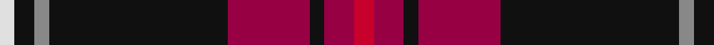

In pattern [RRKRKRKW](/patterns/rrkrkrkw/).

This was sourced from tartans-authority.  It is a [8 stripes tartan](/stripes/stripes8/).

Original link http://www.tartansauthority.com/tartan-ferret/display/8272/

## Thread count
LN/6 K8 N6 K72 R33 K6 R12 Ra/8

## Palette
Each colour and its ΔE from the base-6 reference it is a variant of.

| Colour | Shade | Base | ΔE (OKLab) |
|---|---|---|---|
| K | <code style="background-color:#101010;">#101010</code> `#101010` | K <code style="background-color:#000000;">#000000</code> | 0.17 |
| LN | <code style="background-color:#E0E0E0;">#E0E0E0</code> `#E0E0E0` | W <code style="background-color:#F7F7F7;">#F7F7F7</code> | 0.07 |
| N | <code style="background-color:#888888;">#888888</code> `#888888` | R <code style="background-color:#CC0000;">#CC0000</code> | 0.24 |
| R | <code style="background-color:#980044;">#980044</code> `#980044` | R <code style="background-color:#CC0000;">#CC0000</code> | 0.13 |
| Ra | <code style="background-color:#C8002C;">#C8002C</code> `#C8002C` | R <code style="background-color:#CC0000;">#CC0000</code> | 0.03 |

# Sample pattern

## Nearest tartans

The nearest existing variants by ΔTartan distance.

1. [Brotherhood of Dirk (Corporate)](/setts/s11/r18k6r18k4b8k8ba8k6ba4k64g12-b1474b4-ba780078-g5c6428-k101010-rc8002c/) — ΔT 0.90
1. [Toronto Fire Services (Corporate)](/setts/s8/k8r4w4r56b54r4k4y4-b202060-k000000-r8c0000-wc8c8c8-yc88c00/) — ΔT 1.13
1. [Tott (Personal))](/setts/s7/k102r42y8r24g16b8r10-b2c2c80-g006818-k101010-rc80000-yc4bc68/) — ΔT 1.16
1. [Brotherhood of Dirk, The](/setts/s11/r18k6r18k4b8k8ba8k6ba4k64y12-b576982-ba3d2e60-k1c1714-r89051b-yb7d38b/) — ΔT 1.18
1. [Ayllu Thuban (Corporate)](/setts/s5/b46k6g9y9r4-b440044-g006818-k101010-rc80000-ydc943c/) — ΔT 1.21
1. [Drambuie](/setts/s6/w6r36k48y4k5ya6-k101010-r880000-we0e0e0-ya08858-yae8c000/) — ΔT 1.26
1. [MacShimsi](/setts/s5/r22ra10g10k80y6-g006818-k101010-rb43448-ra901c38-ye8c000/) — ΔT 1.35
1. [Westin Kierland](/setts/s8/r4k74ra20b6ra10y8ra6w4-b00008c-k101010-rb84c00-rac8002c-wffffff-yd09800/) — ΔT 1.35
1. [Hudson (Personal)](/setts/s11/b8ba4k4b24ba8r12k12r56k4ba4r6-b00008c-ba788cb4-k000000-r8c0000/) — ΔT 1.40
1. [Westin Kierland (Corporate)](/setts/s8/w4r6y8r10b6r20k76ya4-b2c2c80-k101010-r880000-we8ccb8-yfccc00-yabc8c00/) — ΔT 1.40

## Neighbour map

Every grey dot is one of 15726 variants placed by the first two principal components of the ΔTartan feature space (44% of its variance). Red is this tartan; blue dots are its nearest — click one to open its page.

<svg viewBox="0 0 640 380" role="img" style="max-width:100%;height:auto;border:1px solid #e0e0e0;border-radius:4px;display:block" xmlns="http://www.w3.org/2000/svg"><image href="/nn/cloud.v1.png" width="640" height="380"/><a href="/setts/s11/r18k6r18k4b8k8ba8k6ba4k64g12-b1474b4-ba780078-g5c6428-k101010-rc8002c/"><circle cx="311.6" cy="131.7" r="4" fill="#3465a4"><title>Brotherhood of Dirk (Corporate)</title></circle></a><a href="/setts/s8/k8r4w4r56b54r4k4y4-b202060-k000000-r8c0000-wc8c8c8-yc88c00/"><circle cx="291.2" cy="142.5" r="4" fill="#3465a4"><title>Toronto Fire Services (Corporate)</title></circle></a><a href="/setts/s7/k102r42y8r24g16b8r10-b2c2c80-g006818-k101010-rc80000-yc4bc68/"><circle cx="266.2" cy="156.6" r="4" fill="#3465a4"><title>Tott (Personal))</title></circle></a><a href="/setts/s11/r18k6r18k4b8k8ba8k6ba4k64y12-b576982-ba3d2e60-k1c1714-r89051b-yb7d38b/"><circle cx="316.4" cy="136.7" r="4" fill="#3465a4"><title>Brotherhood of Dirk, The</title></circle></a><a href="/setts/s5/b46k6g9y9r4-b440044-g006818-k101010-rc80000-ydc943c/"><circle cx="345.3" cy="181.4" r="4" fill="#3465a4"><title>Ayllu Thuban (Corporate)</title></circle></a><a href="/setts/s6/w6r36k48y4k5ya6-k101010-r880000-we0e0e0-ya08858-yae8c000/"><circle cx="264.5" cy="167.1" r="4" fill="#3465a4"><title>Drambuie</title></circle></a><a href="/setts/s5/r22ra10g10k80y6-g006818-k101010-rb43448-ra901c38-ye8c000/"><circle cx="347.9" cy="178.5" r="4" fill="#3465a4"><title>MacShimsi</title></circle></a><a href="/setts/s8/r4k74ra20b6ra10y8ra6w4-b00008c-k101010-rb84c00-rac8002c-wffffff-yd09800/"><circle cx="297.1" cy="102.3" r="4" fill="#3465a4"><title>Westin Kierland</title></circle></a><a href="/setts/s11/b8ba4k4b24ba8r12k12r56k4ba4r6-b00008c-ba788cb4-k000000-r8c0000/"><circle cx="286.7" cy="143.4" r="4" fill="#3465a4"><title>Hudson (Personal)</title></circle></a><a href="/setts/s8/w4r6y8r10b6r20k76ya4-b2c2c80-k101010-r880000-we8ccb8-yfccc00-yabc8c00/"><circle cx="309.8" cy="107.6" r="4" fill="#3465a4"><title>Westin Kierland (Corporate)</title></circle></a><circle cx="317.3" cy="152.9" r="5" fill="#c00000"/></svg>

ID: /setts/s8/r8ra12k6ra33k72rb6k8w6-k101010-rc8002c-ra980044-rb888888-we0e0e0/
