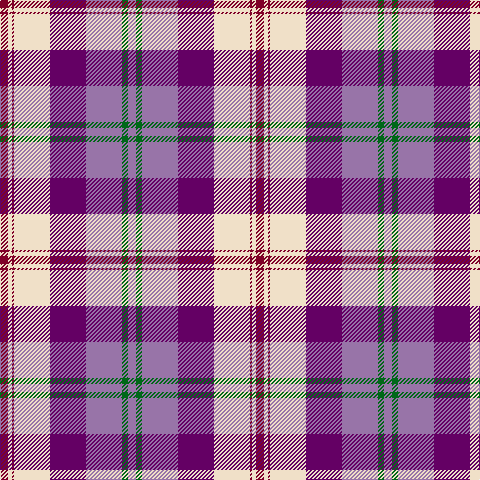

In pattern [RGRBWRWR](/patterns/rgrbwrwr/).

This was sourced from tartans-authority.  It is a [8 stripes tartan](/stripes/stripes8/).

Original link http://www.tartansauthority.com/tartan-ferret/display/7582/

## Thread count
DR/8 W4 DR2 W36 P36 LP36 G6 LP/8

## Palette
Each colour and its ΔE from the base-6 reference it is a variant of.

| Colour | Shade | Base | ΔE (OKLab) |
|---|---|---|---|
| DR | <code style="background-color:#800028;">#800028</code> `#800028` | R <code style="background-color:#C80000;">#C80000</code> | 0.16 |
| G | <code style="background-color:#006818;">#006818</code> `#006818` | G <code style="background-color:#006400;">#006400</code> | 0.02 |
| LP | <code style="background-color:#9874A8;">#9874A8</code> `#9874A8` | R <code style="background-color:#C80000;">#C80000</code> | 0.23 |
| P | <code style="background-color:#640064;">#640064</code> `#640064` | B <code style="background-color:#2C4084;">#2C4084</code> | 0.15 |
| W | <code style="background-color:#F0E0C8;">#F0E0C8</code> `#F0E0C8` | W <code style="background-color:#F4F4F0;">#F4F4F0</code> | 0.06 |

# Sample pattern

ID: /setts/s8/r8w4r2w36b36ra36g6ra8-b640064-g006818-r800028-ra9874a8-wf0e0c8/
