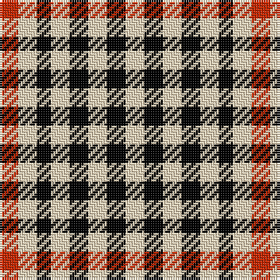

In pattern [RWKWKWKW](/patterns/rwkwkwkw/).

This was sourced from register-of-tartans.  It is a [8 stripes tartan](/stripes/stripes8/).

Original link https://www.tartanregister.gov.uk/tartanDetails.aspx?ref=1378

## Thread count
R/8 W8 K6 W8 K8 W8 K8 W/8

## Palette
Each colour and its ΔE from the base-6 reference it is a variant of.

| Colour | Shade | Base | ΔE (OKLab) |
|---|---|---|---|
| K | <code style="background-color:#000000;">#000000</code> `#000000` | K <code style="background-color:#000000;">#000000</code> | 0.00 |
| R | <code style="background-color:#C82800;">#C82800</code> `#C82800` | R <code style="background-color:#C80000;">#C80000</code> | 0.03 |
| W | <code style="background-color:#F0DCBC;">#F0DCBC</code> `#F0DCBC` | W <code style="background-color:#F4F4F0;">#F4F4F0</code> | 0.08 |

# Sample pattern

ID: /setts/s8/r8w8k6w8k8w8k8w8-k000000-rc82800-wf0dcbc/
