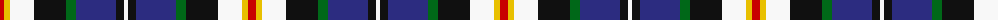
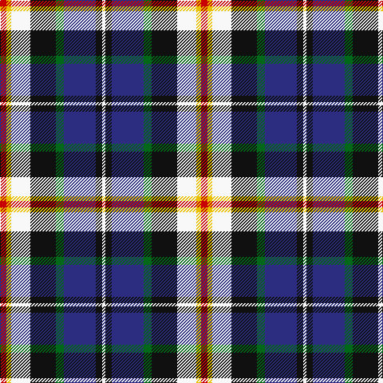

In pattern [RYWKGBKW](/patterns/rywkgbkw/).

This was sourced from tartans-authority.  It is a [8 stripes tartan](/stripes/stripes8/).

Original link http://www.tartansauthority.com/tartan-ferret/display/6382/

## Thread count
R/8 Y6 W24 K32 G10 DB40 K8 W/4

## Palette
Each colour and its ΔE from the base-6 reference it is a variant of.

| Colour | Shade | Base | ΔE (OKLab) |
|---|---|---|---|
| DB | <code style="background-color:#2C2C80;">#2C2C80</code> `#2C2C80` | B <code style="background-color:#2A418A;">#2A418A</code> | 0.06 |
| G | <code style="background-color:#006818;">#006818</code> `#006818` | G <code style="background-color:#006100;">#006100</code> | 0.02 |
| K | <code style="background-color:#101010;">#101010</code> `#101010` | K <code style="background-color:#000000;">#000000</code> | 0.17 |
| R | <code style="background-color:#C80000;">#C80000</code> `#C80000` | R <code style="background-color:#CC0000;">#CC0000</code> | 0.01 |
| W | <code style="background-color:#F8F8F8;">#F8F8F8</code> `#F8F8F8` | W <code style="background-color:#F7F7F7;">#F7F7F7</code> | 0.00 |
| Y | <code style="background-color:#E8C000;">#E8C000</code> `#E8C000` | Y <code style="background-color:#F2BF00;">#F2BF00</code> | 0.02 |

# Sample pattern

## Nearest tartans

The nearest existing variants by ΔTartan distance.

1. [Culloden, Stirling](/setts/s8/r8ra4b30y4k28w28k4w8-b8080d0-k000000-rd03030-ra806050-we0e0e0-yf0c000/) — ΔT 0.84
1. [Leitrim Irish County Tartan Tartan Number: 2271. Earliest known date: 1996 One of a series of Irish District tartans designed by Polly Wittering of the House of Edgar, with colours reminiscent of the Country with soft warm colours dominating. See products available Copyright © Blair Urquhart, Comrie, 2015](/setts/s10/y6k36y8g6y8r26y6ya36k4yb6-g28200c-k000000-rc05830-y749cb0-yaa4a8a8-ybd88c74/) — ΔT 0.98
1. [Scottish Bear (Mathan Albannach)](/setts/s11/g22w6b10w4y2b8w2b4ba22b6ga4-b000048-ba2c4084-g603800-ga006818-wffffff-yffff00/) — ΔT 0.99
1. [National (1934), The](/setts/s9/w4b6r12k16g24y2b8k4w4-b1c0070-g006818-k101010-rc80000-wfcfcfc-yd09800/) — ΔT 1.06
1. [Hoban (Name)](/setts/s9/y12w36k12w16k36g60k36b44wa8-b2c2c80-g408060-k101010-wc49cd8-wafcfcfc-ye8c000/) — ΔT 1.07
1. [Royal Dornoch Golf Club, The](/setts/s10/r24b44g10b6y6b6g34ba18bb14r4-b000048-ba3474fc-bb4c0000-g005020-rfa4b00-yd8b000/) — ΔT 1.08
1. [Californian MacLeod](/setts/s10/y8b44g6k6g6k6g24w44k4r6-b1c0070-g006818-k101010-rc80000-we0e0e0-ye8c000/) — ΔT 1.08
1. [Firth of Tay](/setts/s10/b8w8b4w36k20g12r8g20k4y8-b000088-g004800-k000000-r880000-wc4c4c4-y9c9c00/) — ΔT 1.09
1. [Ailsa, Craig](/setts/s8/r10w4b40y4k32w36k4w10-b304080-k000000-rc00000-we0e0e0-yf0c000/) — ΔT 1.10
1. [Kagame Personal Tartan Tartan Number: 7077. Earliest known date: 2006 Presented to President Kagame of Rwanda, by Tom Hunter, christmas 2006 See products available Copyright © Blair Urquhart, Comrie, 2015](/setts/s10/k8w28ka6k14g6ka6g14ka12b48wa6-b38409c-g289c18-k000000-ka101010-w98c8e8-wae0e0e0/) — ΔT 1.11

## Neighbour map

Every grey dot is one of 15726 variants placed by the first two principal components of the ΔTartan feature space (44% of its variance). Red is this tartan; blue dots are its nearest — click one to open its page.

<svg viewBox="0 0 640 380" role="img" style="max-width:100%;height:auto;border:1px solid #e0e0e0;border-radius:4px;display:block" xmlns="http://www.w3.org/2000/svg"><image href="/nn/cloud.v1.png" width="640" height="380"/><a href="/setts/s8/r8ra4b30y4k28w28k4w8-b8080d0-k000000-rd03030-ra806050-we0e0e0-yf0c000/"><circle cx="58.2" cy="150.2" r="4" fill="#3465a4"><title>Culloden, Stirling</title></circle></a><a href="/setts/s10/y6k36y8g6y8r26y6ya36k4yb6-g28200c-k000000-rc05830-y749cb0-yaa4a8a8-ybd88c74/"><circle cx="53.9" cy="133.9" r="4" fill="#3465a4"><title>Leitrim Irish County Tartan Tartan Number: 2271. Earliest known date: 1996 One of a series of Irish District tartans designed by Polly Wittering of the House of Edgar, with colours reminiscent of the Country with soft warm colours dominating. See products available Copyright © Blair Urquhart, Comrie, 2015</title></circle></a><a href="/setts/s11/g22w6b10w4y2b8w2b4ba22b6ga4-b000048-ba2c4084-g603800-ga006818-wffffff-yffff00/"><circle cx="76.2" cy="134.9" r="4" fill="#3465a4"><title>Scottish Bear (Mathan Albannach)</title></circle></a><a href="/setts/s9/w4b6r12k16g24y2b8k4w4-b1c0070-g006818-k101010-rc80000-wfcfcfc-yd09800/"><circle cx="70.0" cy="145.3" r="4" fill="#3465a4"><title>National (1934), The</title></circle></a><a href="/setts/s9/y12w36k12w16k36g60k36b44wa8-b2c2c80-g408060-k101010-wc49cd8-wafcfcfc-ye8c000/"><circle cx="46.8" cy="181.0" r="4" fill="#3465a4"><title>Hoban (Name)</title></circle></a><a href="/setts/s10/r24b44g10b6y6b6g34ba18bb14r4-b000048-ba3474fc-bb4c0000-g005020-rfa4b00-yd8b000/"><circle cx="92.5" cy="148.7" r="4" fill="#3465a4"><title>Royal Dornoch Golf Club, The</title></circle></a><a href="/setts/s10/y8b44g6k6g6k6g24w44k4r6-b1c0070-g006818-k101010-rc80000-we0e0e0-ye8c000/"><circle cx="67.9" cy="118.6" r="4" fill="#3465a4"><title>Californian MacLeod</title></circle></a><a href="/setts/s10/b8w8b4w36k20g12r8g20k4y8-b000088-g004800-k000000-r880000-wc4c4c4-y9c9c00/"><circle cx="59.7" cy="148.9" r="4" fill="#3465a4"><title>Firth of Tay</title></circle></a><a href="/setts/s8/r10w4b40y4k32w36k4w10-b304080-k000000-rc00000-we0e0e0-yf0c000/"><circle cx="113.3" cy="155.8" r="4" fill="#3465a4"><title>Ailsa, Craig</title></circle></a><a href="/setts/s10/k8w28ka6k14g6ka6g14ka12b48wa6-b38409c-g289c18-k000000-ka101010-w98c8e8-wae0e0e0/"><circle cx="53.5" cy="146.0" r="4" fill="#3465a4"><title>Kagame Personal Tartan Tartan Number: 7077. Earliest known date: 2006 Presented to President Kagame of Rwanda, by Tom Hunter, christmas 2006 See products available Copyright © Blair Urquhart, Comrie, 2015</title></circle></a><circle cx="64.1" cy="149.5" r="5" fill="#c00000"/></svg>

ID: /setts/s8/r8y6w24k32g10b40k8w4-b2c2c80-g006818-k101010-rc80000-wf8f8f8-ye8c000/
