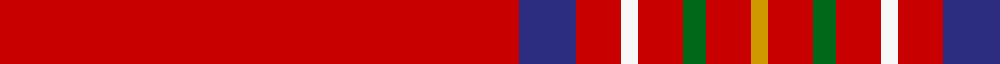
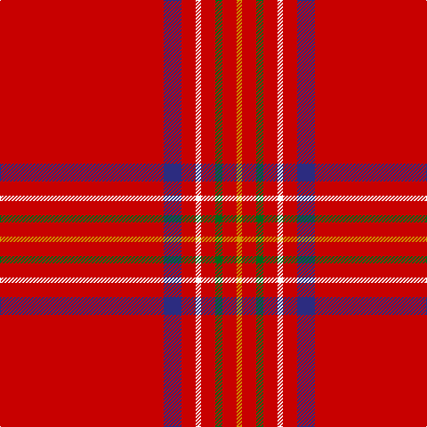

In pattern [RBRWRGRY](/stripes/rbrwrgry/).

This was sourced from register-of-tartans.  It is a [8 stripe tartan](/stripes/stripes8/).

Original link https://www.tartanregister.gov.uk/tartanDetails.aspx?ref=444

## Register references

External register numbers recorded for this tartan.

- Scottish Register of Tartans: [444](https://www.tartanregister.gov.uk/tartanDetails.aspx?ref=444)
- Scottish Tartans Authority (ITI): 1430
- Scottish Tartans World Register: 1430

## Thread count
R/184 DB20 R16 W6 R16 G8 R16 DY/6

## Palette
Each colour and its ΔE from the base-6 reference it is a variant of.

| Colour | Shade | Base | ΔE (OKLab) |
|---|---|---|---|
| DB | <code style="background-color:#2C2C80;">#2C2C80</code> `#2C2C80` | B <code style="background-color:#2A418A;">#2A418A</code> | 0.06 |
| DY | <code style="background-color:#D09800;">#D09800</code> `#D09800` | Y <code style="background-color:#F2BF00;">#F2BF00</code> | 0.12 |
| G | <code style="background-color:#006818;">#006818</code> `#006818` | G <code style="background-color:#006100;">#006100</code> | 0.02 |
| R | <code style="background-color:#C80000;">#C80000</code> `#C80000` | R <code style="background-color:#CC0000;">#CC0000</code> | 0.01 |
| W | <code style="background-color:#F8F8F8;">#F8F8F8</code> `#F8F8F8` | W <code style="background-color:#F7F7F7;">#F7F7F7</code> | 0.00 |

# Sample pattern

## Nearest tartans

The nearest existing variants by ΔTartan distance.

1. [Burnett, of Leys](/setts/s8/r60db5r5w2r5g2r5ly2~x2/) — ΔT 0.51
1. [Burnett of Leys (Clan)](/setts/s8/r75db6r6w2r6g2r6lo2~x2/) — ΔT 0.84
1. [O'Malley (Name?)](/setts/s11/r45k3ly4k3r45k1dp2k1r2g8r2~x2/) — ΔT 1.28
1. [Inverness #2](/setts/s8/r114db10w3db16ly3k3ly3r28~x2/) — ΔT 1.29
1. [Gudbrandsdalen, Rondastakken](/setts/s8/r65w2r3r4dg11r3dg3r11/) — ΔT 1.30
1. [Gudbrandsdalen, Rondastakken](/setts/s8/r65w2r3r4g11r3g3r11~x2/) — ΔT 1.31
1. [Inverness Earl of](/setts/s8/r42db4ly1db6dg1db1dg1r12~x2/) — ΔT 1.38
1. [Earl of Inverness (Artefact)](/setts/s8/r42dp4ly1dp6g1dp1g1r12~x2/) — ΔT 1.39
1. [Taplin (Name)](/setts/s11/r52k2r5g3r5k5r5ly3r5k2r52~x2/) — ΔT 1.42
1. [Prince of Denmark (Corporate)](/setts/s9/r52dg2r2dg2r3w3db2w2db2~x4/) — ΔT 1.45

## Neighbour map

Every grey dot is one of 14299 variants placed by the first two principal components of the ΔTartan feature space (44% of its variance). Red is this tartan; blue dots are its nearest — click one to open its page.

<svg viewBox="0 0 640 380" role="img" style="max-width:100%;height:auto;border:1px solid #e0e0e0;border-radius:4px;display:block" xmlns="http://www.w3.org/2000/svg"><image href="/nn/cloud.v1.png" width="640" height="380"/><a href="/setts/s8/r60db5r5w2r5g2r5ly2~x2/"><circle cx="626.0" cy="105.2" r="4" fill="#3465a4"><title>Burnett, of Leys</title></circle></a><a href="/setts/s8/r75db6r6w2r6g2r6lo2~x2/"><circle cx="626.0" cy="95.7" r="4" fill="#3465a4"><title>Burnett of Leys (Clan)</title></circle></a><a href="/setts/s11/r45k3ly4k3r45k1dp2k1r2g8r2~x2/"><circle cx="593.5" cy="73.7" r="4" fill="#3465a4"><title>O'Malley (Name?)</title></circle></a><a href="/setts/s8/r114db10w3db16ly3k3ly3r28~x2/"><circle cx="571.3" cy="83.5" r="4" fill="#3465a4"><title>Inverness #2</title></circle></a><a href="/setts/s8/r65w2r3r4dg11r3dg3r11/"><circle cx="613.6" cy="120.0" r="4" fill="#3465a4"><title>Gudbrandsdalen, Rondastakken</title></circle></a><a href="/setts/s8/r65w2r3r4g11r3g3r11~x2/"><circle cx="620.9" cy="122.0" r="4" fill="#3465a4"><title>Gudbrandsdalen, Rondastakken</title></circle></a><a href="/setts/s8/r42db4ly1db6dg1db1dg1r12~x2/"><circle cx="607.5" cy="103.0" r="4" fill="#3465a4"><title>Inverness Earl of</title></circle></a><a href="/setts/s8/r42dp4ly1dp6g1dp1g1r12~x2/"><circle cx="623.4" cy="111.9" r="4" fill="#3465a4"><title>Earl of Inverness (Artefact)</title></circle></a><a href="/setts/s11/r52k2r5g3r5k5r5ly3r5k2r52~x2/"><circle cx="626.0" cy="119.9" r="4" fill="#3465a4"><title>Taplin (Name)</title></circle></a><a href="/setts/s9/r52dg2r2dg2r3w3db2w2db2~x4/"><circle cx="608.6" cy="94.9" r="4" fill="#3465a4"><title>Prince of Denmark (Corporate)</title></circle></a><circle cx="626.0" cy="100.8" r="5" fill="#c00000"/></svg>

ID: /setts/s8/r92db10r8w3r8g4r8lo3~x2/
