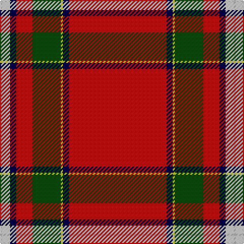

In pattern [RBYGRBWY](/patterns/rbygrbwy/).

This was sourced from weddslist.  It is a [8 stripes tartan](/stripes/stripes8/).

Original link http://www.weddslist.com/cgi-bin/tartans/pg.pl?source=rb

## Thread count
Na/2 N8 DB6 R16 G28 Y2 DB6 R/96

## Palette
Each colour and its ΔE from the base-6 reference it is a variant of.

| Colour | Shade | Base | ΔE (OKLab) |
|---|---|---|---|
| DB | <code style="background-color:#00004C;">#00004C</code> `#00004C` | B <code style="background-color:#2C4084;">#2C4084</code> | 0.21 |
| G | <code style="background-color:#004C00;">#004C00</code> `#004C00` | G <code style="background-color:#006400;">#006400</code> | 0.08 |
| N | <code style="background-color:#D0D0D0;">#D0D0D0</code> `#D0D0D0` | W <code style="background-color:#F4F4F0;">#F4F4F0</code> | 0.11 |
| Na | <code style="background-color:#B0B0B0;">#B0B0B0</code> `#B0B0B0` | Y <code style="background-color:#E8C000;">#E8C000</code> | 0.18 |
| R | <code style="background-color:#C80000;">#C80000</code> `#C80000` | R <code style="background-color:#C80000;">#C80000</code> | 0.00 |
| Y | <code style="background-color:#C8C800;">#C8C800</code> `#C8C800` | Y <code style="background-color:#E8C000;">#E8C000</code> | 0.05 |

# Sample pattern

## Nearest tartans

The nearest existing variants by ΔTartan distance.

1. [Stuart/Stewart of Fingask](/setts/s8/r72g3y2g26r14b6ba6w2-b2c4084-ba3c82af-g005020-rdc0000-we0e0e0-ye8c000/) — ΔT 0.70
1. [MacIngust](/setts/s8/r140k4y2g36r20k8b8w2-b2888c4-g003820-k101010-rc80000-we0e0e0-ye8c000/) — ΔT 0.89
1. [Stewart of Fingask - 1745 (Clan?)](/setts/s8/r72g3y2g26r14b6ba6w2-b2c2c80-ba5c8ca8-g006818-rc80000-we0e0e0-ye8c000/) — ΔT 0.94
1. [Conroy Family Tartan Tartan Number: 1626. Earliest known date: 1986 See products available Copyright © Blair Urquhart, Comrie, 2015](/setts/s8/r128k20y8ra10w4k4b6y8-b2c2c80-k101010-rc80000-raa00048-we0e0e0-ye8c000/) — ΔT 0.97
1. [Stewart of Fingask](/setts/s8/r72g3y2g26r14b6ba6w2-b304080-ba5480b0-g008000-rc00000-we0e0e0-yf0c000/) — ΔT 1.04
1. [Drummond, Ancient](/setts/s9/r76y2b6w2g26r12b6ba6w2-b304080-ba5480b0-g008000-rc00000-we0e0e0-yf0c000/) — ΔT 1.04
1. [Inverness Cathedral (Corporate)](/setts/s9/r144b12y2b24k8w2ba8w2k10-b2c2c80-ba5c5c5c-k101010-rc80000-we0e0e0-ye8c000/) — ΔT 1.04
1. [Stewart/Stuart, Royal](/setts/s12/r87b8k11y2k3w2k3g13r11k2r5w3-b2c2c80-g006818-k101010-rc80000-we0e0e0-ye8c000/) — ΔT 1.07
1. [Perthshire or Drummond of Perth](/setts/s9/r72w2b6y2g32r16b6ba4w2-b2c2c80-ba5c8ca8-g285800-rc80000-we0e0e0-ye8c000/) — ΔT 1.08
1. [Drummond of Perth (Clan)](/setts/s9/r72w2b6y2g32r16b6ba4w2-b2c2c80-ba1870a4-g006818-rc80000-we0e0e0-ye8c000/) — ΔT 1.09

## Neighbour map

Every grey dot is one of 15726 variants placed by the first two principal components of the ΔTartan feature space (44% of its variance). Red is this tartan; blue dots are its nearest — click one to open its page.

<svg viewBox="0 0 640 380" role="img" style="max-width:100%;height:auto;border:1px solid #e0e0e0;border-radius:4px;display:block" xmlns="http://www.w3.org/2000/svg"><image href="/nn/cloud.v1.png" width="640" height="380"/><a href="/setts/s8/r72g3y2g26r14b6ba6w2-b2c4084-ba3c82af-g005020-rdc0000-we0e0e0-ye8c000/"><circle cx="423.4" cy="78.2" r="4" fill="#3465a4"><title>Stuart/Stewart of Fingask</title></circle></a><a href="/setts/s8/r140k4y2g36r20k8b8w2-b2888c4-g003820-k101010-rc80000-we0e0e0-ye8c000/"><circle cx="503.2" cy="60.9" r="4" fill="#3465a4"><title>MacIngust</title></circle></a><a href="/setts/s8/r72g3y2g26r14b6ba6w2-b2c2c80-ba5c8ca8-g006818-rc80000-we0e0e0-ye8c000/"><circle cx="430.9" cy="84.1" r="4" fill="#3465a4"><title>Stewart of Fingask - 1745 (Clan?)</title></circle></a><a href="/setts/s8/r128k20y8ra10w4k4b6y8-b2c2c80-k101010-rc80000-raa00048-we0e0e0-ye8c000/"><circle cx="437.2" cy="61.7" r="4" fill="#3465a4"><title>Conroy Family Tartan Tartan Number: 1626. Earliest known date: 1986 See products available Copyright © Blair Urquhart, Comrie, 2015</title></circle></a><a href="/setts/s8/r72g3y2g26r14b6ba6w2-b304080-ba5480b0-g008000-rc00000-we0e0e0-yf0c000/"><circle cx="429.6" cy="84.7" r="4" fill="#3465a4"><title>Stewart of Fingask</title></circle></a><a href="/setts/s9/r76y2b6w2g26r12b6ba6w2-b304080-ba5480b0-g008000-rc00000-we0e0e0-yf0c000/"><circle cx="410.3" cy="69.3" r="4" fill="#3465a4"><title>Drummond, Ancient</title></circle></a><a href="/setts/s9/r144b12y2b24k8w2ba8w2k10-b2c2c80-ba5c5c5c-k101010-rc80000-we0e0e0-ye8c000/"><circle cx="465.8" cy="43.2" r="4" fill="#3465a4"><title>Inverness Cathedral (Corporate)</title></circle></a><a href="/setts/s12/r87b8k11y2k3w2k3g13r11k2r5w3-b2c2c80-g006818-k101010-rc80000-we0e0e0-ye8c000/"><circle cx="447.1" cy="32.4" r="4" fill="#3465a4"><title>Stewart/Stuart, Royal</title></circle></a><a href="/setts/s9/r72w2b6y2g32r16b6ba4w2-b2c2c80-ba5c8ca8-g285800-rc80000-we0e0e0-ye8c000/"><circle cx="396.7" cy="75.0" r="4" fill="#3465a4"><title>Perthshire or Drummond of Perth</title></circle></a><a href="/setts/s9/r72w2b6y2g32r16b6ba4w2-b2c2c80-ba1870a4-g006818-rc80000-we0e0e0-ye8c000/"><circle cx="392.3" cy="74.1" r="4" fill="#3465a4"><title>Drummond of Perth (Clan)</title></circle></a><circle cx="443.5" cy="61.9" r="5" fill="#c00000"/></svg>

ID: /setts/s8/r96b6y2g28r16b6w8ya2-b00004c-g004c00-rc80000-wd0d0d0-yc8c800-yab0b0b0/
