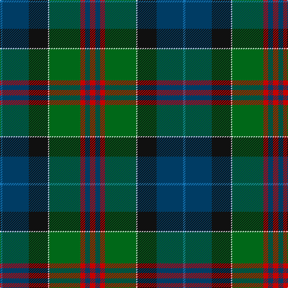

In pattern [BBKWGRBR](/patterns/bbkwgrbr/).

This was sourced from tartans-authority.  It is a [8 stripes tartan](/stripes/stripes8/).

Original link http://www.tartansauthority.com/tartan-ferret/display/8954/

## Thread count
B/4 DB44 K32 LN2 G52 R8 DB8 R/9

## Palette
Each colour and its ΔE from the base-6 reference it is a variant of.

| Colour | Shade | Base | ΔE (OKLab) |
|---|---|---|---|
| B | <code style="background-color:#1474B4;">#1474B4</code> `#1474B4` | B <code style="background-color:#2A418A;">#2A418A</code> | 0.15 |
| DB | <code style="background-color:#003C64;">#003C64</code> `#003C64` | B <code style="background-color:#2A418A;">#2A418A</code> | 0.08 |
| G | <code style="background-color:#006818;">#006818</code> `#006818` | G <code style="background-color:#006100;">#006100</code> | 0.02 |
| K | <code style="background-color:#101010;">#101010</code> `#101010` | K <code style="background-color:#000000;">#000000</code> | 0.17 |
| LN | <code style="background-color:#E0E0E0;">#E0E0E0</code> `#E0E0E0` | W <code style="background-color:#F7F7F7;">#F7F7F7</code> | 0.07 |
| R | <code style="background-color:#C80000;">#C80000</code> `#C80000` | R <code style="background-color:#CC0000;">#CC0000</code> | 0.01 |

# Sample pattern

## Nearest tartans

The nearest existing variants by ΔTartan distance.

1. [Whitson (Name)](/setts/s9/w4k1g19y1k19b13r2b4r2~b0c585c-g3c6040-k101010-r880000-wc0c0c0-yd09800~x4/) — ΔT 0.66
1. [Jones (Name)](/setts/s7/r4w1g6ga25k8b15w2~b2c2c80-g5c6428-ga006818-k101010-rc80000-wc0c0c0~x2/) — ΔT 0.82
1. [Jones Personal Tartan Tartan Number: 2476. Earliest known date: 1997 Designed by Peter MacDonald for Mrs Ros Jones, Aros, Isle of Mull and intended for all of the name Jones. Produced to raise money for National and International Charities. Registered Design Number :- 602573 See products available Copyright © Blair Urquhart, Comrie, 2015](/setts/s7/r4w1g6ga25k8b15w2~b202060-g5c6428-ga007460-k101010-ra01420-wc0c0c0~x2/) — ΔT 0.89
1. [Hughes](/setts/s7/g20ga14b9y2b9k1w2~b2c4084-g005020-ga002814-k101010-we0e0e0-ye8c000~x4/) — ΔT 0.92
1. [Adams (Name)](/setts/s11/r4g4k2g17b5g5b17g6w1ba22r2~b441800-ba1c0070-g006818-k101010-r880000-wc0c0c0~x2/) — ΔT 0.93
1. [Groen (Personal)](/setts/s11/b12r2b3r4b15k24g18y1k3g3w3~b506878-g184c20-k101010-rc80000-wfcfcfc-ye8c000~x2/) — ΔT 1.01
1. [McMeeken (Name)](/setts/s10/r7g20y2g4k5b4k2b20k3w1~b185ca8-g0c643c-k101010-ra41414-we0e0e0-yfccc3c~x2/) — ΔT 1.05
1. [Adams](/setts/s11/r4g4k2g15b5g5b15g6w1ba19r2~b441800-ba1c0070-g006818-k101010-r880000-wffffff~x2/) — ΔT 1.05
1. [Redgate (Connecticut) Hunting](/setts/s9/b1ba4b12ba1k7g12k7bb21w1~b788cb4-ba5d0f04-bb402a21-g334e3d-k120a01-wddd5af~x2/) — ΔT 1.10
1. [MacNeil - 1840 (Chief's sett)](/setts/s7/w2r3b33k33g33k6y2~b2c2c80-g006818-k101010-rc80000-wfcfcfc-ye8c000~x2/) — ΔT 1.13

## Neighbour map

Every grey dot is one of 15726 variants placed by the first two principal components of the ΔTartan feature space (44% of its variance). Red is this tartan; blue dots are its nearest — click one to open its page.

<svg viewBox="0 0 640 380" role="img" style="max-width:100%;height:auto;border:1px solid #e0e0e0;border-radius:4px;display:block" xmlns="http://www.w3.org/2000/svg"><image href="/nn/cloud.v1.png" width="640" height="380"/><a href="/setts/s9/w4k1g19y1k19b13r2b4r2~b0c585c-g3c6040-k101010-r880000-wc0c0c0-yd09800~x4/"><circle cx="172.5" cy="137.7" r="4" fill="#3465a4"><title>Whitson (Name)</title></circle></a><a href="/setts/s7/r4w1g6ga25k8b15w2~b2c2c80-g5c6428-ga006818-k101010-rc80000-wc0c0c0~x2/"><circle cx="206.7" cy="141.5" r="4" fill="#3465a4"><title>Jones (Name)</title></circle></a><a href="/setts/s7/r4w1g6ga25k8b15w2~b202060-g5c6428-ga007460-k101010-ra01420-wc0c0c0~x2/"><circle cx="212.5" cy="144.0" r="4" fill="#3465a4"><title>Jones Personal Tartan Tartan Number: 2476. Earliest known date: 1997 Designed by Peter MacDonald for Mrs Ros Jones, Aros, Isle of Mull and intended for all of the name Jones. Produced to raise money for National and International Charities. Registered Design Number :- 602573 See products available Copyright © Blair Urquhart, Comrie, 2015</title></circle></a><a href="/setts/s7/g20ga14b9y2b9k1w2~b2c4084-g005020-ga002814-k101010-we0e0e0-ye8c000~x4/"><circle cx="192.8" cy="168.4" r="4" fill="#3465a4"><title>Hughes</title></circle></a><a href="/setts/s11/r4g4k2g17b5g5b17g6w1ba22r2~b441800-ba1c0070-g006818-k101010-r880000-wc0c0c0~x2/"><circle cx="205.3" cy="134.3" r="4" fill="#3465a4"><title>Adams (Name)</title></circle></a><a href="/setts/s11/b12r2b3r4b15k24g18y1k3g3w3~b506878-g184c20-k101010-rc80000-wfcfcfc-ye8c000~x2/"><circle cx="173.0" cy="116.0" r="4" fill="#3465a4"><title>Groen (Personal)</title></circle></a><a href="/setts/s10/r7g20y2g4k5b4k2b20k3w1~b185ca8-g0c643c-k101010-ra41414-we0e0e0-yfccc3c~x2/"><circle cx="187.1" cy="127.5" r="4" fill="#3465a4"><title>McMeeken (Name)</title></circle></a><a href="/setts/s11/r4g4k2g15b5g5b15g6w1ba19r2~b441800-ba1c0070-g006818-k101010-r880000-wffffff~x2/"><circle cx="190.5" cy="142.1" r="4" fill="#3465a4"><title>Adams</title></circle></a><a href="/setts/s9/b1ba4b12ba1k7g12k7bb21w1~b788cb4-ba5d0f04-bb402a21-g334e3d-k120a01-wddd5af~x2/"><circle cx="163.8" cy="140.7" r="4" fill="#3465a4"><title>Redgate (Connecticut) Hunting</title></circle></a><a href="/setts/s7/w2r3b33k33g33k6y2~b2c2c80-g006818-k101010-rc80000-wfcfcfc-ye8c000~x2/"><circle cx="178.9" cy="155.8" r="4" fill="#3465a4"><title>MacNeil - 1840 (Chief's sett)</title></circle></a><circle cx="190.5" cy="137.2" r="5" fill="#c00000"/></svg>

ID: /setts/s8/r9b8r8g52w2k32b44ba4~b003c64-ba1474b4-g006818-k101010-rc80000-we0e0e0/
