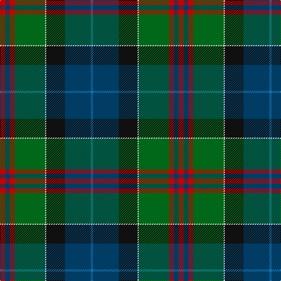

This page is one **sett** — a single exact thread-count. It belongs to the [tartan](/tartans/r9dt8r8g52w2k32dt44b4/)
(the same proportion at any scale), whose colour order is pattern [BBKWGRBR](/stripes/bbkwgrbr/).

Sourced from tartans-authority.  It is a [8 stripe tartan](/stripes/stripes8/).

Original link http://www.tartansauthority.com/tartan-ferret/display/8954/

## Register references

External register numbers recorded for this tartan.

- Scottish Tartans Authority (ITI): 8954

## Thread count
R/9 DB8 R8 G52 LN2 K32 DB44 B/4

## Palette

Palette: <strong>Tartan Register</strong>
<table><thead><tr><th>Colour</th><th>Threads</th><th>Shade</th><th>Base</th><th>OKLCh</th></tr></thead><tbody><tr><td>R/</td><td style="text-align:right;font-variant-numeric:tabular-nums">9</td><td><code style="background-color:#C80000;">#C80000</code> <small style="color:#888">#C80000</small></td><td>R <code style="background-color:#CC0000;">#CC0000</code></td><td><small style="color:#888">oklch(52.3% 0.215 29.2)</small></td></tr><tr><td>DB</td><td style="text-align:right;font-variant-numeric:tabular-nums">8</td><td><code style="background-color:#003C64;">#003C64</code> <small style="color:#888">#003C64</small></td><td>B <code style="background-color:#2A418A;">#2A418A</code></td><td><small style="color:#888">oklch(34.5% 0.089 246.0)</small></td></tr><tr><td>R</td><td style="text-align:right;font-variant-numeric:tabular-nums">8</td><td><code style="background-color:#C80000;">#C80000</code> <small style="color:#888">#C80000</small></td><td>R <code style="background-color:#CC0000;">#CC0000</code></td><td><small style="color:#888">oklch(52.3% 0.215 29.2)</small></td></tr><tr><td>G</td><td style="text-align:right;font-variant-numeric:tabular-nums">52</td><td><code style="background-color:#006818;">#006818</code> <small style="color:#888">#006818</small></td><td>G <code style="background-color:#006100;">#006100</code></td><td><small style="color:#888">oklch(45.0% 0.142 145.0)</small></td></tr><tr><td>LN</td><td style="text-align:right;font-variant-numeric:tabular-nums">2</td><td><code style="background-color:#E0E0E0;">#E0E0E0</code> <small style="color:#888">#E0E0E0</small></td><td>W <code style="background-color:#F7F7F7;">#F7F7F7</code></td><td><small style="color:#888">oklch(90.7% 0.000 89.9)</small></td></tr><tr><td>K</td><td style="text-align:right;font-variant-numeric:tabular-nums">32</td><td><code style="background-color:#101010;">#101010</code> <small style="color:#888">#101010</small></td><td>K <code style="background-color:#000000;">#000000</code></td><td><small style="color:#888">oklch(17.3% 0.000 89.9)</small></td></tr><tr><td>DB</td><td style="text-align:right;font-variant-numeric:tabular-nums">44</td><td><code style="background-color:#003C64;">#003C64</code> <small style="color:#888">#003C64</small></td><td>B <code style="background-color:#2A418A;">#2A418A</code></td><td><small style="color:#888">oklch(34.5% 0.089 246.0)</small></td></tr><tr><td>B/</td><td style="text-align:right;font-variant-numeric:tabular-nums">4</td><td><code style="background-color:#1474B4;">#1474B4</code> <small style="color:#888">#1474B4</small></td><td>B <code style="background-color:#2A418A;">#2A418A</code></td><td><small style="color:#888">oklch(54.0% 0.129 245.1)</small></td></tr></tbody></table>

# Sample pattern

## Nearest tartans

The nearest existing variants by ΔTartan distance, with this tartan at the top so the swatches line up against it.

ΔTartan

Tartan

Sett

—

<a href="/ttd/edit/#slug=r9dt8r8g52w2k32dt44b4">Highland Wedding (Fashion)</a> <a class="nn-out" href="/setts/s8/r9dt8r8g52w2k32dt44b4/" title="open its dictionary page">↗</a>

0.66

<a href="/ttd/edit/#slug=lb4k1y19lo1k19n13r2n4r2~x4">Whitson (Name)</a> <a class="nn-out" href="/setts/s9/lb4k1y19lo1k19n13r2n4r2~x4/" title="open its dictionary page">↗</a>

0.82

<a href="/ttd/edit/#slug=r4lb1y6g25k8db15lb2~x2">Jones (Name)</a> <a class="nn-out" href="/setts/s7/r4lb1y6g25k8db15lb2~x2/" title="open its dictionary page">↗</a>

0.92

<a href="/ttd/edit/#slug=dgi20dg14db9ly2db9k1w2~x4">Hughes</a> <a class="nn-out" href="/setts/s7/dgi20dg14db9ly2db9k1w2~x4/" title="open its dictionary page">↗</a>

0.92

<a href="/ttd/edit/#slug=r4g4k2g17do5g5do17g6lb1db22r2~x2">Adams (Name)</a> <a class="nn-out" href="/setts/s11/r4g4k2g17do5g5do17g6lb1db22r2~x2/" title="open its dictionary page">↗</a>

1.00

<a href="/ttd/edit/#slug=n12r2n3r4n15k24dg18ly1k3dg3w3~x2">Groen (Personal)</a> <a class="nn-out" href="/setts/s11/n12r2n3r4n15k24dg18ly1k3dg3w3~x2/" title="open its dictionary page">↗</a>

1.05

<a href="/ttd/edit/#slug=r7g20ly2g4k5b4k2b20k3w1~x2">McMeeken (Name)</a> <a class="nn-out" href="/setts/s10/r7g20ly2g4k5b4k2b20k3w1~x2/" title="open its dictionary page">↗</a>

1.05

<a href="/ttd/edit/#slug=r4g4k2g15do5g5do15g6w1db19r2~x2">Adams</a> <a class="nn-out" href="/setts/s11/r4g4k2g15do5g5do15g6w1db19r2~x2/" title="open its dictionary page">↗</a>

1.10

<a href="/ttd/edit/#slug=t1dr4t12dr1k7dg12k7do21w1~x2">Redgate (Connecticut) Hunting</a> <a class="nn-out" href="/setts/s9/t1dr4t12dr1k7dg12k7do21w1~x2/" title="open its dictionary page">↗</a>

1.12

<a href="/ttd/edit/#slug=w2r3db33k33g33k6ly2~x2">MacNeil - 1840 (Chief's sett)</a> <a class="nn-out" href="/setts/s7/w2r3db33k33g33k6ly2~x2/" title="open its dictionary page">↗</a>

1.13

<a href="/ttd/edit/#slug=m8k2dy10dp30dy30g55k4lo6">Aberuchill</a> <a class="nn-out" href="/setts/s8/m8k2dy10dp30dy30g55k4lo6/" title="open its dictionary page">↗</a>

## Neighbour map

Every grey dot is one of 14359 variants placed by the first two principal components of the ΔTartan feature space (44% of its variance). Red is this tartan; blue dots are its nearest — click one to open its page.

<svg viewBox="0 0 640 380" role="img" style="max-width:100%;height:auto;border:1px solid #e0e0e0;border-radius:4px;display:block" xmlns="http://www.w3.org/2000/svg"><image href="/nn/cloud.v1.png" width="640" height="380"/><a href="/setts/s9/lb4k1y19lo1k19n13r2n4r2~x4/"><circle cx="175.6" cy="145.9" r="4" fill="#3465a4"><title>Whitson (Name)</title></circle></a><a href="/setts/s7/r4lb1y6g25k8db15lb2~x2/"><circle cx="209.4" cy="147.7" r="4" fill="#3465a4"><title>Jones (Name)</title></circle></a><a href="/setts/s7/dgi20dg14db9ly2db9k1w2~x4/"><circle cx="196.1" cy="177.3" r="4" fill="#3465a4"><title>Hughes</title></circle></a><a href="/setts/s11/r4g4k2g17do5g5do17g6lb1db22r2~x2/"><circle cx="208.0" cy="142.3" r="4" fill="#3465a4"><title>Adams (Name)</title></circle></a><a href="/setts/s11/n12r2n3r4n15k24dg18ly1k3dg3w3~x2/"><circle cx="175.8" cy="121.5" r="4" fill="#3465a4"><title>Groen (Personal)</title></circle></a><a href="/setts/s10/r7g20ly2g4k5b4k2b20k3w1~x2/"><circle cx="190.2" cy="134.5" r="4" fill="#3465a4"><title>McMeeken (Name)</title></circle></a><a href="/setts/s11/r4g4k2g15do5g5do15g6w1db19r2~x2/"><circle cx="193.2" cy="149.4" r="4" fill="#3465a4"><title>Adams</title></circle></a><a href="/setts/s9/t1dr4t12dr1k7dg12k7do21w1~x2/"><circle cx="166.3" cy="148.8" r="4" fill="#3465a4"><title>Redgate (Connecticut) Hunting</title></circle></a><a href="/setts/s7/w2r3db33k33g33k6ly2~x2/"><circle cx="182.3" cy="161.3" r="4" fill="#3465a4"><title>MacNeil - 1840 (Chief's sett)</title></circle></a><a href="/setts/s8/m8k2dy10dp30dy30g55k4lo6/"><circle cx="232.1" cy="141.8" r="4" fill="#3465a4"><title>Aberuchill</title></circle></a><circle cx="193.6" cy="145.0" r="5" fill="#c00000"/></svg>

ID: /setts/s8/r9dt8r8g52w2k32dt44b4/
