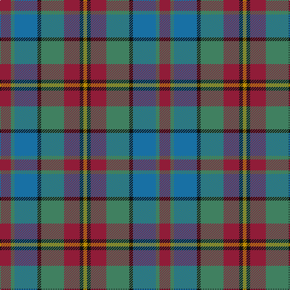

In pattern [RGBKGRKY](/patterns/rgbkgrky/).

This was sourced from tartans-authority.  It is a [8 stripes tartan](/stripes/stripes8/).

Original link http://www.tartansauthority.com/tartan-ferret/display/2681/

## Thread count
DR/18 G6 B38 K6 G38 DR26 K6 DY/6

## Palette
Each colour and its ΔE from the base-6 reference it is a variant of.

| Colour | Shade | Base | ΔE (OKLab) |
|---|---|---|---|
| B | <code style="background-color:#1870A4;">#1870A4</code> `#1870A4` | B <code style="background-color:#2A418A;">#2A418A</code> | 0.13 |
| DR | <code style="background-color:#901C38;">#901C38</code> `#901C38` | R <code style="background-color:#CC0000;">#CC0000</code> | 0.13 |
| DY | <code style="background-color:#BC8C00;">#BC8C00</code> `#BC8C00` | Y <code style="background-color:#F2BF00;">#F2BF00</code> | 0.16 |
| G | <code style="background-color:#408060;">#408060</code> `#408060` | G <code style="background-color:#006100;">#006100</code> | 0.14 |
| K | <code style="background-color:#101010;">#101010</code> `#101010` | K <code style="background-color:#000000;">#000000</code> | 0.17 |

# Sample pattern

## Nearest tartans

The nearest existing variants by ΔTartan distance.

1. [Orkney](/setts/s8/r6g2b12k2g12r9k2y2x2~b304080-g607030-k000000-r802040-yd08010/) — ΔT 0.98
1. [Holland & Sherry (Corporate)](/setts/s9/b20ba3b4r3b3k10g21k4r20x2~b003c64-ba3850c8-g006818-k101010-r901c38/) — ΔT 1.01
1. [Orkney District Tartan Tartan Number: 2301. Earliest known date: 2000 Orkney District tartan was designed for the Westry Knitters, on Orkney, by Ronnie Hek. Four designs were advertised in the window of a shop on Orkney's mainland and the most popular was chosen as the official Orcadian tartan. See products available Copyright © Blair Urquhart, Comrie, 2015](/setts/s8/r3g1b6k1g6r4k1y1x4~b2888c4-g006818-k101010-rb468ac-yd87c00/) — ΔT 1.11
1. [Newmill Corporate Tartan Tartan Number: 2053. Earliest known date: March 1992 Designed to be used in the refurbishing of Johnstons of Elgin new mill shop and based on the colours of the mill shop house style. The lighter square is represented here as green from the 'Antique' colour range, a speciality of Johnstons of Elgin. See products available Copyright © Blair Urquhart, Comrie, 2015](/setts/s7/r5ra20b13ba42b13ra20y5~b003c64-ba2c2c80-rc8002c-raa07c58-ydc943c/) — ΔT 1.14
1. [Crossbill](/setts/s7/k2r15g15ga15ra2ga3y2x2~g604000-ga00643c-k101010-r9c68a4-rac80000-ye8c000/) — ΔT 1.16
1. [Orkney](/setts/s14/k3r13g19k3b19g3r9g3b19k3g19r13k3y3x2~b1870a4-g408060-k101010-r901c38-ybc8c00/) — ΔT 1.19
1. [Land's End Maroon](/setts/s9/b23y2r3ba7r3y2g15r21y5x2~b003c64-ba2c2c80-g006818-r901c38-ybc8c00/) — ΔT 1.20
1. [Crook](/setts/s9/g4b12r3k3r3g16b2r14k4x2~b1870a4-g406054-k101010-ra00048/) — ΔT 1.23
1. [Adamson (Personal)](/setts/s9/r1g7b3ga1ra3ga1b3ga7w1x4~b2c2c80-g604000-ga006818-rc80000-ra888888-we0e0e0/) — ΔT 1.27
1. [Casely](/setts/s6/r4g11k11g2b11ga3x4~b506878-g30644c-ga446428-k101010-rc80000/) — ΔT 1.29

## Neighbour map

Every grey dot is one of 15726 variants placed by the first two principal components of the ΔTartan feature space (44% of its variance). Red is this tartan; blue dots are its nearest — click one to open its page.

<svg viewBox="0 0 640 380" role="img" style="max-width:100%;height:auto;border:1px solid #e0e0e0;border-radius:4px;display:block" xmlns="http://www.w3.org/2000/svg"><image href="/nn/cloud.v1.png" width="640" height="380"/><a href="/setts/s8/r6g2b12k2g12r9k2y2x2~b304080-g607030-k000000-r802040-yd08010/"><circle cx="139.1" cy="212.8" r="4" fill="#3465a4"><title>Orkney</title></circle></a><a href="/setts/s9/b20ba3b4r3b3k10g21k4r20x2~b003c64-ba3850c8-g006818-k101010-r901c38/"><circle cx="154.5" cy="209.3" r="4" fill="#3465a4"><title>Holland &amp; Sherry (Corporate)</title></circle></a><a href="/setts/s8/r3g1b6k1g6r4k1y1x4~b2888c4-g006818-k101010-rb468ac-yd87c00/"><circle cx="114.9" cy="207.4" r="4" fill="#3465a4"><title>Orkney District Tartan Tartan Number: 2301. Earliest known date: 2000 Orkney District tartan was designed for the Westry Knitters, on Orkney, by Ronnie Hek. Four designs were advertised in the window of a shop on Orkney's mainland and the most popular was chosen as the official Orcadian tartan. See products available Copyright © Blair Urquhart, Comrie, 2015</title></circle></a><a href="/setts/s7/r5ra20b13ba42b13ra20y5~b003c64-ba2c2c80-rc8002c-raa07c58-ydc943c/"><circle cx="174.8" cy="213.1" r="4" fill="#3465a4"><title>Newmill Corporate Tartan Tartan Number: 2053. Earliest known date: March 1992 Designed to be used in the refurbishing of Johnstons of Elgin new mill shop and based on the colours of the mill shop house style. The lighter square is represented here as green from the 'Antique' colour range, a speciality of Johnstons of Elgin. See products available Copyright © Blair Urquhart, Comrie, 2015</title></circle></a><a href="/setts/s7/k2r15g15ga15ra2ga3y2x2~g604000-ga00643c-k101010-r9c68a4-rac80000-ye8c000/"><circle cx="161.5" cy="193.1" r="4" fill="#3465a4"><title>Crossbill</title></circle></a><a href="/setts/s14/k3r13g19k3b19g3r9g3b19k3g19r13k3y3x2~b1870a4-g408060-k101010-r901c38-ybc8c00/"><circle cx="150.0" cy="193.5" r="4" fill="#3465a4"><title>Orkney</title></circle></a><a href="/setts/s9/b23y2r3ba7r3y2g15r21y5x2~b003c64-ba2c2c80-g006818-r901c38-ybc8c00/"><circle cx="183.9" cy="176.5" r="4" fill="#3465a4"><title>Land's End Maroon</title></circle></a><a href="/setts/s9/g4b12r3k3r3g16b2r14k4x2~b1870a4-g406054-k101010-ra00048/"><circle cx="199.4" cy="218.2" r="4" fill="#3465a4"><title>Crook</title></circle></a><a href="/setts/s9/r1g7b3ga1ra3ga1b3ga7w1x4~b2c2c80-g604000-ga006818-rc80000-ra888888-we0e0e0/"><circle cx="127.4" cy="188.5" r="4" fill="#3465a4"><title>Adamson (Personal)</title></circle></a><a href="/setts/s6/r4g11k11g2b11ga3x4~b506878-g30644c-ga446428-k101010-rc80000/"><circle cx="130.4" cy="255.6" r="4" fill="#3465a4"><title>Casely</title></circle></a><circle cx="149.3" cy="214.4" r="5" fill="#c00000"/></svg>

ID: /setts/s8/r9g3b19k3g19r13k3y3x2~b1870a4-g408060-k101010-r901c38-ybc8c00/
