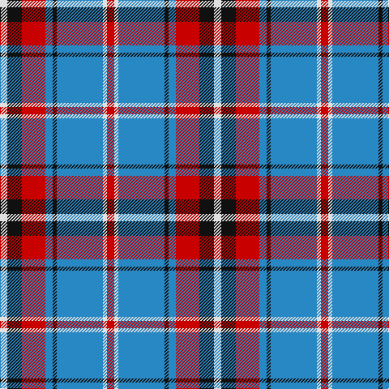

In pattern [RWBKBRKW](/patterns/rwbkbrkw/).

This was sourced from tartans-authority.  It is a [8 stripes tartan](/stripes/stripes8/).

Original link http://www.tartansauthority.com/tartan-ferret/display/10464/

## Thread count
LN/9 K18 R29 B9 K5 B57 LN5 R/9

## Palette
Each colour and its ΔE from the base-6 reference it is a variant of.

| Colour | Shade | Base | ΔE (OKLab) |
|---|---|---|---|
| B | <code style="background-color:#2888C4;">#2888C4</code> `#2888C4` | B <code style="background-color:#2A418A;">#2A418A</code> | 0.21 |
| K | <code style="background-color:#101010;">#101010</code> `#101010` | K <code style="background-color:#000000;">#000000</code> | 0.17 |
| LN | <code style="background-color:#E0E0E0;">#E0E0E0</code> `#E0E0E0` | W <code style="background-color:#F7F7F7;">#F7F7F7</code> | 0.07 |
| R | <code style="background-color:#C80000;">#C80000</code> `#C80000` | R <code style="background-color:#CC0000;">#CC0000</code> | 0.01 |

# Sample pattern

## Nearest tartans

The nearest existing variants by ΔTartan distance.

1. [Lord Arran (Corporate)](/setts/s9/r6g2w24g4b4g4b28w4b4-b2c2c80-g604000-r880000-we0e0e0/) — ΔT 0.82
1. [Yale College, Wrexham](/setts/s8/b57k5b9r29k18w9r9w5-b2383bf-k101010-rc52e8b-wffffff/) — ΔT 0.84
1. [Yusra (Malay) (Personal)](/setts/s7/r24y6w28b20y4b48r4-b003c64-rc80000-we0e0e0-ye8c000/) — ΔT 0.85
1. [Yusra (Personal)](/setts/s7/r24y6w28b20y4b48r4-b003c64-rc80000-we0e0e0-yfccc00/) — ΔT 0.87
1. [Downside (Corporate)](/setts/s6/r8ra82k10w28k36r8-k101010-rc80000-ra888888-we0e0e0/) — ΔT 0.95
1. [Yusra Personal Tartan Tartan Number: 10455. Earliest known date: 6th April 2011 The colours used in the design are based on the colours of the Malaysian flag (blue/navy, red, yellow and white/cream) to represent the country of origin of part of the Yusra family. A woven sample of this tartan has been received by the Scottish Register of Tartans for permanent preservation in the National Archives of Scotland. See products available Copyright © Blair Urquhart, Comrie, 2015](/setts/s7/r24k6w28b20k4b48r4-b003c64-k000000-rc80000-we0e0e0/) — ΔT 1.01
1. [Virtuoso (Corporate)](/setts/s9/r8w8k8w8k8w8k4ra46w4-k101010-rc80000-ra888888-we0e0e0/) — ΔT 1.03
1. [Unnamed](/setts/s10/r36y4b12y4b8y4b24y6r8g4-b3850c8-g009468-r880000-yfccc00/) — ΔT 1.05
1. [Clemens and August (Personal)](/setts/s8/w64b6r8b6r16b64wa6b8-b1c0070-rc80000-wf0e4bc-wae0e0e0/) — ΔT 1.08
1. [Kinnaird](/setts/s8/w66k8w8k10w8k14b82r8-b304080-k000000-rc00000-wc0c0c0/) — ΔT 1.09

## Neighbour map

Every grey dot is one of 15726 variants placed by the first two principal components of the ΔTartan feature space (44% of its variance). Red is this tartan; blue dots are its nearest — click one to open its page.

<svg viewBox="0 0 640 380" role="img" style="max-width:100%;height:auto;border:1px solid #e0e0e0;border-radius:4px;display:block" xmlns="http://www.w3.org/2000/svg"><image href="/nn/cloud.v1.png" width="640" height="380"/><a href="/setts/s9/r6g2w24g4b4g4b28w4b4-b2c2c80-g604000-r880000-we0e0e0/"><circle cx="222.0" cy="144.2" r="4" fill="#3465a4"><title>Lord Arran (Corporate)</title></circle></a><a href="/setts/s8/b57k5b9r29k18w9r9w5-b2383bf-k101010-rc52e8b-wffffff/"><circle cx="220.9" cy="166.9" r="4" fill="#3465a4"><title>Yale College, Wrexham</title></circle></a><a href="/setts/s7/r24y6w28b20y4b48r4-b003c64-rc80000-we0e0e0-ye8c000/"><circle cx="228.5" cy="182.0" r="4" fill="#3465a4"><title>Yusra (Malay) (Personal)</title></circle></a><a href="/setts/s7/r24y6w28b20y4b48r4-b003c64-rc80000-we0e0e0-yfccc00/"><circle cx="227.3" cy="181.2" r="4" fill="#3465a4"><title>Yusra (Personal)</title></circle></a><a href="/setts/s6/r8ra82k10w28k36r8-k101010-rc80000-ra888888-we0e0e0/"><circle cx="222.6" cy="183.1" r="4" fill="#3465a4"><title>Downside (Corporate)</title></circle></a><a href="/setts/s7/r24k6w28b20k4b48r4-b003c64-k000000-rc80000-we0e0e0/"><circle cx="226.2" cy="184.0" r="4" fill="#3465a4"><title>Yusra Personal Tartan Tartan Number: 10455. Earliest known date: 6th April 2011 The colours used in the design are based on the colours of the Malaysian flag (blue/navy, red, yellow and white/cream) to represent the country of origin of part of the Yusra family. A woven sample of this tartan has been received by the Scottish Register of Tartans for permanent preservation in the National Archives of Scotland. See products available Copyright © Blair Urquhart, Comrie, 2015</title></circle></a><a href="/setts/s9/r8w8k8w8k8w8k4ra46w4-k101010-rc80000-ra888888-we0e0e0/"><circle cx="214.9" cy="145.6" r="4" fill="#3465a4"><title>Virtuoso (Corporate)</title></circle></a><a href="/setts/s10/r36y4b12y4b8y4b24y6r8g4-b3850c8-g009468-r880000-yfccc00/"><circle cx="202.0" cy="167.8" r="4" fill="#3465a4"><title>Unnamed</title></circle></a><a href="/setts/s8/w64b6r8b6r16b64wa6b8-b1c0070-rc80000-wf0e4bc-wae0e0e0/"><circle cx="226.3" cy="150.4" r="4" fill="#3465a4"><title>Clemens and August (Personal)</title></circle></a><a href="/setts/s8/w66k8w8k10w8k14b82r8-b304080-k000000-rc00000-wc0c0c0/"><circle cx="199.5" cy="157.9" r="4" fill="#3465a4"><title>Kinnaird</title></circle></a><circle cx="223.5" cy="167.4" r="5" fill="#c00000"/></svg>

ID: /setts/s8/r9w5b57k5b9r29k18w9-b2888c4-k101010-rc80000-we0e0e0/
