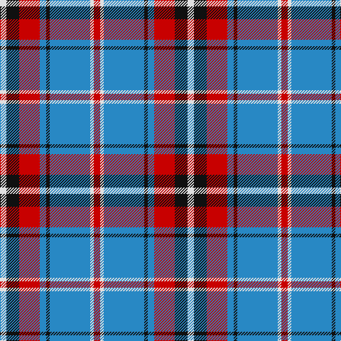

**Bands:** [RWBKBRKW](/stripes/rwbkbrkw/) · **Stripes:** [R W T K T R K W](/stripes/stripes8/) R W T K T R K W

This was sourced from tartans-authority.  It is a [8 band tartan](/bands/bands8/).

Original link http://www.tartansauthority.com/tartan-ferret/display/10464/

## Thread count
LN/9 K18 R29 B9 K5 B57 LN5 R/9

## Palette
Each colour and its ΔE from the base-6 reference it is a variant of.

| Colour | Shade | Base | ΔE (OKLab) |
|---|---|---|---|
| B | <code style="background-color:#2888C4;">#2888C4</code> `#2888C4` | B <code style="background-color:#2A418A;">#2A418A</code> | 0.21 |
| K | <code style="background-color:#101010;">#101010</code> `#101010` | K <code style="background-color:#000000;">#000000</code> | 0.17 |
| LN | <code style="background-color:#E0E0E0;">#E0E0E0</code> `#E0E0E0` | W <code style="background-color:#F7F7F7;">#F7F7F7</code> | 0.07 |
| R | <code style="background-color:#C80000;">#C80000</code> `#C80000` | R <code style="background-color:#CC0000;">#CC0000</code> | 0.01 |

# Sample pattern

## Nearest tartans

The nearest existing variants by ΔTartan distance.

1. [Lord Arran (Corporate)](/setts/s9/r3dy1w12dy2db2dy2db14w2db2~x2/) — ΔT 0.82
1. [Yale College, Wrexham](/setts/s8/t57k5t9m29k18w9m9w5/) — ΔT 0.83
1. [Yusra (Malay) (Personal)](/setts/s7/r12ly3w14dt10ly2dt24r2~x2/) — ΔT 0.85
1. [Downside (Corporate)](/setts/s6/r4o41k5w14k18r4~x2/) — ΔT 0.95
1. [Yusra Personal Tartan Tartan Number: 10455. Earliest known date: 6th April 2011 The colours used in the design are based on the colours of the Malaysian flag (blue/navy, red, yellow and white/cream) to represent the country of origin of part of the Yusra family. A woven sample of this tartan has been received by the Scottish Register of Tartans for permanent preservation in the National Archives of Scotland. See products available Copyright © Blair Urquhart, Comrie, 2015](/setts/s7/r12k3w14dt10k2dt24r2~x2/) — ΔT 1.02
1. [Virtuoso (Corporate)](/setts/s9/r4w4k4w4k4w4k2o23w2~x2/) — ΔT 1.03
1. [Unnamed](/setts/s10/r18ly2b6ly2b4ly2b12ly3r4g2~x2/) — ΔT 1.05
1. [Clemens and August (Personal)](/setts/s8/w32db3r4db3r8db32w3db4~x2/) — ΔT 1.09
1. [Kinnaird](/setts/s8/lb33k4lb4k5lb4k7db41r4~x2/) — ΔT 1.09
1. [Thompson Navy Trade Tartan Tartan Number: 1443. Earliest known date: Oregon Possibly designed by Councillor John Hannay himself. No other information is available. See products available Copyright © Blair Urquhart, Comrie, 2015](/setts/s7/m3db15w13dy6db2dy2m2~x2/) — ΔT 1.12

## Neighbour map

Every grey dot is one of 14313 variants placed by the first two principal components of the ΔTartan feature space (44% of its variance). Red is this tartan; blue dots are its nearest — click one to open its page.

<svg viewBox="0 0 640 380" role="img" style="max-width:100%;height:auto;border:1px solid #e0e0e0;border-radius:4px;display:block" xmlns="http://www.w3.org/2000/svg"><image href="/nn/cloud.v1.png" width="640" height="380"/><a href="/setts/s9/r3dy1w12dy2db2dy2db14w2db2~x2/"><circle cx="225.4" cy="143.3" r="4" fill="#3465a4"><title>Lord Arran (Corporate)</title></circle></a><a href="/setts/s8/t57k5t9m29k18w9m9w5/"><circle cx="224.0" cy="166.8" r="4" fill="#3465a4"><title>Yale College, Wrexham</title></circle></a><a href="/setts/s7/r12ly3w14dt10ly2dt24r2~x2/"><circle cx="230.2" cy="180.7" r="4" fill="#3465a4"><title>Yusra (Malay) (Personal)</title></circle></a><a href="/setts/s6/r4o41k5w14k18r4~x2/"><circle cx="224.4" cy="181.9" r="4" fill="#3465a4"><title>Downside (Corporate)</title></circle></a><a href="/setts/s7/r12k3w14dt10k2dt24r2~x2/"><circle cx="228.2" cy="182.9" r="4" fill="#3465a4"><title>Yusra Personal Tartan Tartan Number: 10455. Earliest known date: 6th April 2011 The colours used in the design are based on the colours of the Malaysian flag (blue/navy, red, yellow and white/cream) to represent the country of origin of part of the Yusra family. A woven sample of this tartan has been received by the Scottish Register of Tartans for permanent preservation in the National Archives of Scotland. See products available Copyright © Blair Urquhart, Comrie, 2015</title></circle></a><a href="/setts/s9/r4w4k4w4k4w4k2o23w2~x2/"><circle cx="217.7" cy="144.4" r="4" fill="#3465a4"><title>Virtuoso (Corporate)</title></circle></a><a href="/setts/s10/r18ly2b6ly2b4ly2b12ly3r4g2~x2/"><circle cx="204.4" cy="167.2" r="4" fill="#3465a4"><title>Unnamed</title></circle></a><a href="/setts/s8/w32db3r4db3r8db32w3db4~x2/"><circle cx="229.0" cy="148.3" r="4" fill="#3465a4"><title>Clemens and August (Personal)</title></circle></a><a href="/setts/s8/lb33k4lb4k5lb4k7db41r4~x2/"><circle cx="203.1" cy="157.1" r="4" fill="#3465a4"><title>Kinnaird</title></circle></a><a href="/setts/s7/m3db15w13dy6db2dy2m2~x2/"><circle cx="159.6" cy="189.2" r="4" fill="#3465a4"><title>Thompson Navy Trade Tartan Tartan Number: 1443. Earliest known date: Oregon Possibly designed by Councillor John Hannay himself. No other information is available. See products available Copyright © Blair Urquhart, Comrie, 2015</title></circle></a><circle cx="226.2" cy="167.1" r="5" fill="#c00000"/></svg>

ID: /setts/s8/r9w5t57k5t9r29k18w9/
