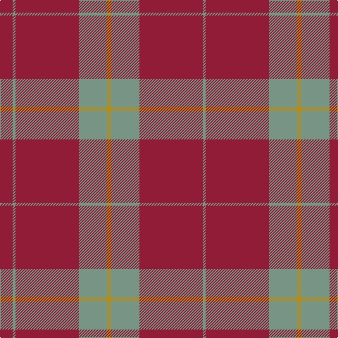

**Bands:** [GRGYGRGR](/stripes/grgygrgr/) · **Stripes:** [Y R Y LO Y R Y R](/stripes/stripes8/) Y R Y LO Y R Y R

This was sourced from register-of-tartans.  It is a [8 band tartan](/bands/bands8/).

Original link https://www.tartanregister.gov.uk/tartanDetails.aspx?ref=1787

## Register references

External register numbers recorded for this tartan.

- Scottish Register of Tartans: [1787](https://www.tartanregister.gov.uk/tartanDetails.aspx?ref=1787)
- Scottish Tartans Authority (ITI): 6254

## Thread count
DRa/18 LG4 DRa90 LG40 DY6 LG40 DRa90 LG/4

## Palette
Each colour and its ΔE from the base-6 reference it is a variant of.

| Colour | Shade | Base | ΔE (OKLab) |
|---|---|---|---|
| B | <code style="background-color:#5C8CA8;">#5C8CA8</code> `#5C8CA8` | B <code style="background-color:#2A418A;">#2A418A</code> | 0.23 |
| DR | <code style="background-color:#880000;">#880000</code> `#880000` | R <code style="background-color:#CC0000;">#CC0000</code> | 0.15 |
| DRa | <code style="background-color:#901C38;">#901C38</code> `#901C38` | R <code style="background-color:#CC0000;">#CC0000</code> | 0.13 |
| DY | <code style="background-color:#BC8C00;">#BC8C00</code> `#BC8C00` | Y <code style="background-color:#F2BF00;">#F2BF00</code> | 0.16 |
| G | <code style="background-color:#005448;">#005448</code> `#005448` | G <code style="background-color:#006100;">#006100</code> | 0.10 |
| LG | <code style="background-color:#789484;">#789484</code> `#789484` | G <code style="background-color:#006100;">#006100</code> | 0.24 |

# Sample pattern

## Nearest tartans

The nearest existing variants by ΔTartan distance.

1. [Hunt (Personal)](/setts/s5/r9y2r45y20lo3~x2/) — ΔT 0.99
1. [Monica](/setts/s6/r3o10r3o4r20lb1~x4/) — ΔT 1.06
1. [Crawford](/setts/s7/m6lb2m30g12m3g12m3~x2/) — ΔT 1.39
1. [Baluchistan Fitzgerald Regimental Tartan Tartan Number: 1524. Earliest known date: 1983 Based on Rothesay dating possibly early 1900s. Adopted by the Baluch Regiment, Northern India, Fitzgerald being the name of the commanding officer at that time and has since become the Fitxgerald tartan. See products available Copyright © Blair Urquhart, Comrie, 2015](/setts/s9/m5y20m5y3m4y5m36y1w4~x2/) — ΔT 1.40
1. [Crawford (Clan)](/setts/s7/m6w2m30g12m3g12m3~x2/) — ΔT 1.52
1. [MacKintosh, Red](/setts/s6/r24g5r3g9r3db1~x4/) — ΔT 1.64
1. [MacGregor Hunting Glengyle Clan Tartan Tartan Number: 1285. Earliest known date: 1960 This is the usual MacGregor sett but with a darker crimson background colour. The story goes that Alasdair MacGregor of Cardney wanted to make tartan from the wool of his own sheep. His initial dyeing attempt produced a shocking pink colour, so he dyed the wool a second time to get this dark crimson colour. He liked the result so much that he had a bolt of cloth woven and the Cardney MacGregors have worn it ever since. The addition of the term 'Hunting' to the name is, apparently a commercial attribution. Notes from the STA, quoting Sir Malcolm MacGregor of MacGregor (2006) See products available Copyright © Blair Urquhart, Comrie, 2015](/setts/s6/m96g42m16g17k4lb6/) — ΔT 1.73
1. [Washington State University Cougar](/setts/s7/m6lb3n6o10m38lb2n4/) — ΔT 1.74
1. [MacKintosh, Plaid](/setts/s6/r16db6r2g6r2db1~x2/) — ΔT 1.79
1. [MacDonell of Keppoch](/setts/s11/r8g2r6db1r2db1r8g12r14db1r2~x2/) — ΔT 1.79

## Neighbour map

Every grey dot is one of 14313 variants placed by the first two principal components of the ΔTartan feature space (44% of its variance). Red is this tartan; blue dots are its nearest — click one to open its page.

<svg viewBox="0 0 640 380" role="img" style="max-width:100%;height:auto;border:1px solid #e0e0e0;border-radius:4px;display:block" xmlns="http://www.w3.org/2000/svg"><image href="/nn/cloud.v1.png" width="640" height="380"/><a href="/setts/s5/r9y2r45y20lo3~x2/"><circle cx="517.0" cy="209.2" r="4" fill="#3465a4"><title>Hunt (Personal)</title></circle></a><a href="/setts/s6/r3o10r3o4r20lb1~x4/"><circle cx="462.4" cy="199.3" r="4" fill="#3465a4"><title>Monica</title></circle></a><a href="/setts/s7/m6lb2m30g12m3g12m3~x2/"><circle cx="427.1" cy="203.6" r="4" fill="#3465a4"><title>Crawford</title></circle></a><a href="/setts/s9/m5y20m5y3m4y5m36y1w4~x2/"><circle cx="475.0" cy="151.2" r="4" fill="#3465a4"><title>Baluchistan Fitzgerald Regimental Tartan Tartan Number: 1524. Earliest known date: 1983 Based on Rothesay dating possibly early 1900s. Adopted by the Baluch Regiment, Northern India, Fitzgerald being the name of the commanding officer at that time and has since become the Fitxgerald tartan. See products available Copyright © Blair Urquhart, Comrie, 2015</title></circle></a><a href="/setts/s7/m6w2m30g12m3g12m3~x2/"><circle cx="421.1" cy="200.5" r="4" fill="#3465a4"><title>Crawford (Clan)</title></circle></a><a href="/setts/s6/r24g5r3g9r3db1~x4/"><circle cx="490.4" cy="183.9" r="4" fill="#3465a4"><title>MacKintosh, Red</title></circle></a><a href="/setts/s6/m96g42m16g17k4lb6/"><circle cx="430.1" cy="167.9" r="4" fill="#3465a4"><title>MacGregor Hunting Glengyle Clan Tartan Tartan Number: 1285. Earliest known date: 1960 This is the usual MacGregor sett but with a darker crimson background colour. The story goes that Alasdair MacGregor of Cardney wanted to make tartan from the wool of his own sheep. His initial dyeing attempt produced a shocking pink colour, so he dyed the wool a second time to get this dark crimson colour. He liked the result so much that he had a bolt of cloth woven and the Cardney MacGregors have worn it ever since. The addition of the term 'Hunting' to the name is, apparently a commercial attribution. Notes from the STA, quoting Sir Malcolm MacGregor of MacGregor (2006) See products available Copyright © Blair Urquhart, Comrie, 2015</title></circle></a><a href="/setts/s7/m6lb3n6o10m38lb2n4/"><circle cx="444.0" cy="165.1" r="4" fill="#3465a4"><title>Washington State University Cougar</title></circle></a><a href="/setts/s6/r16db6r2g6r2db1~x2/"><circle cx="403.1" cy="201.9" r="4" fill="#3465a4"><title>MacKintosh, Plaid</title></circle></a><a href="/setts/s11/r8g2r6db1r2db1r8g12r14db1r2~x2/"><circle cx="462.9" cy="189.4" r="4" fill="#3465a4"><title>MacDonell of Keppoch</title></circle></a><circle cx="500.9" cy="195.9" r="5" fill="#c00000"/></svg>

ID: /setts/s8/r9y2r45y20lo3y20r45y2~x2/
