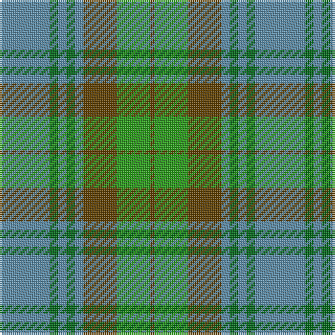

This page is one **sett** — a single exact thread-count. It belongs to the [tartan](/tartans/t12gi2t2gi2t2dy8g8dy1/)
(the same proportion at any scale), whose colour order is pattern [BGBGBGGG](/stripes/bgbgbggg/).

Sourced from house-of-tartan.  It is a [8 stripe tartan](/stripes/stripes8/).

Original link http://www.house-of-tartan.scotland.net/house/TartanViewjs.asp?colr=Def&tnam=136

## Thread count
B/24 G4 B4 G4 B4 T16 Ga16 T/2

## Palette

Palette: <strong>Tartan Register</strong>
<table><thead><tr><th>Colour</th><th>Threads</th><th>Shade</th><th>Base</th><th>OKLCh</th></tr></thead><tbody><tr><td>B/</td><td style="text-align:right;font-variant-numeric:tabular-nums">24</td><td><code style="background-color:#5C8CA8;">#5C8CA8</code> <small style="color:#888">#5C8CA8</small></td><td>B <code style="background-color:#2A418A;">#2A418A</code></td><td><small style="color:#888">oklch(61.7% 0.067 235.0)</small></td></tr><tr><td>G</td><td style="text-align:right;font-variant-numeric:tabular-nums">4</td><td><code style="background-color:#006818;">#006818</code> <small style="color:#888">#006818</small></td><td>G <code style="background-color:#006100;">#006100</code></td><td><small style="color:#888">oklch(45.0% 0.142 145.0)</small></td></tr><tr><td>B</td><td style="text-align:right;font-variant-numeric:tabular-nums">4</td><td><code style="background-color:#5C8CA8;">#5C8CA8</code> <small style="color:#888">#5C8CA8</small></td><td>B <code style="background-color:#2A418A;">#2A418A</code></td><td><small style="color:#888">oklch(61.7% 0.067 235.0)</small></td></tr><tr><td>G</td><td style="text-align:right;font-variant-numeric:tabular-nums">4</td><td><code style="background-color:#006818;">#006818</code> <small style="color:#888">#006818</small></td><td>G <code style="background-color:#006100;">#006100</code></td><td><small style="color:#888">oklch(45.0% 0.142 145.0)</small></td></tr><tr><td>B</td><td style="text-align:right;font-variant-numeric:tabular-nums">4</td><td><code style="background-color:#5C8CA8;">#5C8CA8</code> <small style="color:#888">#5C8CA8</small></td><td>B <code style="background-color:#2A418A;">#2A418A</code></td><td><small style="color:#888">oklch(61.7% 0.067 235.0)</small></td></tr><tr><td>T</td><td style="text-align:right;font-variant-numeric:tabular-nums">16</td><td><code style="background-color:#604000;">#604000</code> <small style="color:#888">#604000</small></td><td>G <code style="background-color:#006100;">#006100</code></td><td><small style="color:#888">oklch(39.8% 0.083 76.8)</small></td></tr><tr><td>Ga</td><td style="text-align:right;font-variant-numeric:tabular-nums">16</td><td><code style="background-color:#289C18;">#289C18</code> <small style="color:#888">#289C18</small></td><td>G <code style="background-color:#006100;">#006100</code></td><td><small style="color:#888">oklch(60.6% 0.191 141.6)</small></td></tr><tr><td>T/</td><td style="text-align:right;font-variant-numeric:tabular-nums">2</td><td><code style="background-color:#604000;">#604000</code> <small style="color:#888">#604000</small></td><td>G <code style="background-color:#006100;">#006100</code></td><td><small style="color:#888">oklch(39.8% 0.083 76.8)</small></td></tr></tbody></table>

# Sample pattern

## Nearest tartans

The nearest existing variants by ΔTartan distance, with this tartan at the top so the swatches line up against it.

ΔTartan

Tartan

Sett

—

<a href="/ttd/edit/#slug=t12gi2t2gi2t2dy8g8dy1~x2">Universal Ancient International Tartan Tartan Number: 136. Earliest known date: Canada This design is different in warp and weft. The display gives the general appearance only. Produced to celebrate American tourism is Scotland. The colours are taken from the flags of the two nations and the Atlantic Ocean that separates them. See products available Copyright © Blair Urquhart, Comrie, 2015</a> <a class="nn-out" href="/setts/s8/t12gi2t2gi2t2dy8g8dy1~x2/" title="open its dictionary page">↗</a>

0.64

<a href="/ttd/edit/#slug=t12dg2t2dg2t2dy8g8dy1~x2">Universal Ancient</a> <a class="nn-out" href="/setts/s8/t12dg2t2dg2t2dy8g8dy1~x2/" title="open its dictionary page">↗</a>

0.93

<a href="/ttd/edit/#slug=g32o7g7o16db32ly3o8~x2">Strange Of Balcaskie</a> <a class="nn-out" href="/setts/s7/g32o7g7o16db32ly3o8~x2/" title="open its dictionary page">↗</a>

0.96

<a href="/ttd/edit/#slug=yi12dg2yi2dg2yi2dy8y8dy1~x2">Ancient Universal (Fashion?)</a> <a class="nn-out" href="/setts/s8/yi12dg2yi2dg2yi2dy8y8dy1~x2/" title="open its dictionary page">↗</a>

1.12

<a href="/ttd/edit/#slug=t12g2t2g2t2o8gi8o1~x2">Universal, Ancient</a> <a class="nn-out" href="/setts/s8/t12g2t2g2t2o8gi8o1~x2/" title="open its dictionary page">↗</a>

1.19

<a href="/ttd/edit/#slug=t4dg26gi8t8gi8g3t2~x2">Valley of the Green (The ) Canadian Tartan Tartan Number: 148. Earliest known date: 1968 Specimen from Miss K Sinclair 1968 See products available Copyright © Blair Urquhart, Comrie, 2015</a> <a class="nn-out" href="/setts/s7/t4dg26gi8t8gi8g3t2~x2/" title="open its dictionary page">↗</a>

1.20

<a href="/ttd/edit/#slug=db4o7ly3o12g15o5db20o5g4o2~x2">Tupper., Sir Charles..</a> <a class="nn-out" href="/setts/s10/db4o7ly3o12g15o5db20o5g4o2~x2/" title="open its dictionary page">↗</a>

1.22

<a href="/ttd/edit/#slug=gi2lo1gi12lb6g12r1~x4">City of Vancouver (Commemorative)</a> <a class="nn-out" href="/setts/s6/gi2lo1gi12lb6g12r1~x4/" title="open its dictionary page">↗</a>

1.26

<a href="/ttd/edit/#slug=t32r3t3r3t3r10g24ri3~x2">Gammell (Personal)</a> <a class="nn-out" href="/setts/s8/t32r3t3r3t3r10g24ri3~x2/" title="open its dictionary page">↗</a>

1.34

<a href="/ttd/edit/#slug=db3o7g2r2g14o2g2db3~x2">Daks, Tartan-Loden</a> <a class="nn-out" href="/setts/s8/db3o7g2r2g14o2g2db3~x2/" title="open its dictionary page">↗</a>

1.39

<a href="/ttd/edit/#slug=b30ly3dy11ly3g33r6~x2">Balfour Hunting</a> <a class="nn-out" href="/setts/s6/b30ly3dy11ly3g33r6~x2/" title="open its dictionary page">↗</a>

## Neighbour map

Every grey dot is one of 14359 variants placed by the first two principal components of the ΔTartan feature space (44% of its variance). Red is this tartan; blue dots are its nearest — click one to open its page.

<svg viewBox="0 0 640 380" role="img" style="max-width:100%;height:auto;border:1px solid #e0e0e0;border-radius:4px;display:block" xmlns="http://www.w3.org/2000/svg"><image href="/nn/cloud.v1.png" width="640" height="380"/><a href="/setts/s8/t12dg2t2dg2t2dy8g8dy1~x2/"><circle cx="254.5" cy="219.6" r="4" fill="#3465a4"><title>Universal Ancient</title></circle></a><a href="/setts/s7/g32o7g7o16db32ly3o8~x2/"><circle cx="237.9" cy="236.3" r="4" fill="#3465a4"><title>Strange Of Balcaskie</title></circle></a><a href="/setts/s8/yi12dg2yi2dg2yi2dy8y8dy1~x2/"><circle cx="283.4" cy="227.7" r="4" fill="#3465a4"><title>Ancient Universal (Fashion?)</title></circle></a><a href="/setts/s8/t12g2t2g2t2o8gi8o1~x2/"><circle cx="290.1" cy="235.3" r="4" fill="#3465a4"><title>Universal, Ancient</title></circle></a><a href="/setts/s7/t4dg26gi8t8gi8g3t2~x2/"><circle cx="278.8" cy="224.8" r="4" fill="#3465a4"><title>Valley of the Green (The ) Canadian Tartan Tartan Number: 148. Earliest known date: 1968 Specimen from Miss K Sinclair 1968 See products available Copyright © Blair Urquhart, Comrie, 2015</title></circle></a><a href="/setts/s10/db4o7ly3o12g15o5db20o5g4o2~x2/"><circle cx="241.9" cy="224.6" r="4" fill="#3465a4"><title>Tupper., Sir Charles..</title></circle></a><a href="/setts/s6/gi2lo1gi12lb6g12r1~x4/"><circle cx="246.1" cy="215.0" r="4" fill="#3465a4"><title>City of Vancouver (Commemorative)</title></circle></a><a href="/setts/s8/t32r3t3r3t3r10g24ri3~x2/"><circle cx="303.4" cy="202.3" r="4" fill="#3465a4"><title>Gammell (Personal)</title></circle></a><a href="/setts/s8/db3o7g2r2g14o2g2db3~x2/"><circle cx="304.6" cy="239.6" r="4" fill="#3465a4"><title>Daks, Tartan-Loden</title></circle></a><a href="/setts/s6/b30ly3dy11ly3g33r6~x2/"><circle cx="216.8" cy="209.7" r="4" fill="#3465a4"><title>Balfour Hunting</title></circle></a><circle cx="264.9" cy="222.2" r="5" fill="#c00000"/></svg>

ID: /setts/s8/t12gi2t2gi2t2dy8g8dy1~x2/
