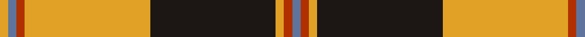
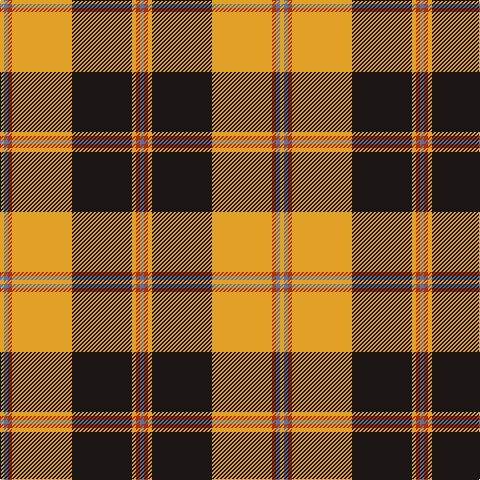

This page is one **sett** — a single exact thread-count. It belongs to the [tartan](/tartans/t1r1lo1k15lo15r1t1lo1/)
(the same proportion at any scale), whose colour order is pattern [BRYKYRBY](/stripes/brykyrby/).

Sourced from register-of-tartans.  It is a [8 stripe tartan](/stripes/stripes8/).

Original link https://www.tartanregister.gov.uk/tartanDetails.aspx?ref=11503

## Register references

External register numbers recorded for this tartan.

- Scottish Register of Tartans: [11503](https://www.tartanregister.gov.uk/tartanDetails.aspx?ref=11503)

## Thread count
Y/4 B4 R4 Y60 K60 Y4 R4 B/4

## Palette

Palette: <strong>Tartan Register</strong>
<table><thead><tr><th>Colour</th><th>Threads</th><th>Shade</th><th>Base</th><th>OKLCh</th></tr></thead><tbody><tr><td>Y/</td><td style="text-align:right;font-variant-numeric:tabular-nums">4</td><td><code style="background-color:#E0A126;">#E0A126</code> <small style="color:#888">#E0A126</small></td><td>Y <code style="background-color:#F2BF00;">#F2BF00</code></td><td><small style="color:#888">oklch(75.1% 0.146 78.3)</small></td></tr><tr><td>B</td><td style="text-align:right;font-variant-numeric:tabular-nums">4</td><td><code style="background-color:#5F749C;">#5F749C</code> <small style="color:#888">#5F749C</small></td><td>B <code style="background-color:#2A418A;">#2A418A</code></td><td><small style="color:#888">oklch(55.8% 0.067 262.9)</small></td></tr><tr><td>R</td><td style="text-align:right;font-variant-numeric:tabular-nums">4</td><td><code style="background-color:#B03000;">#B03000</code> <small style="color:#888">#B03000</small></td><td>R <code style="background-color:#CC0000;">#CC0000</code></td><td><small style="color:#888">oklch(50.3% 0.171 36.3)</small></td></tr><tr><td>Y</td><td style="text-align:right;font-variant-numeric:tabular-nums">60</td><td><code style="background-color:#E0A126;">#E0A126</code> <small style="color:#888">#E0A126</small></td><td>Y <code style="background-color:#F2BF00;">#F2BF00</code></td><td><small style="color:#888">oklch(75.1% 0.146 78.3)</small></td></tr><tr><td>K</td><td style="text-align:right;font-variant-numeric:tabular-nums">60</td><td><code style="background-color:#1C1714;">#1C1714</code> <small style="color:#888">#1C1714</small></td><td>K <code style="background-color:#000000;">#000000</code></td><td><small style="color:#888">oklch(20.9% 0.010 52.9)</small></td></tr><tr><td>Y</td><td style="text-align:right;font-variant-numeric:tabular-nums">4</td><td><code style="background-color:#E0A126;">#E0A126</code> <small style="color:#888">#E0A126</small></td><td>Y <code style="background-color:#F2BF00;">#F2BF00</code></td><td><small style="color:#888">oklch(75.1% 0.146 78.3)</small></td></tr><tr><td>R</td><td style="text-align:right;font-variant-numeric:tabular-nums">4</td><td><code style="background-color:#B03000;">#B03000</code> <small style="color:#888">#B03000</small></td><td>R <code style="background-color:#CC0000;">#CC0000</code></td><td><small style="color:#888">oklch(50.3% 0.171 36.3)</small></td></tr><tr><td>B/</td><td style="text-align:right;font-variant-numeric:tabular-nums">4</td><td><code style="background-color:#5F749C;">#5F749C</code> <small style="color:#888">#5F749C</small></td><td>B <code style="background-color:#2A418A;">#2A418A</code></td><td><small style="color:#888">oklch(55.8% 0.067 262.9)</small></td></tr></tbody></table>

# Sample pattern

## Nearest tartans

The nearest existing variants by ΔTartan distance, with this tartan at the top so the swatches line up against it.

ΔTartan

Tartan

Sett

—

<a href="/ttd/edit/#slug=t1r1lo1k15lo15r1t1lo1~x4">Pittsburgh St Andrew's Society</a> <a class="nn-out" href="/setts/s8/t1r1lo1k15lo15r1t1lo1~x4/" title="open its dictionary page">↗</a>

1.04

<a href="/ttd/edit/#slug=g18w3ly1r2ly1r3ly1r10~x4">Brisbane (Artefact)</a> <a class="nn-out" href="/setts/s8/g18w3ly1r2ly1r3ly1r10~x4/" title="open its dictionary page">↗</a>

1.09

<a href="/ttd/edit/#slug=r2lb10k15lo36lb2k2lb2~x2">Unidentified (ex Tony Murray)</a> <a class="nn-out" href="/setts/s7/r2lb10k15lo36lb2k2lb2~x2/" title="open its dictionary page">↗</a>

1.10

<a href="/ttd/edit/#slug=r15k1ly2db3r2k1ly15~x6">Scrymgeour</a> <a class="nn-out" href="/setts/s7/r15k1ly2db3r2k1ly15~x6/" title="open its dictionary page">↗</a>

1.10

<a href="/ttd/edit/#slug=r15k1ly2db3r2k1ly15~x3">Scrymgeour</a> <a class="nn-out" href="/setts/s7/r15k1ly2db3r2k1ly15~x3/" title="open its dictionary page">↗</a>

1.19

<a href="/ttd/edit/#slug=o10lb2lg3lb2do24lb4do4o34do2lb3do2~x2">Fort William (Fashion)</a> <a class="nn-out" href="/setts/s11/o10lb2lg3lb2do24lb4do4o34do2lb3do2~x2/" title="open its dictionary page">↗</a>

1.19

<a href="/ttd/edit/#slug=r1lb5k8o18lb1k1lb1~x4">Merrick, Camel</a> <a class="nn-out" href="/setts/s7/r1lb5k8o18lb1k1lb1~x4/" title="open its dictionary page">↗</a>

1.21

<a href="/ttd/edit/#slug=do2w2k6do3k2o14k1o1~x4">Braemar or Blair Atholl</a> <a class="nn-out" href="/setts/s8/do2w2k6do3k2o14k1o1~x4/" title="open its dictionary page">↗</a>

1.23

<a href="/ttd/edit/#slug=w2k35g30k3lo30k2lo4k2lo30k3w2">Vaughan (Welsh Series)</a> <a class="nn-out" href="/setts/s11/w2k35g30k3lo30k2lo4k2lo30k3w2/" title="open its dictionary page">↗</a>

1.29

<a href="/ttd/edit/#slug=k44lb3lo16lb2lo2lb2lo2y10k3y8~x2">Wcwm 1399</a> <a class="nn-out" href="/setts/s10/k44lb3lo16lb2lo2lb2lo2y10k3y8~x2/" title="open its dictionary page">↗</a>

1.29

<a href="/ttd/edit/#slug=dg5r4dg17lt5r32lt5dg17r4dg5w2~x2">Wilson's No.005</a> <a class="nn-out" href="/setts/s10/dg5r4dg17lt5r32lt5dg17r4dg5w2~x2/" title="open its dictionary page">↗</a>

## Neighbour map

Every grey dot is one of 14299 variants placed by the first two principal components of the ΔTartan feature space (44% of its variance). Red is this tartan; blue dots are its nearest — click one to open its page.

<svg viewBox="0 0 640 380" role="img" style="max-width:100%;height:auto;border:1px solid #e0e0e0;border-radius:4px;display:block" xmlns="http://www.w3.org/2000/svg"><image href="/nn/cloud.v1.png" width="640" height="380"/><a href="/setts/s8/g18w3ly1r2ly1r3ly1r10~x4/"><circle cx="282.8" cy="138.0" r="4" fill="#3465a4"><title>Brisbane (Artefact)</title></circle></a><a href="/setts/s7/r2lb10k15lo36lb2k2lb2~x2/"><circle cx="292.3" cy="137.7" r="4" fill="#3465a4"><title>Unidentified (ex Tony Murray)</title></circle></a><a href="/setts/s7/r15k1ly2db3r2k1ly15~x6/"><circle cx="267.0" cy="149.1" r="4" fill="#3465a4"><title>Scrymgeour</title></circle></a><a href="/setts/s7/r15k1ly2db3r2k1ly15~x3/"><circle cx="267.0" cy="149.1" r="4" fill="#3465a4"><title>Scrymgeour</title></circle></a><a href="/setts/s11/o10lb2lg3lb2do24lb4do4o34do2lb3do2~x2/"><circle cx="298.4" cy="127.1" r="4" fill="#3465a4"><title>Fort William (Fashion)</title></circle></a><a href="/setts/s7/r1lb5k8o18lb1k1lb1~x4/"><circle cx="295.4" cy="142.8" r="4" fill="#3465a4"><title>Merrick, Camel</title></circle></a><a href="/setts/s8/do2w2k6do3k2o14k1o1~x4/"><circle cx="256.5" cy="154.6" r="4" fill="#3465a4"><title>Braemar or Blair Atholl</title></circle></a><a href="/setts/s11/w2k35g30k3lo30k2lo4k2lo30k3w2/"><circle cx="235.6" cy="128.5" r="4" fill="#3465a4"><title>Vaughan (Welsh Series)</title></circle></a><a href="/setts/s10/k44lb3lo16lb2lo2lb2lo2y10k3y8~x2/"><circle cx="287.7" cy="112.6" r="4" fill="#3465a4"><title>Wcwm 1399</title></circle></a><a href="/setts/s10/dg5r4dg17lt5r32lt5dg17r4dg5w2~x2/"><circle cx="261.7" cy="148.5" r="4" fill="#3465a4"><title>Wilson's No.005</title></circle></a><circle cx="284.0" cy="129.0" r="5" fill="#c00000"/></svg>

ID: /setts/s8/t1r1lo1k15lo15r1t1lo1~x4/
