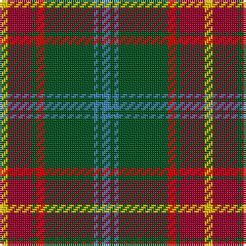

In pattern [BGBGRGRY](/stripes/bgbgrgry/).

This was sourced from register-of-tartans.  It is a [8 stripe tartan](/stripes/stripes8/).

Original link https://www.tartanregister.gov.uk/tartanDetails.aspx?ref=2808

## Also known as

This cloth is also recorded under:

- Manitoba

## Register references

External register numbers recorded for this tartan.

- Scottish Register of Tartans: [2808](https://www.tartanregister.gov.uk/tartanDetails.aspx?ref=2808)
- Scottish Tartans World Register: 146

## Thread count
Y/4 DR12 G2 R4 G24 B2 G2 B/4

## Palette
Each colour and the base-6 reference it is a variant of.

| Colour | Shade | Base |
|---|---|---|
| B | <code style="background-color:#3C82AF;">#3C82AF</code> `oklch(58.1% 0.099 239.8)` <small>#3C82AF</small> | B <code style="background-color:#2A418A;">#2A418A</code> |
| DR | <code style="background-color:#960028;">#960028</code> `oklch(42.7% 0.171 18.3)` <small>#960028</small> | R <code style="background-color:#CC0000;">#CC0000</code> |
| G | <code style="background-color:#005020;">#005020</code> `oklch(37.7% 0.105 149.6)` <small>#005020</small> | G <code style="background-color:#006100;">#006100</code> |
| R | <code style="background-color:#DC0000;">#DC0000</code> `oklch(56.2% 0.230 29.2)` <small>#DC0000</small> | R <code style="background-color:#CC0000;">#CC0000</code> |
| Y | <code style="background-color:#E8C000;">#E8C000</code> `oklch(81.9% 0.168 93.7)` <small>#E8C000</small> | Y <code style="background-color:#F2BF00;">#F2BF00</code> |

# Sample pattern

## Nearest tartans

The nearest existing variants by ΔTartan distance.

1. [Manitoba District Tartan Tartan Number: 146. Earliest known date: 1962 The tartan as it would appear with red in place of green, the 'G' of green having been interpreted as 'Gules'. The designer, Hugh Kirkwood Rankine, clearly intended a green stripe. This version can be found in the shops. See products available Copyright © Blair Urquhart, Comrie, 2015](/setts/s8/t2g1t1g12r2g1m6ly2~x2/) — ΔT 0.48
1. [Manitoba District Tartan Tartan Number: 144. Earliest known date: 1962 The official recording of the sett shows the letter G for the dark green stripe. In heraldic terms this means 'Gules' - red. The designer, Hugh Kirkwood Rankine, clearly intended dark green and this is reproduced here.It was given Royal Assent in 1962. See products available Copyright © Blair Urquhart, Comrie, 2015](/setts/s8/t2g1t1g12dg2g1r6ly2~x4/) — ΔT 0.91
1. [Manitoba](/setts/s8/t2g1t1g12r2g1r6ly2~x2/) — ΔT 0.94
1. [Connacht #2](/setts/s8/r1o1dg6o15dy2o1dy6w1~x4/) — ΔT 0.96
1. [Ware/Warr (Name)](/setts/s8/b9w2dg30o6r2o2r2o6~x2/) — ΔT 0.98
1. [Bryan Wedding (Personal)](/setts/s6/dy30ly5b10k10w2k2~x2/) — ΔT 1.05
1. [Newfoundland (District)](/setts/s7/r6dg4do14w4do7dg30lo4~x2/) — ΔT 1.12
1. [Bryan Wedding (Personal)](/setts/s6/dy30ly5t10k10w2k2~x2/) — ΔT 1.15
1. [MacCall/McCall](/setts/s8/r3k2r3g12r3w1r1g1~x4/) — ΔT 1.16
1. [Chisholm Hunting #2](/setts/s10/dy5w3dy30db6g3db3g3db3g15r3~x2/) — ΔT 1.16

## Neighbour map

Every grey dot is one of 14299 variants placed by the first two principal components of the ΔTartan feature space (44% of its variance). Red is this tartan; blue dots are its nearest — click one to open its page.

<svg viewBox="0 0 640 380" role="img" style="max-width:100%;height:auto;border:1px solid #e0e0e0;border-radius:4px;display:block" xmlns="http://www.w3.org/2000/svg"><image href="/nn/cloud.v1.png" width="640" height="380"/><a href="/setts/s8/t2g1t1g12r2g1m6ly2~x2/"><circle cx="274.3" cy="163.3" r="4" fill="#3465a4"><title>Manitoba District Tartan Tartan Number: 146. Earliest known date: 1962 The tartan as it would appear with red in place of green, the 'G' of green having been interpreted as 'Gules'. The designer, Hugh Kirkwood Rankine, clearly intended a green stripe. This version can be found in the shops. See products available Copyright © Blair Urquhart, Comrie, 2015</title></circle></a><a href="/setts/s8/t2g1t1g12dg2g1r6ly2~x4/"><circle cx="280.6" cy="173.0" r="4" fill="#3465a4"><title>Manitoba District Tartan Tartan Number: 144. Earliest known date: 1962 The official recording of the sett shows the letter G for the dark green stripe. In heraldic terms this means 'Gules' - red. The designer, Hugh Kirkwood Rankine, clearly intended dark green and this is reproduced here.It was given Royal Assent in 1962. See products available Copyright © Blair Urquhart, Comrie, 2015</title></circle></a><a href="/setts/s8/t2g1t1g12r2g1r6ly2~x2/"><circle cx="268.9" cy="161.7" r="4" fill="#3465a4"><title>Manitoba</title></circle></a><a href="/setts/s8/r1o1dg6o15dy2o1dy6w1~x4/"><circle cx="284.5" cy="143.4" r="4" fill="#3465a4"><title>Connacht #2</title></circle></a><a href="/setts/s8/b9w2dg30o6r2o2r2o6~x2/"><circle cx="277.2" cy="144.8" r="4" fill="#3465a4"><title>Ware/Warr (Name)</title></circle></a><a href="/setts/s6/dy30ly5b10k10w2k2~x2/"><circle cx="267.9" cy="171.8" r="4" fill="#3465a4"><title>Bryan Wedding (Personal)</title></circle></a><a href="/setts/s7/r6dg4do14w4do7dg30lo4~x2/"><circle cx="237.5" cy="199.6" r="4" fill="#3465a4"><title>Newfoundland (District)</title></circle></a><a href="/setts/s6/dy30ly5t10k10w2k2~x2/"><circle cx="252.7" cy="161.5" r="4" fill="#3465a4"><title>Bryan Wedding (Personal)</title></circle></a><a href="/setts/s8/r3k2r3g12r3w1r1g1~x4/"><circle cx="307.8" cy="182.7" r="4" fill="#3465a4"><title>MacCall/McCall</title></circle></a><a href="/setts/s10/dy5w3dy30db6g3db3g3db3g15r3~x2/"><circle cx="268.1" cy="172.7" r="4" fill="#3465a4"><title>Chisholm Hunting #2</title></circle></a><circle cx="274.2" cy="164.0" r="5" fill="#c00000"/></svg>

ID: /setts/s8/t2dg1t1dg12r2dg1r6ly2~x2/
