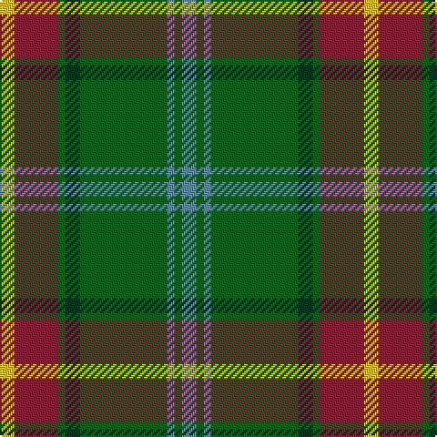

In pattern [BGBGGGRY](/stripes/bgbgggry/).

This was sourced from house-of-tartan.  It is a [8 stripe tartan](/stripes/stripes8/).

Original link http://www.house-of-tartan.scotland.net/house/TartanViewjs.asp?colr=Def&tnam=144

## Thread count
Y/8 DR24 G4 DG8 G48 B4 G4 B/8

## Palette
Each colour and its ΔE from the base-6 reference it is a variant of.

| Colour | Shade | Base | ΔE (OKLab) |
|---|---|---|---|
| B | <code style="background-color:#5C8CA8;">#5C8CA8</code> `#5C8CA8` | B <code style="background-color:#2A418A;">#2A418A</code> | 0.23 |
| DG | <code style="background-color:#003820;">#003820</code> `#003820` | G <code style="background-color:#006100;">#006100</code> | 0.15 |
| DR | <code style="background-color:#901C38;">#901C38</code> `#901C38` | R <code style="background-color:#CC0000;">#CC0000</code> | 0.13 |
| G | <code style="background-color:#006818;">#006818</code> `#006818` | G <code style="background-color:#006100;">#006100</code> | 0.02 |
| Y | <code style="background-color:#E8C000;">#E8C000</code> `#E8C000` | Y <code style="background-color:#F2BF00;">#F2BF00</code> | 0.02 |

# Sample pattern

## Nearest tartans

The nearest existing variants by ΔTartan distance.

1. [Manitoba](/setts/s8/t2g1t1g12dg2g1m6ly2~x4/) — ΔT 0.57
1. [Manitoba District Tartan Tartan Number: 146. Earliest known date: 1962 The tartan as it would appear with red in place of green, the 'G' of green having been interpreted as 'Gules'. The designer, Hugh Kirkwood Rankine, clearly intended a green stripe. This version can be found in the shops. See products available Copyright © Blair Urquhart, Comrie, 2015](/setts/s8/t2g1t1g12r2g1m6ly2~x2/) — ΔT 0.69
1. [Manitoba](/setts/s8/t2g1t1g12r2g1r6ly2~x2/) — ΔT 0.72
1. [O'Neill (Name)](/setts/s8/w6g5r5g45k4lo24k4g5~x2/) — ΔT 0.84
1. [Manitoba Red](/setts/s8/t2dg1t1dg12r2dg1r6ly2~x2/) — ΔT 0.91
1. [Sinclair](/setts/s7/g10r3g30y10w2db15r4~x2/) — ΔT 1.01
1. [Tennessee](/setts/s10/r2db10w1m1g1r1g6m1g10w1~x2/) — ΔT 1.02
1. [Botherston (Name)](/setts/s8/r2lo24r2lo3r2g24k8ly2~x2/) — ΔT 1.07
1. [Chisholm Hunting #2](/setts/s10/dy5w3dy30db6g3db3g3db3g15r3~x2/) — ΔT 1.10
1. [Boucherville (Tartan de..) District Tartan Tartan Number: 2119. Earliest known date: 1990 From the notes accompanying the petition for accreditation. "Les symboles ont cette remarquable propriete de reunir en une expression imagee des notions diverses. Ils refletent l'histoire, les croyances, les idealogies et les aspirations de groupes humains habitant un territoire precis. Les tisserands, c'est nous tous....!" See products available Copyright © Blair Urquhart, Comrie, 2015](/setts/s9/g20ly2o5w4g2o2g2o2db6~x2/) — ΔT 1.12

## Neighbour map

Every grey dot is one of 14299 variants placed by the first two principal components of the ΔTartan feature space (44% of its variance). Red is this tartan; blue dots are its nearest — click one to open its page.

<svg viewBox="0 0 640 380" role="img" style="max-width:100%;height:auto;border:1px solid #e0e0e0;border-radius:4px;display:block" xmlns="http://www.w3.org/2000/svg"><image href="/nn/cloud.v1.png" width="640" height="380"/><a href="/setts/s8/t2g1t1g12dg2g1m6ly2~x4/"><circle cx="267.4" cy="167.1" r="4" fill="#3465a4"><title>Manitoba</title></circle></a><a href="/setts/s8/t2g1t1g12r2g1m6ly2~x2/"><circle cx="274.3" cy="163.3" r="4" fill="#3465a4"><title>Manitoba District Tartan Tartan Number: 146. Earliest known date: 1962 The tartan as it would appear with red in place of green, the 'G' of green having been interpreted as 'Gules'. The designer, Hugh Kirkwood Rankine, clearly intended a green stripe. This version can be found in the shops. See products available Copyright © Blair Urquhart, Comrie, 2015</title></circle></a><a href="/setts/s8/t2g1t1g12r2g1r6ly2~x2/"><circle cx="268.9" cy="161.7" r="4" fill="#3465a4"><title>Manitoba</title></circle></a><a href="/setts/s8/w6g5r5g45k4lo24k4g5~x2/"><circle cx="299.6" cy="167.3" r="4" fill="#3465a4"><title>O'Neill (Name)</title></circle></a><a href="/setts/s8/t2dg1t1dg12r2dg1r6ly2~x2/"><circle cx="274.2" cy="164.0" r="4" fill="#3465a4"><title>Manitoba Red</title></circle></a><a href="/setts/s7/g10r3g30y10w2db15r4~x2/"><circle cx="289.3" cy="189.5" r="4" fill="#3465a4"><title>Sinclair</title></circle></a><a href="/setts/s10/r2db10w1m1g1r1g6m1g10w1~x2/"><circle cx="247.3" cy="162.6" r="4" fill="#3465a4"><title>Tennessee</title></circle></a><a href="/setts/s8/r2lo24r2lo3r2g24k8ly2~x2/"><circle cx="226.9" cy="162.0" r="4" fill="#3465a4"><title>Botherston (Name)</title></circle></a><a href="/setts/s10/dy5w3dy30db6g3db3g3db3g15r3~x2/"><circle cx="268.1" cy="172.7" r="4" fill="#3465a4"><title>Chisholm Hunting #2</title></circle></a><a href="/setts/s9/g20ly2o5w4g2o2g2o2db6~x2/"><circle cx="258.4" cy="163.8" r="4" fill="#3465a4"><title>Boucherville (Tartan de..) District Tartan Tartan Number: 2119. Earliest known date: 1990 From the notes accompanying the petition for accreditation. &quot;Les symboles ont cette remarquable propriete de reunir en une expression imagee des notions diverses. Ils refletent l'histoire, les croyances, les idealogies et les aspirations de groupes humains habitant un territoire precis. Les tisserands, c'est nous tous....!&quot; See products available Copyright © Blair Urquhart, Comrie, 2015</title></circle></a><circle cx="280.6" cy="173.0" r="5" fill="#c00000"/></svg>

ID: /setts/s8/t2g1t1g12dg2g1r6ly2~x4/
