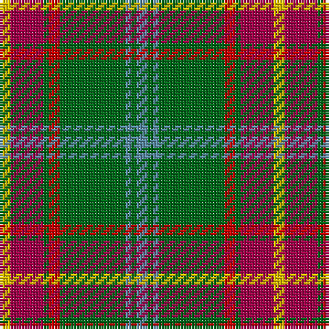

In pattern [BGBGRGRY](/stripes/bgbgrgry/).

This was sourced from house-of-tartan.  It is a [8 stripe tartan](/stripes/stripes8/).

Original link http://www.house-of-tartan.scotland.net/house/TartanViewjs.asp?colr=Def&tnam=146

## Thread count
Y/4 R12 G2 Ra4 G24 B2 G2 B/4

## Palette
Each colour and the base-6 reference it is a variant of.

| Colour | Shade | Base |
|---|---|---|
| B | <code style="background-color:#5C8CA8;">#5C8CA8</code> `oklch(61.7% 0.067 235.0)` <small>#5C8CA8</small> | B <code style="background-color:#2A418A;">#2A418A</code> |
| G | <code style="background-color:#006818;">#006818</code> `oklch(45.0% 0.142 145.0)` <small>#006818</small> | G <code style="background-color:#006100;">#006100</code> |
| R | <code style="background-color:#A00048;">#A00048</code> `oklch(45.4% 0.182 5.3)` <small>#A00048</small> | R <code style="background-color:#CC0000;">#CC0000</code> |
| Ra | <code style="background-color:#C80000;">#C80000</code> `oklch(52.3% 0.215 29.2)` <small>#C80000</small> | R <code style="background-color:#CC0000;">#CC0000</code> |
| Y | <code style="background-color:#E8C000;">#E8C000</code> `oklch(81.9% 0.168 93.7)` <small>#E8C000</small> | Y <code style="background-color:#F2BF00;">#F2BF00</code> |

# Sample pattern

## Nearest tartans

The nearest existing variants by ΔTartan distance.

1. [Manitoba Red](/setts/s8/t2dg1t1dg12r2dg1r6ly2~x2/) — ΔT 0.48
1. [Manitoba](/setts/s8/t2g1t1g12r2g1r6ly2~x2/) — ΔT 0.52
1. [Manitoba District Tartan Tartan Number: 144. Earliest known date: 1962 The official recording of the sett shows the letter G for the dark green stripe. In heraldic terms this means 'Gules' - red. The designer, Hugh Kirkwood Rankine, clearly intended dark green and this is reproduced here.It was given Royal Assent in 1962. See products available Copyright © Blair Urquhart, Comrie, 2015](/setts/s8/t2g1t1g12dg2g1r6ly2~x4/) — ΔT 0.69
1. [Manitoba](/setts/s8/t2g1t1g12dg2g1m6ly2~x4/) — ΔT 0.90
1. [Connacht #2](/setts/s8/r1o1dg6o15dy2o1dy6w1~x4/) — ΔT 0.92
1. [Botherston (Name)](/setts/s8/r2lo24r2lo3r2g24k8ly2~x2/) — ΔT 1.02
1. [O'Neill (Name)](/setts/s8/w6g5r5g45k4lo24k4g5~x2/) — ΔT 1.12
1. [Unidentified Plaid 6](/setts/s10/r4t3r32db30r4g32r3g32r3g3~x2/) — ΔT 1.15
1. [Tennessee](/setts/s10/r2db10w1m1g1r1g6m1g10w1~x2/) — ΔT 1.15
1. [Newfoundland](/setts/s7/r6g4do14w4do7g30lo4~x2/) — ΔT 1.19

## Neighbour map

Every grey dot is one of 14299 variants placed by the first two principal components of the ΔTartan feature space (44% of its variance). Red is this tartan; blue dots are its nearest — click one to open its page.

<svg viewBox="0 0 640 380" role="img" style="max-width:100%;height:auto;border:1px solid #e0e0e0;border-radius:4px;display:block" xmlns="http://www.w3.org/2000/svg"><image href="/nn/cloud.v1.png" width="640" height="380"/><a href="/setts/s8/t2dg1t1dg12r2dg1r6ly2~x2/"><circle cx="274.2" cy="164.0" r="4" fill="#3465a4"><title>Manitoba Red</title></circle></a><a href="/setts/s8/t2g1t1g12r2g1r6ly2~x2/"><circle cx="268.9" cy="161.7" r="4" fill="#3465a4"><title>Manitoba</title></circle></a><a href="/setts/s8/t2g1t1g12dg2g1r6ly2~x4/"><circle cx="280.6" cy="173.0" r="4" fill="#3465a4"><title>Manitoba District Tartan Tartan Number: 144. Earliest known date: 1962 The official recording of the sett shows the letter G for the dark green stripe. In heraldic terms this means 'Gules' - red. The designer, Hugh Kirkwood Rankine, clearly intended dark green and this is reproduced here.It was given Royal Assent in 1962. See products available Copyright © Blair Urquhart, Comrie, 2015</title></circle></a><a href="/setts/s8/t2g1t1g12dg2g1m6ly2~x4/"><circle cx="267.4" cy="167.1" r="4" fill="#3465a4"><title>Manitoba</title></circle></a><a href="/setts/s8/r1o1dg6o15dy2o1dy6w1~x4/"><circle cx="284.5" cy="143.4" r="4" fill="#3465a4"><title>Connacht #2</title></circle></a><a href="/setts/s8/r2lo24r2lo3r2g24k8ly2~x2/"><circle cx="226.9" cy="162.0" r="4" fill="#3465a4"><title>Botherston (Name)</title></circle></a><a href="/setts/s8/w6g5r5g45k4lo24k4g5~x2/"><circle cx="299.6" cy="167.3" r="4" fill="#3465a4"><title>O'Neill (Name)</title></circle></a><a href="/setts/s10/r4t3r32db30r4g32r3g32r3g3~x2/"><circle cx="261.3" cy="183.0" r="4" fill="#3465a4"><title>Unidentified Plaid 6</title></circle></a><a href="/setts/s10/r2db10w1m1g1r1g6m1g10w1~x2/"><circle cx="247.3" cy="162.6" r="4" fill="#3465a4"><title>Tennessee</title></circle></a><a href="/setts/s7/r6g4do14w4do7g30lo4~x2/"><circle cx="233.0" cy="196.9" r="4" fill="#3465a4"><title>Newfoundland</title></circle></a><circle cx="274.3" cy="163.3" r="5" fill="#c00000"/></svg>

ID: /setts/s8/t2g1t1g12r2g1m6ly2~x2/
