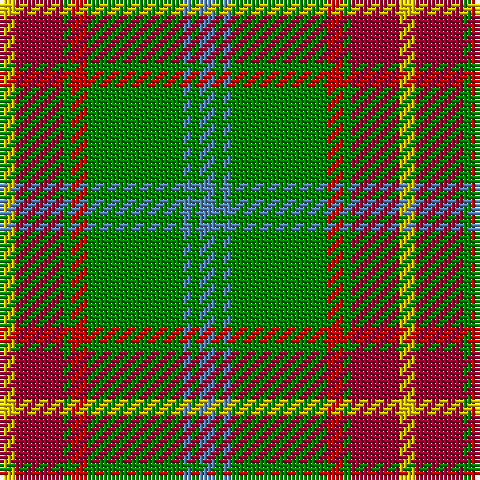

This page is one **sett** — a single exact thread-count. It belongs to the [tartan](/tartans/y2dr6g1r2g12b1g1b2/)
(the same proportion at any scale), whose colour order is pattern [BGBGRGRY](/stripes/bgbgrgry/).

Sourced from weddslist.  It is a [8 stripe tartan](/stripes/stripes8/).

Original link http://www.weddslist.com/cgi-bin/tartans/pg.pl?source=sts

## Also known as

This cloth is also recorded under:

- Manitoba

## Thread count
Y/4 DR12 G2 R4 G24 B2 G2 B/4

## Palette
Each colour and the base-6 reference it is a variant of.

| Colour | Shade | Base |
|---|---|---|
| B | <code style="background-color:#5480B0;">#5480B0</code> `oklch(58.8% 0.089 251.5)` <small>#5480B0</small> | B <code style="background-color:#2A418A;">#2A418A</code> |
| DR | <code style="background-color:#900030;">#900030</code> `oklch(41.6% 0.166 13.6)` <small>#900030</small> | R <code style="background-color:#CC0000;">#CC0000</code> |
| G | <code style="background-color:#008000;">#008000</code> `oklch(52.0% 0.177 142.5)` <small>#008000</small> | G <code style="background-color:#006100;">#006100</code> |
| R | <code style="background-color:#C00000;">#C00000</code> `oklch(50.7% 0.208 29.2)` <small>#C00000</small> | R <code style="background-color:#CC0000;">#CC0000</code> |
| Y | <code style="background-color:#F0C000;">#F0C000</code> `oklch(82.7% 0.169 90.5)` <small>#F0C000</small> | Y <code style="background-color:#F2BF00;">#F2BF00</code> |

# Sample pattern

## Nearest tartans

The nearest existing variants by ΔTartan distance, with this tartan at the top so the swatches line up against it.

ΔTartan

Tartan

Sett

—

<a href="/ttd/edit/#slug=t2g1t1g12r2g1r6ly2~x2">Manitoba</a> <a class="nn-out" href="/setts/s8/t2g1t1g12r2g1r6ly2~x2/" title="open its dictionary page">↗</a>

0.52

<a href="/ttd/edit/#slug=t2g1t1g12r2g1m6ly2~x2">Manitoba District Tartan Tartan Number: 146. Earliest known date: 1962 The tartan as it would appear with red in place of green, the 'G' of green having been interpreted as 'Gules'. The designer, Hugh Kirkwood Rankine, clearly intended a green stripe. This version can be found in the shops. See products available Copyright © Blair Urquhart, Comrie, 2015</a> <a class="nn-out" href="/setts/s8/t2g1t1g12r2g1m6ly2~x2/" title="open its dictionary page">↗</a>

0.61

<a href="/ttd/edit/#slug=t2g1t1g12dg2g1m6ly2~x4">Manitoba</a> <a class="nn-out" href="/setts/s8/t2g1t1g12dg2g1m6ly2~x4/" title="open its dictionary page">↗</a>

0.72

<a href="/ttd/edit/#slug=t2g1t1g12dg2g1r6ly2~x4">Manitoba District Tartan Tartan Number: 144. Earliest known date: 1962 The official recording of the sett shows the letter G for the dark green stripe. In heraldic terms this means 'Gules' - red. The designer, Hugh Kirkwood Rankine, clearly intended dark green and this is reproduced here.It was given Royal Assent in 1962. See products available Copyright © Blair Urquhart, Comrie, 2015</a> <a class="nn-out" href="/setts/s8/t2g1t1g12dg2g1r6ly2~x4/" title="open its dictionary page">↗</a>

0.89

<a href="/ttd/edit/#slug=w6g5r5g45k4lo24k4g5~x2">O'Neill (Name)</a> <a class="nn-out" href="/setts/s8/w6g5r5g45k4lo24k4g5~x2/" title="open its dictionary page">↗</a>

0.94

<a href="/ttd/edit/#slug=t2dg1t1dg12r2dg1r6ly2~x2">Manitoba Red</a> <a class="nn-out" href="/setts/s8/t2dg1t1dg12r2dg1r6ly2~x2/" title="open its dictionary page">↗</a>

0.99

<a href="/ttd/edit/#slug=r2lo24r2lo3r2g24k8ly2~x2">Botherston (Name)</a> <a class="nn-out" href="/setts/s8/r2lo24r2lo3r2g24k8ly2~x2/" title="open its dictionary page">↗</a>

1.09

<a href="/ttd/edit/#slug=w6g5r5g45k4o24k4g5~x2">O'Neill</a> <a class="nn-out" href="/setts/s8/w6g5r5g45k4o24k4g5~x2/" title="open its dictionary page">↗</a>

1.10

<a href="/ttd/edit/#slug=r1o1dg6o15dy2o1dy6w1~x4">Connacht #2</a> <a class="nn-out" href="/setts/s8/r1o1dg6o15dy2o1dy6w1~x4/" title="open its dictionary page">↗</a>

1.13

<a href="/ttd/edit/#slug=ly5g14dy4db4dy27g3dy4ly5~x2">Invertere (Daks #2) (Fashion)</a> <a class="nn-out" href="/setts/s8/ly5g14dy4db4dy27g3dy4ly5~x2/" title="open its dictionary page">↗</a>

1.15

<a href="/ttd/edit/#slug=t6g2t2g41dg6g2r21ly6">Manitoba</a> <a class="nn-out" href="/setts/s8/t6g2t2g41dg6g2r21ly6/" title="open its dictionary page">↗</a>

## Neighbour map

Every grey dot is one of 14299 variants placed by the first two principal components of the ΔTartan feature space (44% of its variance). Red is this tartan; blue dots are its nearest — click one to open its page.

<svg viewBox="0 0 640 380" role="img" style="max-width:100%;height:auto;border:1px solid #e0e0e0;border-radius:4px;display:block" xmlns="http://www.w3.org/2000/svg"><image href="/nn/cloud.v1.png" width="640" height="380"/><a href="/setts/s8/t2g1t1g12r2g1m6ly2~x2/"><circle cx="274.3" cy="163.3" r="4" fill="#3465a4"><title>Manitoba District Tartan Tartan Number: 146. Earliest known date: 1962 The tartan as it would appear with red in place of green, the 'G' of green having been interpreted as 'Gules'. The designer, Hugh Kirkwood Rankine, clearly intended a green stripe. This version can be found in the shops. See products available Copyright © Blair Urquhart, Comrie, 2015</title></circle></a><a href="/setts/s8/t2g1t1g12dg2g1m6ly2~x4/"><circle cx="267.4" cy="167.1" r="4" fill="#3465a4"><title>Manitoba</title></circle></a><a href="/setts/s8/t2g1t1g12dg2g1r6ly2~x4/"><circle cx="280.6" cy="173.0" r="4" fill="#3465a4"><title>Manitoba District Tartan Tartan Number: 144. Earliest known date: 1962 The official recording of the sett shows the letter G for the dark green stripe. In heraldic terms this means 'Gules' - red. The designer, Hugh Kirkwood Rankine, clearly intended dark green and this is reproduced here.It was given Royal Assent in 1962. See products available Copyright © Blair Urquhart, Comrie, 2015</title></circle></a><a href="/setts/s8/w6g5r5g45k4lo24k4g5~x2/"><circle cx="299.6" cy="167.3" r="4" fill="#3465a4"><title>O'Neill (Name)</title></circle></a><a href="/setts/s8/t2dg1t1dg12r2dg1r6ly2~x2/"><circle cx="274.2" cy="164.0" r="4" fill="#3465a4"><title>Manitoba Red</title></circle></a><a href="/setts/s8/r2lo24r2lo3r2g24k8ly2~x2/"><circle cx="226.9" cy="162.0" r="4" fill="#3465a4"><title>Botherston (Name)</title></circle></a><a href="/setts/s8/w6g5r5g45k4o24k4g5~x2/"><circle cx="283.5" cy="159.2" r="4" fill="#3465a4"><title>O'Neill</title></circle></a><a href="/setts/s8/r1o1dg6o15dy2o1dy6w1~x4/"><circle cx="284.5" cy="143.4" r="4" fill="#3465a4"><title>Connacht #2</title></circle></a><a href="/setts/s8/ly5g14dy4db4dy27g3dy4ly5~x2/"><circle cx="278.5" cy="194.4" r="4" fill="#3465a4"><title>Invertere (Daks #2) (Fashion)</title></circle></a><a href="/setts/s8/t6g2t2g41dg6g2r21ly6/"><circle cx="289.2" cy="127.4" r="4" fill="#3465a4"><title>Manitoba</title></circle></a><circle cx="268.9" cy="161.7" r="5" fill="#c00000"/></svg>

ID: /setts/s8/t2g1t1g12r2g1r6ly2~x2/
