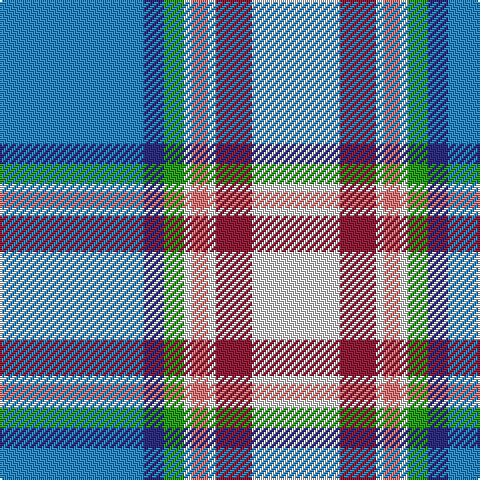

**Bands:** [BBGWRWRW](/stripes/bbgwrwrw/) · **Stripes:** [T DB G W R W R W](/stripes/stripes8/) T DB G W R W R W

This was sourced from tartans-authority.  It is a [8 band tartan](/bands/bands8/).

Original link http://www.tartansauthority.com/tartan-ferret/display/2431/

## Thread count
B/72 DB10 G10 LN4 LR8 LN4 DR18 LN/44

## Palette
Each colour and its ΔE from the base-6 reference it is a variant of.

| Colour | Shade | Base | ΔE (OKLab) |
|---|---|---|---|
| B | <code style="background-color:#2888C4;">#2888C4</code> `#2888C4` | B <code style="background-color:#2A418A;">#2A418A</code> | 0.21 |
| DB | <code style="background-color:#2C2C80;">#2C2C80</code> `#2C2C80` | B <code style="background-color:#2A418A;">#2A418A</code> | 0.06 |
| DR | <code style="background-color:#901C38;">#901C38</code> `#901C38` | R <code style="background-color:#CC0000;">#CC0000</code> | 0.13 |
| G | <code style="background-color:#289C18;">#289C18</code> `#289C18` | G <code style="background-color:#006100;">#006100</code> | 0.19 |
| LN | <code style="background-color:#E0E0E0;">#E0E0E0</code> `#E0E0E0` | W <code style="background-color:#F7F7F7;">#F7F7F7</code> | 0.07 |
| LR | <code style="background-color:#E87878;">#E87878</code> `#E87878` | R <code style="background-color:#CC0000;">#CC0000</code> | 0.19 |

# Sample pattern

## Nearest tartans

The nearest existing variants by ΔTartan distance.

1. [Jubilee, South Canterbury Centre Piping & Dancing Association](/setts/s8/b36db5g5w2r4w2m9w22~x2/) — ΔT 0.59
1. [Jong Nederland Born Union (Corp)](/setts/s10/r2w1r1w13t12ly2k2t2k1ly1~x4/) — ΔT 1.06
1. [WCWM 3947](/setts/s8/o2b30ly3b2o16r2g16w2~x2/) — ΔT 1.12
1. [Morgan in Maryland (USA)](/setts/s9/db4k1lg18y2lg11y11lb18k1r4~x2/) — ΔT 1.15
1. [Forfar](/setts/s10/t3ly1t23w20lo1w4db22t4db4r1~x2/) — ΔT 1.17
1. [Corryvrechan Dress (Corporate)](/setts/s10/t40db12ly2db2t2db2g6w21r2t2~x2/) — ΔT 1.22
1. [Queensferry High (School)](/setts/s9/lr5lb3lb7lr5lb27b8dt43w3lb3/) — ΔT 1.25
1. [Dignan School of Dancing](/setts/s7/lo4r2b32k10dp4lb21dp2~x2/) — ΔT 1.26
1. [Musselburgh Dress (Dance)](/setts/s9/t14db1n3g1n3db1n4w24r1~x4/) — ΔT 1.27
1. [Dignan](/setts/s7/ly2r1t16k5p2w11p1~x4/) — ΔT 1.33

## Neighbour map

Every grey dot is one of 14299 variants placed by the first two principal components of the ΔTartan feature space (44% of its variance). Red is this tartan; blue dots are its nearest — click one to open its page.

<svg viewBox="0 0 640 380" role="img" style="max-width:100%;height:auto;border:1px solid #e0e0e0;border-radius:4px;display:block" xmlns="http://www.w3.org/2000/svg"><image href="/nn/cloud.v1.png" width="640" height="380"/><a href="/setts/s8/b36db5g5w2r4w2m9w22~x2/"><circle cx="189.3" cy="113.5" r="4" fill="#3465a4"><title>Jubilee, South Canterbury Centre Piping &amp; Dancing Association</title></circle></a><a href="/setts/s10/r2w1r1w13t12ly2k2t2k1ly1~x4/"><circle cx="158.8" cy="100.4" r="4" fill="#3465a4"><title>Jong Nederland Born Union (Corp)</title></circle></a><a href="/setts/s8/o2b30ly3b2o16r2g16w2~x2/"><circle cx="216.3" cy="139.4" r="4" fill="#3465a4"><title>WCWM 3947</title></circle></a><a href="/setts/s9/db4k1lg18y2lg11y11lb18k1r4~x2/"><circle cx="171.7" cy="127.3" r="4" fill="#3465a4"><title>Morgan in Maryland (USA)</title></circle></a><a href="/setts/s10/t3ly1t23w20lo1w4db22t4db4r1~x2/"><circle cx="165.7" cy="88.8" r="4" fill="#3465a4"><title>Forfar</title></circle></a><a href="/setts/s10/t40db12ly2db2t2db2g6w21r2t2~x2/"><circle cx="228.7" cy="91.4" r="4" fill="#3465a4"><title>Corryvrechan Dress (Corporate)</title></circle></a><a href="/setts/s9/lr5lb3lb7lr5lb27b8dt43w3lb3/"><circle cx="196.9" cy="122.1" r="4" fill="#3465a4"><title>Queensferry High (School)</title></circle></a><a href="/setts/s7/lo4r2b32k10dp4lb21dp2~x2/"><circle cx="178.3" cy="128.5" r="4" fill="#3465a4"><title>Dignan School of Dancing</title></circle></a><a href="/setts/s9/t14db1n3g1n3db1n4w24r1~x4/"><circle cx="226.4" cy="75.7" r="4" fill="#3465a4"><title>Musselburgh Dress (Dance)</title></circle></a><a href="/setts/s7/ly2r1t16k5p2w11p1~x4/"><circle cx="159.9" cy="115.8" r="4" fill="#3465a4"><title>Dignan</title></circle></a><circle cx="194.5" cy="115.3" r="5" fill="#c00000"/></svg>

ID: /setts/s8/t36db5g5w2r4w2r9w22~x2/
