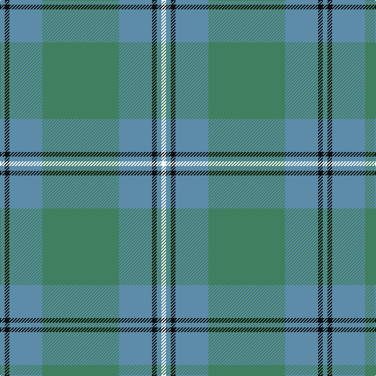

This page is one **sett** — a single exact thread-count. It belongs to the [tartan](/tartans/t3k3t21g49t21k3t3w3/)
(the same proportion at any scale), whose colour order is pattern [BKBGBKBW](/stripes/bkbgbkbw/).

Sourced from register-of-tartans.  It is a [8 stripe tartan](/stripes/stripes8/).

Original link https://www.tartanregister.gov.uk/tartanDetails.aspx?ref=1858

## Register references

External register numbers recorded for this tartan.

- Scottish Register of Tartans: [1858](https://www.tartanregister.gov.uk/tartanDetails.aspx?ref=1858)
- Scottish Tartans Authority (ITI): 733
- Scottish Tartans World Register: 733

## Thread count
B/6 K6 B42 Ga98 B42 K6 B6 W/6

## Palette

Palette: <strong>Tartan Register</strong>
<table><thead><tr><th>Colour</th><th>Threads</th><th>Shade</th><th>Base</th><th>OKLCh</th></tr></thead><tbody><tr><td>B/</td><td style="text-align:right;font-variant-numeric:tabular-nums">6</td><td><code style="background-color:#5C8CA8;">#5C8CA8</code> <small style="color:#888">#5C8CA8</small></td><td>B <code style="background-color:#2A418A;">#2A418A</code></td><td><small style="color:#888">oklch(61.7% 0.067 235.0)</small></td></tr><tr><td>K</td><td style="text-align:right;font-variant-numeric:tabular-nums">6</td><td><code style="background-color:#101010;">#101010</code> <small style="color:#888">#101010</small></td><td>K <code style="background-color:#000000;">#000000</code></td><td><small style="color:#888">oklch(17.3% 0.000 89.9)</small></td></tr><tr><td>B</td><td style="text-align:right;font-variant-numeric:tabular-nums">42</td><td><code style="background-color:#5C8CA8;">#5C8CA8</code> <small style="color:#888">#5C8CA8</small></td><td>B <code style="background-color:#2A418A;">#2A418A</code></td><td><small style="color:#888">oklch(61.7% 0.067 235.0)</small></td></tr><tr><td>Ga</td><td style="text-align:right;font-variant-numeric:tabular-nums">98</td><td><code style="background-color:#408060;">#408060</code> <small style="color:#888">#408060</small></td><td>G <code style="background-color:#006100;">#006100</code></td><td><small style="color:#888">oklch(54.8% 0.084 160.1)</small></td></tr><tr><td>B</td><td style="text-align:right;font-variant-numeric:tabular-nums">42</td><td><code style="background-color:#5C8CA8;">#5C8CA8</code> <small style="color:#888">#5C8CA8</small></td><td>B <code style="background-color:#2A418A;">#2A418A</code></td><td><small style="color:#888">oklch(61.7% 0.067 235.0)</small></td></tr><tr><td>K</td><td style="text-align:right;font-variant-numeric:tabular-nums">6</td><td><code style="background-color:#101010;">#101010</code> <small style="color:#888">#101010</small></td><td>K <code style="background-color:#000000;">#000000</code></td><td><small style="color:#888">oklch(17.3% 0.000 89.9)</small></td></tr><tr><td>B</td><td style="text-align:right;font-variant-numeric:tabular-nums">6</td><td><code style="background-color:#5C8CA8;">#5C8CA8</code> <small style="color:#888">#5C8CA8</small></td><td>B <code style="background-color:#2A418A;">#2A418A</code></td><td><small style="color:#888">oklch(61.7% 0.067 235.0)</small></td></tr><tr><td>W/</td><td style="text-align:right;font-variant-numeric:tabular-nums">6</td><td><code style="background-color:#FCFCFC;">#FCFCFC</code> <small style="color:#888">#FCFCFC</small></td><td>W <code style="background-color:#F7F7F7;">#F7F7F7</code></td><td><small style="color:#888">oklch(99.1% 0.000 89.9)</small></td></tr></tbody></table>

# Sample pattern

## Nearest tartans

The nearest existing variants by ΔTartan distance, with this tartan at the top so the swatches line up against it.

ΔTartan

Tartan

Sett

—

<a href="/ttd/edit/#slug=t3k3t21g49t21k3t3w3~x2">Irvine of Drum</a> <a class="nn-out" href="/setts/s8/t3k3t21g49t21k3t3w3~x2/" title="open its dictionary page">↗</a>

1.32

<a href="/ttd/edit/#slug=lo2n28k2w2k2g26n3g5lo2~x2">Clyde (WCWM Fashion)</a> <a class="nn-out" href="/setts/s9/lo2n28k2w2k2g26n3g5lo2~x2/" title="open its dictionary page">↗</a>

1.34

<a href="/ttd/edit/#slug=lo2t2lo1t18y2t10y10t2y18ly1y2ly2~x2">Yarmouth NS (District)</a> <a class="nn-out" href="/setts/s12/lo2t2lo1t18y2t10y10t2y18ly1y2ly2~x2/" title="open its dictionary page">↗</a>

1.44

<a href="/ttd/edit/#slug=n44o8n8o22lb4o4lb11o2lbi2~x2">Titanium (Fashion)</a> <a class="nn-out" href="/setts/s9/n44o8n8o22lb4o4lb11o2lbi2~x2/" title="open its dictionary page">↗</a>

1.47

<a href="/ttd/edit/#slug=b5lg2b2lg9k3b9g3b3g25lr2~x2">Un-named (D C Dalgliesh) #2</a> <a class="nn-out" href="/setts/s10/b5lg2b2lg9k3b9g3b3g25lr2~x2/" title="open its dictionary page">↗</a>

1.49

<a href="/ttd/edit/#slug=db4g3db2g19t24g1t2~x2">Unidentified 1</a> <a class="nn-out" href="/setts/s7/db4g3db2g19t24g1t2~x2/" title="open its dictionary page">↗</a>

1.52

<a href="/ttd/edit/#slug=g6n2g25n4t25n2t6~x2">Lennox Dress, Purple (Dance)</a> <a class="nn-out" href="/setts/s7/g6n2g25n4t25n2t6~x2/" title="open its dictionary page">↗</a>

1.58

<a href="/ttd/edit/#slug=dg36db3dg3db3dg6n34r4n4~x2">Wcwm 1530</a> <a class="nn-out" href="/setts/s8/dg36db3dg3db3dg6n34r4n4~x2/" title="open its dictionary page">↗</a>

1.64

<a href="/ttd/edit/#slug=db4dg3db2dg19t24dg1t2~x2">Unidentified #6</a> <a class="nn-out" href="/setts/s7/db4dg3db2dg19t24dg1t2~x2/" title="open its dictionary page">↗</a>

1.64

<a href="/ttd/edit/#slug=g13k2g34k6b16r2b16k2g13~x2">Lockhart</a> <a class="nn-out" href="/setts/s9/g13k2g34k6b16r2b16k2g13~x2/" title="open its dictionary page">↗</a>

1.69

<a href="/ttd/edit/#slug=t12g2t2g2t2o8gi8o1~x2">Universal, Ancient</a> <a class="nn-out" href="/setts/s8/t12g2t2g2t2o8gi8o1~x2/" title="open its dictionary page">↗</a>

## Neighbour map

Every grey dot is one of 14359 variants placed by the first two principal components of the ΔTartan feature space (44% of its variance). Red is this tartan; blue dots are its nearest — click one to open its page.

<svg viewBox="0 0 640 380" role="img" style="max-width:100%;height:auto;border:1px solid #e0e0e0;border-radius:4px;display:block" xmlns="http://www.w3.org/2000/svg"><image href="/nn/cloud.v1.png" width="640" height="380"/><a href="/setts/s9/lo2n28k2w2k2g26n3g5lo2~x2/"><circle cx="326.5" cy="179.5" r="4" fill="#3465a4"><title>Clyde (WCWM Fashion)</title></circle></a><a href="/setts/s12/lo2t2lo1t18y2t10y10t2y18ly1y2ly2~x2/"><circle cx="342.4" cy="176.1" r="4" fill="#3465a4"><title>Yarmouth NS (District)</title></circle></a><a href="/setts/s9/n44o8n8o22lb4o4lb11o2lbi2~x2/"><circle cx="379.0" cy="181.6" r="4" fill="#3465a4"><title>Titanium (Fashion)</title></circle></a><a href="/setts/s10/b5lg2b2lg9k3b9g3b3g25lr2~x2/"><circle cx="286.6" cy="189.9" r="4" fill="#3465a4"><title>Un-named (D C Dalgliesh) #2</title></circle></a><a href="/setts/s7/db4g3db2g19t24g1t2~x2/"><circle cx="386.4" cy="207.2" r="4" fill="#3465a4"><title>Unidentified 1</title></circle></a><a href="/setts/s7/g6n2g25n4t25n2t6~x2/"><circle cx="314.4" cy="223.3" r="4" fill="#3465a4"><title>Lennox Dress, Purple (Dance)</title></circle></a><a href="/setts/s8/dg36db3dg3db3dg6n34r4n4~x2/"><circle cx="361.3" cy="218.5" r="4" fill="#3465a4"><title>Wcwm 1530</title></circle></a><a href="/setts/s7/db4dg3db2dg19t24dg1t2~x2/"><circle cx="392.7" cy="212.5" r="4" fill="#3465a4"><title>Unidentified #6</title></circle></a><a href="/setts/s9/g13k2g34k6b16r2b16k2g13~x2/"><circle cx="373.7" cy="213.7" r="4" fill="#3465a4"><title>Lockhart</title></circle></a><a href="/setts/s8/t12g2t2g2t2o8gi8o1~x2/"><circle cx="290.1" cy="235.3" r="4" fill="#3465a4"><title>Universal, Ancient</title></circle></a><circle cx="367.3" cy="200.9" r="5" fill="#c00000"/></svg>

ID: /setts/s8/t3k3t21g49t21k3t3w3~x2/
