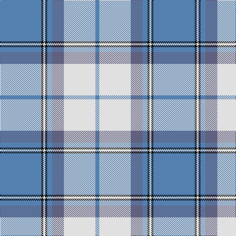

This page is one **sett** — a single exact thread-count. It belongs to the [tartan](/tartans/t42k2w2k2t5n12w32t4/)
(the same proportion at any scale), whose colour order is pattern [BKWKBBWB](/stripes/bkwkbbwb/).

Sourced from weddslist.  It is a [8 stripe tartan](/stripes/stripes8/).

Original link http://www.weddslist.com/cgi-bin/tartans/pg.pl?source=sts

## Thread count
B/84 K4 LN4 K4 B10 N24 LN64 B/8

## Palette

Palette: <strong>Tartan Register</strong> <small style="color:#888">(2 of 4 colours)</small>
<table><thead><tr><th>Colour</th><th>Threads</th><th>Shade</th><th>Base</th><th>OKLCh</th></tr></thead><tbody><tr><td>B/</td><td style="text-align:right;font-variant-numeric:tabular-nums">84</td><td><code style="background-color:#5480B0;">#5480B0</code> <small style="color:#888">#5480B0</small></td><td>B <code style="background-color:#2A418A;">#2A418A</code></td><td><small style="color:#888">oklch(58.8% 0.089 251.5)</small></td></tr><tr><td>K</td><td style="text-align:right;font-variant-numeric:tabular-nums">4</td><td><code style="background-color:#000000;">#000000</code> <small style="color:#888">#000000</small></td><td>K <code style="background-color:#000000;">#000000</code></td><td><small style="color:#888">oklch(0.0% 0.000 0.0)</small></td></tr><tr><td>LN</td><td style="text-align:right;font-variant-numeric:tabular-nums">4</td><td><code style="background-color:#E0E0E0;">#E0E0E0</code> <small style="color:#888">#E0E0E0</small></td><td>W <code style="background-color:#F7F7F7;">#F7F7F7</code></td><td><small style="color:#888">oklch(90.7% 0.000 89.9)</small></td></tr><tr><td>K</td><td style="text-align:right;font-variant-numeric:tabular-nums">4</td><td><code style="background-color:#000000;">#000000</code> <small style="color:#888">#000000</small></td><td>K <code style="background-color:#000000;">#000000</code></td><td><small style="color:#888">oklch(0.0% 0.000 0.0)</small></td></tr><tr><td>B</td><td style="text-align:right;font-variant-numeric:tabular-nums">10</td><td><code style="background-color:#5480B0;">#5480B0</code> <small style="color:#888">#5480B0</small></td><td>B <code style="background-color:#2A418A;">#2A418A</code></td><td><small style="color:#888">oklch(58.8% 0.089 251.5)</small></td></tr><tr><td>N</td><td style="text-align:right;font-variant-numeric:tabular-nums">24</td><td><code style="background-color:#606080;">#606080</code> <small style="color:#888">#606080</small></td><td>B <code style="background-color:#2A418A;">#2A418A</code></td><td><small style="color:#888">oklch(50.2% 0.051 284.4)</small></td></tr><tr><td>LN</td><td style="text-align:right;font-variant-numeric:tabular-nums">64</td><td><code style="background-color:#E0E0E0;">#E0E0E0</code> <small style="color:#888">#E0E0E0</small></td><td>W <code style="background-color:#F7F7F7;">#F7F7F7</code></td><td><small style="color:#888">oklch(90.7% 0.000 89.9)</small></td></tr><tr><td>B/</td><td style="text-align:right;font-variant-numeric:tabular-nums">8</td><td><code style="background-color:#5480B0;">#5480B0</code> <small style="color:#888">#5480B0</small></td><td>B <code style="background-color:#2A418A;">#2A418A</code></td><td><small style="color:#888">oklch(58.8% 0.089 251.5)</small></td></tr></tbody></table>

# Sample pattern

## Nearest tartans

The nearest existing variants by ΔTartan distance, with this tartan at the top so the swatches line up against it.

ΔTartan

Tartan

Sett

—

<a href="/ttd/edit/#slug=t42k2w2k2t5n12w32t4~x2">Longniddry, dress (Turquoise)</a> <a class="nn-out" href="/setts/s8/t42k2w2k2t5n12w32t4~x2/" title="open its dictionary page">↗</a>

0.91

<a href="/ttd/edit/#slug=db41t2w2t2db5b12w31db4~x2">Harmony, Eildon</a> <a class="nn-out" href="/setts/s8/db41t2w2t2db5b12w31db4~x2/" title="open its dictionary page">↗</a>

1.08

<a href="/ttd/edit/#slug=b45ly6b3ly6b3w3db5w3db5w20b2w3~x2">Dunn (Scotland) (Name)</a> <a class="nn-out" href="/setts/s12/b45ly6b3ly6b3w3db5w3db5w20b2w3~x2/" title="open its dictionary page">↗</a>

1.08

<a href="/ttd/edit/#slug=w2db1w15t12w1ly3db1~x6">St. John's (Corporate)</a> <a class="nn-out" href="/setts/s7/w2db1w15t12w1ly3db1~x6/" title="open its dictionary page">↗</a>

1.16

<a href="/ttd/edit/#slug=dt3n2w2n30w30r2w3~x2">Torridon, Royal Blue (Dance)</a> <a class="nn-out" href="/setts/s7/dt3n2w2n30w30r2w3~x2/" title="open its dictionary page">↗</a>

1.18

<a href="/ttd/edit/#slug=w24b24lr6w1db4w20b10lr3w4~x2">Silver (Personal)</a> <a class="nn-out" href="/setts/s9/w24b24lr6w1db4w20b10lr3w4~x2/" title="open its dictionary page">↗</a>

1.19

<a href="/ttd/edit/#slug=r3b2w35b35r2g3~x2">Galloway (Dance)</a> <a class="nn-out" href="/setts/s6/r3b2w35b35r2g3~x2/" title="open its dictionary page">↗</a>

1.21

<a href="/ttd/edit/#slug=t45w4db4w2ly14db2w2db2~x4">Madras 1 (Fashion)</a> <a class="nn-out" href="/setts/s8/t45w4db4w2ly14db2w2db2~x4/" title="open its dictionary page">↗</a>

1.21

<a href="/ttd/edit/#slug=n45lo6n3lo6lb3dp5lb3dp5lb20n2lb3~x2">Dunn</a> <a class="nn-out" href="/setts/s11/n45lo6n3lo6lb3dp5lb3dp5lb20n2lb3~x2/" title="open its dictionary page">↗</a>

1.24

<a href="/ttd/edit/#slug=w4k2w26t23w3t8p3~x2">MacPherson Turquoise Dress Tartan Tartan Number: 8183. Earliest known date: Threadcount and colours aren't 100% original. Generated manually. See products available Copyright © Blair Urquhart, Comrie, 2015</a> <a class="nn-out" href="/setts/s7/w4k2w26t23w3t8p3~x2/" title="open its dictionary page">↗</a>

1.25

<a href="/ttd/edit/#slug=db26w28db14ly3k1ly2k1~x2">Gothenburg/Goteborg</a> <a class="nn-out" href="/setts/s7/db26w28db14ly3k1ly2k1~x2/" title="open its dictionary page">↗</a>

## Neighbour map

Every grey dot is one of 14359 variants placed by the first two principal components of the ΔTartan feature space (44% of its variance). Red is this tartan; blue dots are its nearest — click one to open its page.

<svg viewBox="0 0 640 380" role="img" style="max-width:100%;height:auto;border:1px solid #e0e0e0;border-radius:4px;display:block" xmlns="http://www.w3.org/2000/svg"><image href="/nn/cloud.v1.png" width="640" height="380"/><a href="/setts/s8/db41t2w2t2db5b12w31db4~x2/"><circle cx="285.9" cy="136.0" r="4" fill="#3465a4"><title>Harmony, Eildon</title></circle></a><a href="/setts/s12/b45ly6b3ly6b3w3db5w3db5w20b2w3~x2/"><circle cx="285.9" cy="104.8" r="4" fill="#3465a4"><title>Dunn (Scotland) (Name)</title></circle></a><a href="/setts/s7/w2db1w15t12w1ly3db1~x6/"><circle cx="286.3" cy="154.5" r="4" fill="#3465a4"><title>St. John's (Corporate)</title></circle></a><a href="/setts/s7/dt3n2w2n30w30r2w3~x2/"><circle cx="284.2" cy="142.5" r="4" fill="#3465a4"><title>Torridon, Royal Blue (Dance)</title></circle></a><a href="/setts/s9/w24b24lr6w1db4w20b10lr3w4~x2/"><circle cx="283.1" cy="150.7" r="4" fill="#3465a4"><title>Silver (Personal)</title></circle></a><a href="/setts/s6/r3b2w35b35r2g3~x2/"><circle cx="270.5" cy="144.7" r="4" fill="#3465a4"><title>Galloway (Dance)</title></circle></a><a href="/setts/s8/t45w4db4w2ly14db2w2db2~x4/"><circle cx="352.4" cy="119.4" r="4" fill="#3465a4"><title>Madras 1 (Fashion)</title></circle></a><a href="/setts/s11/n45lo6n3lo6lb3dp5lb3dp5lb20n2lb3~x2/"><circle cx="291.6" cy="117.4" r="4" fill="#3465a4"><title>Dunn</title></circle></a><a href="/setts/s7/w4k2w26t23w3t8p3~x2/"><circle cx="277.7" cy="173.1" r="4" fill="#3465a4"><title>MacPherson Turquoise Dress Tartan Tartan Number: 8183. Earliest known date: Threadcount and colours aren't 100% original. Generated manually. See products available Copyright © Blair Urquhart, Comrie, 2015</title></circle></a><a href="/setts/s7/db26w28db14ly3k1ly2k1~x2/"><circle cx="308.0" cy="133.0" r="4" fill="#3465a4"><title>Gothenburg/Goteborg</title></circle></a><circle cx="296.5" cy="138.3" r="5" fill="#c00000"/></svg>

ID: /setts/s8/t42k2w2k2t5n12w32t4~x2/
