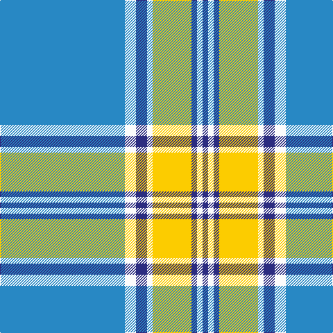

In pattern [BWBWYBWB](/stripes/bwbwybwb/).

This was sourced from tartans-authority.  It is a [8 stripe tartan](/stripes/stripes8/).

Original link http://www.tartansauthority.com/tartan-ferret/display/8600/

## Thread count
B/180 W16 DB16 W8 Y56 DB8 W8 DB/8

## Palette
Each colour and the base-6 reference it is a variant of.

| Colour | Shade | Base |
|---|---|---|
| B | <code style="background-color:#2888C4;">#2888C4</code> `oklch(60.1% 0.125 241.5)` <small>#2888C4</small> | B <code style="background-color:#2A418A;">#2A418A</code> |
| DB | <code style="background-color:#2C2C80;">#2C2C80</code> `oklch(35.0% 0.138 276.6)` <small>#2C2C80</small> | B <code style="background-color:#2A418A;">#2A418A</code> |
| W | <code style="background-color:#FCFCFC;">#FCFCFC</code> `oklch(99.1% 0.000 89.9)` <small>#FCFCFC</small> | W <code style="background-color:#F7F7F7;">#F7F7F7</code> |
| Y | <code style="background-color:#FCCC00;">#FCCC00</code> `oklch(86.2% 0.176 91.5)` <small>#FCCC00</small> | Y <code style="background-color:#F2BF00;">#F2BF00</code> |

# Sample pattern

## Nearest tartans

The nearest existing variants by ΔTartan distance.

1. [Longniddry, dress (Turquoise)](/setts/s8/t42k2w2k2t5n12w32t4~x2/) — ΔT 1.21
1. [Dunn (Scotland) (Name)](/setts/s12/b45ly6b3ly6b3w3db5w3db5w20b2w3~x2/) — ΔT 1.26
1. [D.E.B.S. (Fashion)](/setts/s10/lo15k2lo3k2b50k2lo3k2w10k4~x2/) — ΔT 1.26
1. [Supporter.com](/setts/s7/b120g9r7ly12g33ly33b26/) — ΔT 1.31
1. [MacLintock #2](/setts/s7/n3b2w10b2n6b26k2~x2/) — ΔT 1.38
1. [Alaska Highlanders P & D (Corporate)](/setts/s8/db9lb27db2ly4db2lb10db2w3~x2/) — ΔT 1.41
1. [Goil Dress](/setts/s11/t42db10lo2db2lb2db2t10lb6db2lb3t2~x2/) — ΔT 1.46
1. [Jack Sinclair (Personal)](/setts/s7/b4r2b40k11g2w16r2~x2/) — ΔT 1.54
1. [Torridon, Royal Blue (Dance)](/setts/s7/dt3n2w2n30w30r2w3~x2/) — ΔT 1.54
1. [Glen Moy Tartan Tartan Number: 1293. Earliest known date: pre 1986 A colour variation of the Royal Stewart woven by Edgars, Pitlochry around 1986, named after the place in Angus described as follows: Its mainly Sheep farming in Glen Moy. Off the beaten track, its a very quiet area of the Angus glens close to Cortachy castle and great for walking if you like it to yourself! See products available Copyright © Blair Urquhart, Comrie, 2015](/setts/s12/lb98n12k16w5k5w5k5n28lb16k5lb16w6/) — ΔT 1.56

## Neighbour map

Every grey dot is one of 14299 variants placed by the first two principal components of the ΔTartan feature space (44% of its variance). Red is this tartan; blue dots are its nearest — click one to open its page.

<svg viewBox="0 0 640 380" role="img" style="max-width:100%;height:auto;border:1px solid #e0e0e0;border-radius:4px;display:block" xmlns="http://www.w3.org/2000/svg"><image href="/nn/cloud.v1.png" width="640" height="380"/><a href="/setts/s8/t42k2w2k2t5n12w32t4~x2/"><circle cx="297.4" cy="137.8" r="4" fill="#3465a4"><title>Longniddry, dress (Turquoise)</title></circle></a><a href="/setts/s12/b45ly6b3ly6b3w3db5w3db5w20b2w3~x2/"><circle cx="286.7" cy="104.4" r="4" fill="#3465a4"><title>Dunn (Scotland) (Name)</title></circle></a><a href="/setts/s10/lo15k2lo3k2b50k2lo3k2w10k4~x2/"><circle cx="321.2" cy="107.9" r="4" fill="#3465a4"><title>D.E.B.S. (Fashion)</title></circle></a><a href="/setts/s7/b120g9r7ly12g33ly33b26/"><circle cx="341.0" cy="165.8" r="4" fill="#3465a4"><title>Supporter.com</title></circle></a><a href="/setts/s7/n3b2w10b2n6b26k2~x2/"><circle cx="315.8" cy="169.4" r="4" fill="#3465a4"><title>MacLintock #2</title></circle></a><a href="/setts/s8/db9lb27db2ly4db2lb10db2w3~x2/"><circle cx="333.6" cy="153.4" r="4" fill="#3465a4"><title>Alaska Highlanders P &amp; D (Corporate)</title></circle></a><a href="/setts/s11/t42db10lo2db2lb2db2t10lb6db2lb3t2~x2/"><circle cx="410.5" cy="123.9" r="4" fill="#3465a4"><title>Goil Dress</title></circle></a><a href="/setts/s7/b4r2b40k11g2w16r2~x2/"><circle cx="287.2" cy="119.3" r="4" fill="#3465a4"><title>Jack Sinclair (Personal)</title></circle></a><a href="/setts/s7/dt3n2w2n30w30r2w3~x2/"><circle cx="285.2" cy="141.8" r="4" fill="#3465a4"><title>Torridon, Royal Blue (Dance)</title></circle></a><a href="/setts/s12/lb98n12k16w5k5w5k5n28lb16k5lb16w6/"><circle cx="330.9" cy="101.3" r="4" fill="#3465a4"><title>Glen Moy Tartan Tartan Number: 1293. Earliest known date: pre 1986 A colour variation of the Royal Stewart woven by Edgars, Pitlochry around 1986, named after the place in Angus described as follows: Its mainly Sheep farming in Glen Moy. Off the beaten track, its a very quiet area of the Angus glens close to Cortachy castle and great for walking if you like it to yourself! See products available Copyright © Blair Urquhart, Comrie, 2015</title></circle></a><circle cx="353.3" cy="119.1" r="5" fill="#c00000"/></svg>

ID: /setts/s8/t45w4db4w2ly14db2w2db2~x4/
