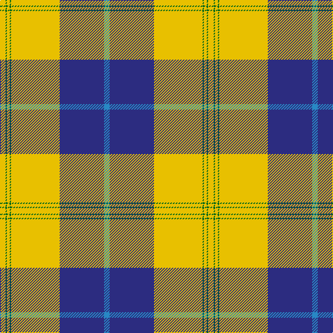

**Bands:** [YGYGYYBB](/stripes/ygygyybb/) · **Stripes:** [LY G LY G LY LY DB T](/stripes/stripes8/) LY G LY G LY LY DB T

This was sourced from tartans-authority.  It is a [8 band tartan](/bands/bands8/).

Original link http://www.tartansauthority.com/tartan-ferret/display/7911/

## Thread count
Y/8 G2 Ya4 G2 Ya64 Ya6 DB64 B/8

## Palette
Each colour and its ΔE from the base-6 reference it is a variant of.

| Colour | Shade | Base | ΔE (OKLab) |
|---|---|---|---|
| B | <code style="background-color:#2888C4;">#2888C4</code> `#2888C4` | B <code style="background-color:#2A418A;">#2A418A</code> | 0.21 |
| DB | <code style="background-color:#2C2C80;">#2C2C80</code> `#2C2C80` | B <code style="background-color:#2A418A;">#2A418A</code> | 0.06 |
| G | <code style="background-color:#006818;">#006818</code> `#006818` | G <code style="background-color:#006100;">#006100</code> | 0.02 |
| Y | <code style="background-color:#E8C000;">#E8C000</code> `#E8C000` | Y <code style="background-color:#F2BF00;">#F2BF00</code> | 0.02 |
| Ya | <code style="background-color:#E8C000;">#E8C000</code> `#E8C000` | Y <code style="background-color:#F2BF00;">#F2BF00</code> | 0.02 |

# Sample pattern

## Nearest tartans

The nearest existing variants by ΔTartan distance.

1. [Drummond of Perth Dress (Dance)](/setts/s9/w50k3g10g11w1k1r20w3r5~x2/) — ΔT 1.15
1. [Fiander, Julian (Personal)](/setts/s10/r6dg2w21dg2lo2k8lo2dg32w1k3~x2/) — ΔT 1.15
1. [Bro-Roazhon](/setts/s11/k28ly1w2ly1k3w17k5w3db2w10g2~x2/) — ΔT 1.17
1. [Pearce Scotch Plaid 4 (Fashion)](/setts/s7/ly6dg36w5b4w30b1w2~x2/) — ΔT 1.21
1. [Caig (Personal)](/setts/s7/w3r2p31g30ly2g2ly1~x2/) — ΔT 1.22
1. [Hohenzollern](/setts/s11/k1w31k4g8r1g2dt7r4k1r4w1~x2/) — ΔT 1.22
1. [Rothesay, Duke of](/setts/s11/r2w28db4w2k6w2g7r4k1r2w1~x2/) — ΔT 1.23
1. [Fiander, Julian (Personal)](/setts/s9/r6g2w21ly2k8ly2g32w1k3~x2/) — ΔT 1.26
1. [Motherwell Football Club. Modern](/setts/s9/lr60k6lr8k2lr8w2r12k49lo4/) — ΔT 1.27
1. [Harris (Personal)](/setts/s11/lo1n8lb2k15lb20r1lb1r1lb8n3lb1~x2/) — ΔT 1.28

## Neighbour map

Every grey dot is one of 14299 variants placed by the first two principal components of the ΔTartan feature space (44% of its variance). Red is this tartan; blue dots are its nearest — click one to open its page.

<svg viewBox="0 0 640 380" role="img" style="max-width:100%;height:auto;border:1px solid #e0e0e0;border-radius:4px;display:block" xmlns="http://www.w3.org/2000/svg"><image href="/nn/cloud.v1.png" width="640" height="380"/><a href="/setts/s9/w50k3g10g11w1k1r20w3r5~x2/"><circle cx="290.1" cy="60.5" r="4" fill="#3465a4"><title>Drummond of Perth Dress (Dance)</title></circle></a><a href="/setts/s10/r6dg2w21dg2lo2k8lo2dg32w1k3~x2/"><circle cx="228.6" cy="80.3" r="4" fill="#3465a4"><title>Fiander, Julian (Personal)</title></circle></a><a href="/setts/s11/k28ly1w2ly1k3w17k5w3db2w10g2~x2/"><circle cx="264.2" cy="81.0" r="4" fill="#3465a4"><title>Bro-Roazhon</title></circle></a><a href="/setts/s7/ly6dg36w5b4w30b1w2~x2/"><circle cx="269.8" cy="114.5" r="4" fill="#3465a4"><title>Pearce Scotch Plaid 4 (Fashion)</title></circle></a><a href="/setts/s7/w3r2p31g30ly2g2ly1~x2/"><circle cx="298.7" cy="109.7" r="4" fill="#3465a4"><title>Caig (Personal)</title></circle></a><a href="/setts/s11/k1w31k4g8r1g2dt7r4k1r4w1~x2/"><circle cx="246.7" cy="56.6" r="4" fill="#3465a4"><title>Hohenzollern</title></circle></a><a href="/setts/s11/r2w28db4w2k6w2g7r4k1r2w1~x2/"><circle cx="276.0" cy="63.6" r="4" fill="#3465a4"><title>Rothesay, Duke of</title></circle></a><a href="/setts/s9/r6g2w21ly2k8ly2g32w1k3~x2/"><circle cx="217.2" cy="86.6" r="4" fill="#3465a4"><title>Fiander, Julian (Personal)</title></circle></a><a href="/setts/s9/lr60k6lr8k2lr8w2r12k49lo4/"><circle cx="293.2" cy="97.4" r="4" fill="#3465a4"><title>Motherwell Football Club. Modern</title></circle></a><a href="/setts/s11/lo1n8lb2k15lb20r1lb1r1lb8n3lb1~x2/"><circle cx="255.5" cy="101.4" r="4" fill="#3465a4"><title>Harris (Personal)</title></circle></a><circle cx="275.8" cy="87.6" r="5" fill="#c00000"/></svg>

ID: /setts/s8/t4db32ly3ly32g1ly2g1ly4~x2/
