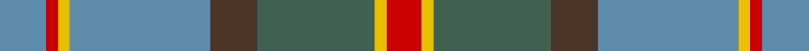

In pattern [BRYBBGYR](/stripes/brybbgyr/).

This was sourced from tartans-authority.  It is a [8 stripe tartan](/stripes/stripes8/).

Original link http://www.tartansauthority.com/tartan-ferret/display/5163/

## Also known as

This cloth is also recorded under:

- Hawaiian

## Attestations

This cloth appears in 2 source records; the oldest owns this page.

- September 1997 — Hawaii (District) (tartans-authority, [record](http://www.tartansauthority.com/tartan-ferret/display/5163/))
- undated — Hawaiian American District Tartan Tartan Number: 5163. Earliest known date: September 1997 Designed in 1997 by Douglas Herring on O'ahu, a member of the Hawaiian Handweavers Hui. It was the winning entry in a contest run by The Caledonian Society of Hawaii to select the State Tartan. Although this beautiful design has yet to be recognized by the Hawaiian state, it is registered in Scotland. Red and yellow symbolise the Monarchy and the fire and lava from which the Hawaiian Islands arise. Brown - the soil. Green - the plant life. Blue - the sky and deep ocean. See products available Copyright © Blair Urquhart, Comrie, 2015 (house-of-tartan, [record](http://www.house-of-tartan.scotland.net/house/TartanViewjs.asp?colr=Def&tnam=5163))

## Thread count
B/16 R4 Y4 B48 T16 N40 Y4 R/12

## Palette
Each colour and the base-6 reference it is a variant of.

| Colour | Shade | Base |
|---|---|---|
| B | <code style="background-color:#5C8CA8;">#5C8CA8</code> `oklch(61.7% 0.067 235.0)` <small>#5C8CA8</small> | B <code style="background-color:#2A418A;">#2A418A</code> |
| N | <code style="background-color:#406054;">#406054</code> `oklch(46.0% 0.042 169.0)` <small>#406054</small> | G <code style="background-color:#006100;">#006100</code> |
| R | <code style="background-color:#C80000;">#C80000</code> `oklch(52.3% 0.215 29.2)` <small>#C80000</small> | R <code style="background-color:#CC0000;">#CC0000</code> |
| T | <code style="background-color:#4C3428;">#4C3428</code> `oklch(34.9% 0.040 47.5)` <small>#4C3428</small> | B <code style="background-color:#2A418A;">#2A418A</code> |
| Y | <code style="background-color:#E8C000;">#E8C000</code> `oklch(81.9% 0.168 93.7)` <small>#E8C000</small> | Y <code style="background-color:#F2BF00;">#F2BF00</code> |

# Sample pattern

## Nearest tartans

The nearest existing variants by ΔTartan distance.

1. [Balfour](/setts/s6/db30ly3o11ly3y33r6~x2/) — ΔT 0.99
1. [Morneau (Quebec), Richard (Personal)](/setts/s10/t29do8g21r3g8t16w3do3w3g8~x2/) — ΔT 1.01
1. [Tasmanian](/setts/s11/m2lr1dg12y1dg1y1dg3y4m3y4ly2~x4/) — ΔT 1.02
1. [Brodie Silver Clan Tartan Tartan Number: 1630. Earliest known date: c.1940-50 Probably a trade design based on Hunting Brodie, that has appeared in the last forty years. It is sometimes referred to as muted Brodie. (P.E. MacDonald, STS 1984) See products available Copyright © Blair Urquhart, Comrie, 2015](/setts/s7/r3n20ly2n20o20lb20r3~x2/) — ΔT 1.03
1. [Hebridean Granite Fashion Tartan Tartan Number: 6821. Earliest known date: 2005 For a new House of Edgar collection. Intended to emulate the gray morning suit perhaps. See products available Copyright © Blair Urquhart, Comrie, 2015](/setts/s8/o3lr4o4do4o18do3n36w3~x2/) — ΔT 1.07
1. [Hebridean Granite (Fashion)](/setts/s8/o3lr4o4k4o18k3n36w3~x2/) — ΔT 1.10
1. [Graeme Heckenberg Hunting](/setts/s7/db3g13lr1o3lr1db10lo1~x2/) — ΔT 1.12
1. [Brodie, Silver](/setts/s7/r3n20ly2n20y20lb20r3~x2/) — ΔT 1.14
1. [Washington DC (Fashion)](/setts/s8/lo5o39r16o5g6o5b32lb5~x2/) — ΔT 1.14
1. [Brodie Silver](/setts/s7/r3n20k2n20o20lb20r3~x2/) — ΔT 1.15

## Neighbour map

Every grey dot is one of 14299 variants placed by the first two principal components of the ΔTartan feature space (44% of its variance). Red is this tartan; blue dots are its nearest — click one to open its page.

<svg viewBox="0 0 640 380" role="img" style="max-width:100%;height:auto;border:1px solid #e0e0e0;border-radius:4px;display:block" xmlns="http://www.w3.org/2000/svg"><image href="/nn/cloud.v1.png" width="640" height="380"/><a href="/setts/s6/db30ly3o11ly3y33r6~x2/"><circle cx="229.2" cy="204.1" r="4" fill="#3465a4"><title>Balfour</title></circle></a><a href="/setts/s10/t29do8g21r3g8t16w3do3w3g8~x2/"><circle cx="232.2" cy="188.7" r="4" fill="#3465a4"><title>Morneau (Quebec), Richard (Personal)</title></circle></a><a href="/setts/s11/m2lr1dg12y1dg1y1dg3y4m3y4ly2~x4/"><circle cx="268.3" cy="168.4" r="4" fill="#3465a4"><title>Tasmanian</title></circle></a><a href="/setts/s7/r3n20ly2n20o20lb20r3~x2/"><circle cx="236.6" cy="214.8" r="4" fill="#3465a4"><title>Brodie Silver Clan Tartan Tartan Number: 1630. Earliest known date: c.1940-50 Probably a trade design based on Hunting Brodie, that has appeared in the last forty years. It is sometimes referred to as muted Brodie. (P.E. MacDonald, STS 1984) See products available Copyright © Blair Urquhart, Comrie, 2015</title></circle></a><a href="/setts/s8/o3lr4o4do4o18do3n36w3~x2/"><circle cx="303.0" cy="173.3" r="4" fill="#3465a4"><title>Hebridean Granite Fashion Tartan Tartan Number: 6821. Earliest known date: 2005 For a new House of Edgar collection. Intended to emulate the gray morning suit perhaps. See products available Copyright © Blair Urquhart, Comrie, 2015</title></circle></a><a href="/setts/s8/o3lr4o4k4o18k3n36w3~x2/"><circle cx="291.6" cy="166.8" r="4" fill="#3465a4"><title>Hebridean Granite (Fashion)</title></circle></a><a href="/setts/s7/db3g13lr1o3lr1db10lo1~x2/"><circle cx="261.7" cy="190.9" r="4" fill="#3465a4"><title>Graeme Heckenberg Hunting</title></circle></a><a href="/setts/s7/r3n20ly2n20y20lb20r3~x2/"><circle cx="221.5" cy="207.7" r="4" fill="#3465a4"><title>Brodie, Silver</title></circle></a><a href="/setts/s8/lo5o39r16o5g6o5b32lb5~x2/"><circle cx="215.9" cy="187.6" r="4" fill="#3465a4"><title>Washington DC (Fashion)</title></circle></a><a href="/setts/s7/r3n20k2n20o20lb20r3~x2/"><circle cx="220.1" cy="207.2" r="4" fill="#3465a4"><title>Brodie Silver</title></circle></a><circle cx="249.8" cy="190.8" r="5" fill="#c00000"/></svg>

ID: /setts/s8/t4r1ly1t12do4y10ly1r3~x4/
