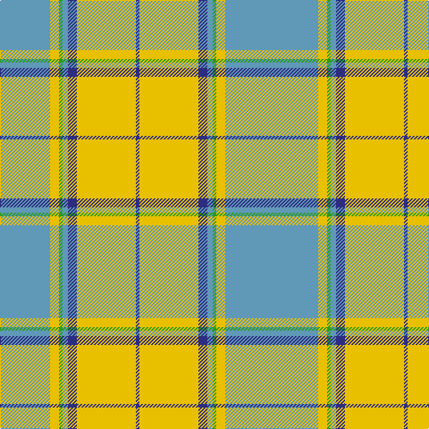

This page is one **sett** — a single exact thread-count. It belongs to the [tartan](/tartans/t4t24ly5g2t3db5ly33db2/)
(the same proportion at any scale), whose colour order is pattern [BBYGBBYB](/stripes/bbygbbyb/).

Sourced from tartans-authority.  It is a [8 stripe tartan](/stripes/stripes8/).

Original link http://www.tartansauthority.com/tartan-ferret/display/6071/

## Thread count
Ba/8 B48 Y10 G4 B6 DB10 Y66 DBa/4

## Palette

Palette: <strong>Tartan Register</strong> <small style="color:#888">(3 of 4 colours)</small>
<table><thead><tr><th>Colour</th><th>Threads</th><th>Shade</th><th>Base</th><th>OKLCh</th></tr></thead><tbody><tr><td>Ba/</td><td style="text-align:right;font-variant-numeric:tabular-nums">8</td><td><code style="background-color:#6098B8;">#6098B8</code> <small style="color:#888">#6098B8</small></td><td>B <code style="background-color:#2A418A;">#2A418A</code></td><td><small style="color:#888">oklch(65.3% 0.076 234.7)</small></td></tr><tr><td>B</td><td style="text-align:right;font-variant-numeric:tabular-nums">48</td><td><code style="background-color:#6098B8;">#6098B8</code> <small style="color:#888">#6098B8</small></td><td>B <code style="background-color:#2A418A;">#2A418A</code></td><td><small style="color:#888">oklch(65.3% 0.076 234.7)</small></td></tr><tr><td>Y</td><td style="text-align:right;font-variant-numeric:tabular-nums">10</td><td><code style="background-color:#E8C000;">#E8C000</code> <small style="color:#888">#E8C000</small></td><td>Y <code style="background-color:#F2BF00;">#F2BF00</code></td><td><small style="color:#888">oklch(81.9% 0.168 93.7)</small></td></tr><tr><td>G</td><td style="text-align:right;font-variant-numeric:tabular-nums">4</td><td><code style="background-color:#289C18;">#289C18</code> <small style="color:#888">#289C18</small></td><td>G <code style="background-color:#006100;">#006100</code></td><td><small style="color:#888">oklch(60.6% 0.191 141.6)</small></td></tr><tr><td>B</td><td style="text-align:right;font-variant-numeric:tabular-nums">6</td><td><code style="background-color:#6098B8;">#6098B8</code> <small style="color:#888">#6098B8</small></td><td>B <code style="background-color:#2A418A;">#2A418A</code></td><td><small style="color:#888">oklch(65.3% 0.076 234.7)</small></td></tr><tr><td>DB</td><td style="text-align:right;font-variant-numeric:tabular-nums">10</td><td><code style="background-color:#2C2C80;">#2C2C80</code> <small style="color:#888">#2C2C80</small></td><td>B <code style="background-color:#2A418A;">#2A418A</code></td><td><small style="color:#888">oklch(35.0% 0.138 276.6)</small></td></tr><tr><td>Y</td><td style="text-align:right;font-variant-numeric:tabular-nums">66</td><td><code style="background-color:#E8C000;">#E8C000</code> <small style="color:#888">#E8C000</small></td><td>Y <code style="background-color:#F2BF00;">#F2BF00</code></td><td><small style="color:#888">oklch(81.9% 0.168 93.7)</small></td></tr><tr><td>DBa/</td><td style="text-align:right;font-variant-numeric:tabular-nums">4</td><td><code style="background-color:#2C2C80;">#2C2C80</code> <small style="color:#888">#2C2C80</small></td><td>B <code style="background-color:#2A418A;">#2A418A</code></td><td><small style="color:#888">oklch(35.0% 0.138 276.6)</small></td></tr></tbody></table>

# Sample pattern

## Nearest tartans

The nearest existing variants by ΔTartan distance, with this tartan at the top so the swatches line up against it.

ΔTartan

Tartan

Sett

—

<a href="/ttd/edit/#slug=t4t24ly5g2t3db5ly33db2~x2">Los Angeles (District)</a> <a class="nn-out" href="/setts/s8/t4t24ly5g2t3db5ly33db2~x2/" title="open its dictionary page">↗</a>

1.32

<a href="/ttd/edit/#slug=g4ly3r2ly22lb22w2lb3k2~x2">Aguilar Pardo, Luis Alejandro (Personal)</a> <a class="nn-out" href="/setts/s8/g4ly3r2ly22lb22w2lb3k2~x2/" title="open its dictionary page">↗</a>

1.47

<a href="/ttd/edit/#slug=o18ly1o2ly1o2db6w4dy1g6~x2">Nickel Lodge Centennial Corporate Tartan Tartan Number: 920. Earliest known date: 1988 1989 See products available Copyright © Blair Urquhart, Comrie, 2015</a> <a class="nn-out" href="/setts/s9/o18ly1o2ly1o2db6w4dy1g6~x2/" title="open its dictionary page">↗</a>

1.47

<a href="/ttd/edit/#slug=lb38dt18lb4ly3g10lo3g4lb3lo17r4~x2">State Seal of Delaware (Fashion)</a> <a class="nn-out" href="/setts/s10/lb38dt18lb4ly3g10lo3g4lb3lo17r4~x2/" title="open its dictionary page">↗</a>

1.49

<a href="/ttd/edit/#slug=w2r12lg5lb35b4r4ly2~x2">Nicolson of the Isles (Personal)</a> <a class="nn-out" href="/setts/s7/w2r12lg5lb35b4r4ly2~x2/" title="open its dictionary page">↗</a>

1.50

<a href="/ttd/edit/#slug=o16ly1o2ly1o2dt6w4dy1dg6~x2">Nickel Lodge Centennial</a> <a class="nn-out" href="/setts/s9/o16ly1o2ly1o2dt6w4dy1dg6~x2/" title="open its dictionary page">↗</a>

1.51

<a href="/ttd/edit/#slug=g3w29g3db3g3db6g13ly3r2~x2">Nova Scotia, dress</a> <a class="nn-out" href="/setts/s9/g3w29g3db3g3db6g13ly3r2~x2/" title="open its dictionary page">↗</a>

1.51

<a href="/ttd/edit/#slug=y18ly1y2ly1y2db6w4o1g6~x2">Nickel Lodge, Centennial</a> <a class="nn-out" href="/setts/s9/y18ly1y2ly1y2db6w4o1g6~x2/" title="open its dictionary page">↗</a>

1.53

<a href="/ttd/edit/#slug=g32r3dy12b3ly3b3lb24lb24k2lb4~x2">Webster (Name)</a> <a class="nn-out" href="/setts/s10/g32r3dy12b3ly3b3lb24lb24k2lb4~x2/" title="open its dictionary page">↗</a>

1.55

<a href="/ttd/edit/#slug=w43k5r3g5ly27dp5~x2">Reekie, Charlene (Personal)</a> <a class="nn-out" href="/setts/s6/w43k5r3g5ly27dp5~x2/" title="open its dictionary page">↗</a>

1.57

<a href="/ttd/edit/#slug=g9k2r4g14w3lp3w23g5ly3~x2">Taylor, dress</a> <a class="nn-out" href="/setts/s9/g9k2r4g14w3lp3w23g5ly3~x2/" title="open its dictionary page">↗</a>

## Neighbour map

Every grey dot is one of 14299 variants placed by the first two principal components of the ΔTartan feature space (44% of its variance). Red is this tartan; blue dots are its nearest — click one to open its page.

<svg viewBox="0 0 640 380" role="img" style="max-width:100%;height:auto;border:1px solid #e0e0e0;border-radius:4px;display:block" xmlns="http://www.w3.org/2000/svg"><image href="/nn/cloud.v1.png" width="640" height="380"/><a href="/setts/s8/g4ly3r2ly22lb22w2lb3k2~x2/"><circle cx="193.6" cy="121.4" r="4" fill="#3465a4"><title>Aguilar Pardo, Luis Alejandro (Personal)</title></circle></a><a href="/setts/s9/o18ly1o2ly1o2db6w4dy1g6~x2/"><circle cx="271.9" cy="121.4" r="4" fill="#3465a4"><title>Nickel Lodge Centennial Corporate Tartan Tartan Number: 920. Earliest known date: 1988 1989 See products available Copyright © Blair Urquhart, Comrie, 2015</title></circle></a><a href="/setts/s10/lb38dt18lb4ly3g10lo3g4lb3lo17r4~x2/"><circle cx="176.8" cy="122.3" r="4" fill="#3465a4"><title>State Seal of Delaware (Fashion)</title></circle></a><a href="/setts/s7/w2r12lg5lb35b4r4ly2~x2/"><circle cx="290.5" cy="114.6" r="4" fill="#3465a4"><title>Nicolson of the Isles (Personal)</title></circle></a><a href="/setts/s9/o16ly1o2ly1o2dt6w4dy1dg6~x2/"><circle cx="247.8" cy="131.1" r="4" fill="#3465a4"><title>Nickel Lodge Centennial</title></circle></a><a href="/setts/s9/g3w29g3db3g3db6g13ly3r2~x2/"><circle cx="210.8" cy="120.6" r="4" fill="#3465a4"><title>Nova Scotia, dress</title></circle></a><a href="/setts/s9/y18ly1y2ly1y2db6w4o1g6~x2/"><circle cx="286.9" cy="130.1" r="4" fill="#3465a4"><title>Nickel Lodge, Centennial</title></circle></a><a href="/setts/s10/g32r3dy12b3ly3b3lb24lb24k2lb4~x2/"><circle cx="180.2" cy="98.5" r="4" fill="#3465a4"><title>Webster (Name)</title></circle></a><a href="/setts/s6/w43k5r3g5ly27dp5~x2/"><circle cx="214.7" cy="119.0" r="4" fill="#3465a4"><title>Reekie, Charlene (Personal)</title></circle></a><a href="/setts/s9/g9k2r4g14w3lp3w23g5ly3~x2/"><circle cx="163.4" cy="130.6" r="4" fill="#3465a4"><title>Taylor, dress</title></circle></a><circle cx="255.4" cy="119.4" r="5" fill="#c00000"/></svg>

ID: /setts/s8/t4t24ly5g2t3db5ly33db2~x2/
