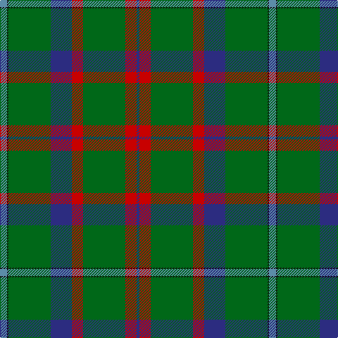

This page is one **sett** — a single exact thread-count. It belongs to the [tartan](/tartans/t5k1g30db15r8g30r8db2/)
(the same proportion at any scale), whose colour order is pattern [BKGBRGRB](/stripes/bkgbrgrb/).

Sourced from tartans-authority.  It is a [8 stripe tartan](/stripes/stripes8/).

Original link http://www.tartansauthority.com/tartan-ferret/display/318/

## Also known as

This cloth is also recorded under:

- Shaw of Tordarroch Green (Clan

## Register references

External register numbers recorded for this tartan.

- Scottish Tartans Authority (ITI): 318

## Thread count
B/10 K2 G60 DB30 R16 G60 R16 DB/4

## Palette

Palette: <strong>Tartan Register</strong>
<table><thead><tr><th>Colour</th><th>Threads</th><th>Shade</th><th>Base</th><th>OKLCh</th></tr></thead><tbody><tr><td>B/</td><td style="text-align:right;font-variant-numeric:tabular-nums">10</td><td><code style="background-color:#5C8CA8;">#5C8CA8</code> <small style="color:#888">#5C8CA8</small></td><td>B <code style="background-color:#2A418A;">#2A418A</code></td><td><small style="color:#888">oklch(61.7% 0.067 235.0)</small></td></tr><tr><td>K</td><td style="text-align:right;font-variant-numeric:tabular-nums">2</td><td><code style="background-color:#101010;">#101010</code> <small style="color:#888">#101010</small></td><td>K <code style="background-color:#000000;">#000000</code></td><td><small style="color:#888">oklch(17.3% 0.000 89.9)</small></td></tr><tr><td>G</td><td style="text-align:right;font-variant-numeric:tabular-nums">60</td><td><code style="background-color:#006818;">#006818</code> <small style="color:#888">#006818</small></td><td>G <code style="background-color:#006100;">#006100</code></td><td><small style="color:#888">oklch(45.0% 0.142 145.0)</small></td></tr><tr><td>DB</td><td style="text-align:right;font-variant-numeric:tabular-nums">30</td><td><code style="background-color:#2C2C80;">#2C2C80</code> <small style="color:#888">#2C2C80</small></td><td>B <code style="background-color:#2A418A;">#2A418A</code></td><td><small style="color:#888">oklch(35.0% 0.138 276.6)</small></td></tr><tr><td>R</td><td style="text-align:right;font-variant-numeric:tabular-nums">16</td><td><code style="background-color:#C80000;">#C80000</code> <small style="color:#888">#C80000</small></td><td>R <code style="background-color:#CC0000;">#CC0000</code></td><td><small style="color:#888">oklch(52.3% 0.215 29.2)</small></td></tr><tr><td>G</td><td style="text-align:right;font-variant-numeric:tabular-nums">60</td><td><code style="background-color:#006818;">#006818</code> <small style="color:#888">#006818</small></td><td>G <code style="background-color:#006100;">#006100</code></td><td><small style="color:#888">oklch(45.0% 0.142 145.0)</small></td></tr><tr><td>R</td><td style="text-align:right;font-variant-numeric:tabular-nums">16</td><td><code style="background-color:#C80000;">#C80000</code> <small style="color:#888">#C80000</small></td><td>R <code style="background-color:#CC0000;">#CC0000</code></td><td><small style="color:#888">oklch(52.3% 0.215 29.2)</small></td></tr><tr><td>DB/</td><td style="text-align:right;font-variant-numeric:tabular-nums">4</td><td><code style="background-color:#2C2C80;">#2C2C80</code> <small style="color:#888">#2C2C80</small></td><td>B <code style="background-color:#2A418A;">#2A418A</code></td><td><small style="color:#888">oklch(35.0% 0.138 276.6)</small></td></tr></tbody></table>

# Sample pattern

## Nearest tartans

The nearest existing variants by ΔTartan distance, with this tartan at the top so the swatches line up against it.

ΔTartan

Tartan

Sett

—

<a href="/ttd/edit/#slug=t5k1g30db15r8g30r8db2~x2">Shaw of Tordarroch Green (Htg) (Clan</a> <a class="nn-out" href="/setts/s8/t5k1g30db15r8g30r8db2~x2/" title="open its dictionary page">↗</a>

1.20

<a href="/setts/s14/t5k1g30db15r8g30r8db2~x2/">Shaw of Tordarroch Green (Hunting)</a>

1.21

<a href="/ttd/edit/#slug=g55db7r24g12dt4ly3dt4~x2">Crieff &amp; Strathearn #1</a> <a class="nn-out" href="/setts/s7/g55db7r24g12dt4ly3dt4~x2/" title="open its dictionary page">↗</a>

1.28

<a href="/ttd/edit/#slug=g55dp7r24g12db4ly3db4~x2">Crieff and Strathearn District Tartan Tartan Number: 664. Earliest known date: 1988 A branch of the Stewart clan from Galloway and the South West of Scotland. See products available Copyright © Blair Urquhart, Comrie, 2015</a> <a class="nn-out" href="/setts/s7/g55dp7r24g12db4ly3db4~x2/" title="open its dictionary page">↗</a>

1.31

<a href="/ttd/edit/#slug=t1dp10k10g12k1g12t2g16w1~x2">Faskin Family (Aberdeenshire)</a> <a class="nn-out" href="/setts/s9/t1dp10k10g12k1g12t2g16w1~x2/" title="open its dictionary page">↗</a>

1.33

<a href="/ttd/edit/#slug=g55k17r9k11ly2db4~x2">Moran Family Tartan Tartan Number: 675. Earliest known date: 1986 The designers requested that the threadcount be Restricted. See products available Copyright © Blair Urquhart, Comrie, 2015</a> <a class="nn-out" href="/setts/s6/g55k17r9k11ly2db4~x2/" title="open its dictionary page">↗</a>

1.33

<a href="/ttd/edit/#slug=do8g19dg42lo3o1~x2">Nolan Family, John J (Personal)</a> <a class="nn-out" href="/setts/s5/do8g19dg42lo3o1~x2/" title="open its dictionary page">↗</a>

1.40

<a href="/ttd/edit/#slug=y32w1k3w1g14y7k3dp3w1~x2">Leach Htg #2 (Name)</a> <a class="nn-out" href="/setts/s9/y32w1k3w1g14y7k3dp3w1~x2/" title="open its dictionary page">↗</a>

1.42

<a href="/ttd/edit/#slug=g9o1g2r3g28k16lb1g8lb1db8r1~x2">New York Caledonian Club Day</a> <a class="nn-out" href="/setts/s11/g9o1g2r3g28k16lb1g8lb1db8r1~x2/" title="open its dictionary page">↗</a>

1.43

<a href="/ttd/edit/#slug=g3n5k4n33g12k4w2n18ly3~x2">Smoke Showing (UFES)</a> <a class="nn-out" href="/setts/s9/g3n5k4n33g12k4w2n18ly3~x2/" title="open its dictionary page">↗</a>

1.43

<a href="/ttd/edit/#slug=w1db6g4db1g16k1g4k6ly1~x4">Henderson/MacKendrick</a> <a class="nn-out" href="/setts/s9/w1db6g4db1g16k1g4k6ly1~x4/" title="open its dictionary page">↗</a>

## Neighbour map

Every grey dot is one of 14359 variants placed by the first two principal components of the ΔTartan feature space (44% of its variance). Red is this tartan; blue dots are its nearest — click one to open its page.

<svg viewBox="0 0 640 380" role="img" style="max-width:100%;height:auto;border:1px solid #e0e0e0;border-radius:4px;display:block" xmlns="http://www.w3.org/2000/svg"><image href="/nn/cloud.v1.png" width="640" height="380"/><a href="/setts/s14/t5k1g30db15r8g30r8db2~x2/"><circle cx="365.6" cy="145.2" r="4" fill="#3465a4"><title>Shaw of Tordarroch Green (Hunting)</title></circle></a><a href="/setts/s7/g55db7r24g12dt4ly3dt4~x2/"><circle cx="386.2" cy="175.6" r="4" fill="#3465a4"><title>Crieff &amp; Strathearn #1</title></circle></a><a href="/setts/s7/g55dp7r24g12db4ly3db4~x2/"><circle cx="365.1" cy="158.4" r="4" fill="#3465a4"><title>Crieff and Strathearn District Tartan Tartan Number: 664. Earliest known date: 1988 A branch of the Stewart clan from Galloway and the South West of Scotland. See products available Copyright © Blair Urquhart, Comrie, 2015</title></circle></a><a href="/setts/s9/t1dp10k10g12k1g12t2g16w1~x2/"><circle cx="317.4" cy="183.0" r="4" fill="#3465a4"><title>Faskin Family (Aberdeenshire)</title></circle></a><a href="/setts/s6/g55k17r9k11ly2db4~x2/"><circle cx="344.8" cy="156.2" r="4" fill="#3465a4"><title>Moran Family Tartan Tartan Number: 675. Earliest known date: 1986 The designers requested that the threadcount be Restricted. See products available Copyright © Blair Urquhart, Comrie, 2015</title></circle></a><a href="/setts/s5/do8g19dg42lo3o1~x2/"><circle cx="377.6" cy="157.3" r="4" fill="#3465a4"><title>Nolan Family, John J (Personal)</title></circle></a><a href="/setts/s9/y32w1k3w1g14y7k3dp3w1~x2/"><circle cx="381.5" cy="121.1" r="4" fill="#3465a4"><title>Leach Htg #2 (Name)</title></circle></a><a href="/setts/s11/g9o1g2r3g28k16lb1g8lb1db8r1~x2/"><circle cx="345.0" cy="114.7" r="4" fill="#3465a4"><title>New York Caledonian Club Day</title></circle></a><a href="/setts/s9/g3n5k4n33g12k4w2n18ly3~x2/"><circle cx="400.3" cy="168.9" r="4" fill="#3465a4"><title>Smoke Showing (UFES)</title></circle></a><a href="/setts/s9/w1db6g4db1g16k1g4k6ly1~x4/"><circle cx="326.6" cy="166.2" r="4" fill="#3465a4"><title>Henderson/MacKendrick</title></circle></a><circle cx="364.8" cy="161.6" r="5" fill="#c00000"/></svg>

ID: /setts/s8/t5k1g30db15r8g30r8db2~x2/
