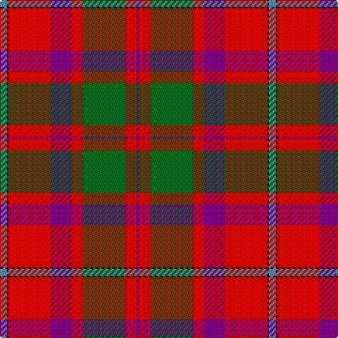

**Bands:** [BKRBRGRB](/stripes/bkrbrgrb/) · **Stripes:** [T K R DP R G R DP](/stripes/stripes8/) T K R DP R G R DP

This was sourced from house-of-tartan.  It is a [8 band tartan](/bands/bands8/).

Original link http://www.house-of-tartan.scotland.net/house/TartanViewjs.asp?colr=Def&tnam=352

## Variants

Other setts woven to the same stripe pattern.

- [Shaw Red of Tordarroch Dress (Clan 2](/setts/s8/t5k1r30dp15r8g30r8dp2~x2/)

## Thread count
B/5 K1 R30 P15 R8 G30 R8 P/2

## Palette
Each colour and its ΔE from the base-6 reference it is a variant of.

| Colour | Shade | Base | ΔE (OKLab) |
|---|---|---|---|
| B | <code style="background-color:#5C8CA8;">#5C8CA8</code> `#5C8CA8` | B <code style="background-color:#2A418A;">#2A418A</code> | 0.23 |
| G | <code style="background-color:#006818;">#006818</code> `#006818` | G <code style="background-color:#006100;">#006100</code> | 0.02 |
| K | <code style="background-color:#101010;">#101010</code> `#101010` | K <code style="background-color:#000000;">#000000</code> | 0.17 |
| P | <code style="background-color:#780078;">#780078</code> `#780078` | B <code style="background-color:#2A418A;">#2A418A</code> | 0.17 |
| R | <code style="background-color:#C80000;">#C80000</code> `#C80000` | R <code style="background-color:#CC0000;">#CC0000</code> | 0.01 |

# Sample pattern

## Nearest tartans

The nearest existing variants by ΔTartan distance.

1. [Shaw of Tordarroch](/setts/s8/t5k1r30p15r8g30r8p2~x2/) — ΔT 0.35
1. [Shaw Red of Tordarroch Dress (Clan 2](/setts/s8/t5k1r30dp15r8g30r8dp2~x2/) — ΔT 0.42
1. [Shaw](/setts/s8/lb5k1r30dp15r8dg30r8dp2/) — ΔT 0.69
1. [Ulster Ancestry (Fashion)](/setts/s9/n47r8k22r7lb3r24n9r10lo3~x2/) — ΔT 1.13
1. [MacDonald of Glenaladale](/setts/s11/db3t1r30db32r3w1r3g23r31db3w1/) — ΔT 1.13
1. [Unidentified 20](/setts/s9/db2r49db51r9w2r9g51r49db2~x2/) — ΔT 1.14
1. [MacQueen of Dalmagarry (Clan?)](/setts/s8/g3r4k1r26y14r4dp16w2~x2/) — ΔT 1.15
1. [Elbrick Dress (Personal)](/setts/s8/r6b22r6g20ly2r45b2w5~x2/) — ΔT 1.17
1. [Carrick](/setts/s9/r28db12r3g20m1g2m1g2r7~x2/) — ΔT 1.23
1. [MacLeay](/setts/s7/r27y4k4y4k4t6lo1~x4/) — ΔT 1.24

## Neighbour map

Every grey dot is one of 14313 variants placed by the first two principal components of the ΔTartan feature space (44% of its variance). Red is this tartan; blue dots are its nearest — click one to open its page.

<svg viewBox="0 0 640 380" role="img" style="max-width:100%;height:auto;border:1px solid #e0e0e0;border-radius:4px;display:block" xmlns="http://www.w3.org/2000/svg"><image href="/nn/cloud.v1.png" width="640" height="380"/><a href="/setts/s8/t5k1r30p15r8g30r8p2~x2/"><circle cx="285.4" cy="133.7" r="4" fill="#3465a4"><title>Shaw of Tordarroch</title></circle></a><a href="/setts/s8/t5k1r30dp15r8g30r8dp2~x2/"><circle cx="286.4" cy="135.6" r="4" fill="#3465a4"><title>Shaw Red of Tordarroch Dress (Clan 2</title></circle></a><a href="/setts/s8/lb5k1r30dp15r8dg30r8dp2/"><circle cx="275.7" cy="129.9" r="4" fill="#3465a4"><title>Shaw</title></circle></a><a href="/setts/s9/n47r8k22r7lb3r24n9r10lo3~x2/"><circle cx="254.1" cy="155.7" r="4" fill="#3465a4"><title>Ulster Ancestry (Fashion)</title></circle></a><a href="/setts/s11/db3t1r30db32r3w1r3g23r31db3w1/"><circle cx="327.3" cy="106.3" r="4" fill="#3465a4"><title>MacDonald of Glenaladale</title></circle></a><a href="/setts/s9/db2r49db51r9w2r9g51r49db2~x2/"><circle cx="330.1" cy="151.9" r="4" fill="#3465a4"><title>Unidentified 20</title></circle></a><a href="/setts/s8/g3r4k1r26y14r4dp16w2~x2/"><circle cx="272.3" cy="112.7" r="4" fill="#3465a4"><title>MacQueen of Dalmagarry (Clan?)</title></circle></a><a href="/setts/s8/r6b22r6g20ly2r45b2w5~x2/"><circle cx="309.2" cy="128.3" r="4" fill="#3465a4"><title>Elbrick Dress (Personal)</title></circle></a><a href="/setts/s9/r28db12r3g20m1g2m1g2r7~x2/"><circle cx="337.9" cy="136.3" r="4" fill="#3465a4"><title>Carrick</title></circle></a><a href="/setts/s7/r27y4k4y4k4t6lo1~x4/"><circle cx="325.8" cy="116.9" r="4" fill="#3465a4"><title>MacLeay</title></circle></a><circle cx="294.7" cy="137.6" r="5" fill="#c00000"/></svg>

ID: /setts/s8/t5k1r30dp15r8g30r8dp2/
