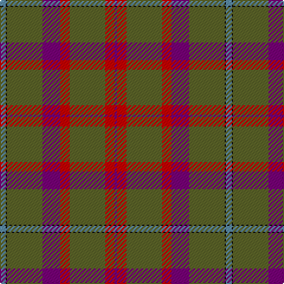

**Bands:** [BKGBRGRB](/stripes/bkgbrgrb/) · **Stripes:** [T K Y DP R Y R DP](/stripes/stripes8/) T K Y DP R Y R DP

This was sourced from house-of-tartan.  It is a [8 band tartan](/bands/bands8/).

Original link http://www.house-of-tartan.scotland.net/house/TartanViewjs.asp?colr=Def&tnam=318

## Thread count
B/5 K1 G30 P15 R8 G30 R8 P/2

## Palette
Each colour and its ΔE from the base-6 reference it is a variant of.

| Colour | Shade | Base | ΔE (OKLab) |
|---|---|---|---|
| B | <code style="background-color:#5C8CA8;">#5C8CA8</code> `#5C8CA8` | B <code style="background-color:#2A418A;">#2A418A</code> | 0.23 |
| G | <code style="background-color:#5C6428;">#5C6428</code> `#5C6428` | G <code style="background-color:#006100;">#006100</code> | 0.10 |
| K | <code style="background-color:#101010;">#101010</code> `#101010` | K <code style="background-color:#000000;">#000000</code> | 0.17 |
| P | <code style="background-color:#780078;">#780078</code> `#780078` | B <code style="background-color:#2A418A;">#2A418A</code> | 0.17 |
| R | <code style="background-color:#C80000;">#C80000</code> `#C80000` | R <code style="background-color:#CC0000;">#CC0000</code> | 0.01 |

# Sample pattern

## Nearest tartans

The nearest existing variants by ΔTartan distance.

1. [Shaw of Tordarroch, hunting](/setts/s8/t5k1y30p15r8y30r8p2~x2/) — ΔT 0.39
1. [MacWilliam Htg](/setts/s7/dg2dy32dy12k10r1db16r2~x2/) — ΔT 1.26
1. [Toyokawa Check](/setts/s11/n36dr10lo2dr5g2dr5lo10n5lo2n10w2~x2/) — ΔT 1.54
1. [Rice Welsh Name Tartan Tartan Number: 5754. Earliest known date: 2002 The tartan for this Welsh surname and its variations, Brice, Bryce, Price, Pryce, Rice, Rhys, Ryce, is actually woven in Wales at the Cambrian Woollen Mill, weaving on the same site since 1830. This tartan differs from many traditional patterns in that the warp and weft differ, giving the finished worsted wool cloth more of a predominant stripe, noticeable in the finished Kilt, or Cilt in Wales. See products available Copyright © Blair Urquhart, Comrie, 2015](/setts/s10/lo4r21lo1r21y8db4y5db4y4lo4/) — ΔT 1.58
1. [Shaw](/setts/s8/b5k1r30n15r8dg30r8n2~x2/) — ΔT 1.60
1. [Shaw](/setts/s8/b5k1r30n15r8dg30r8n2/) — ΔT 1.60
1. [McAlifyfe (Personal)](/setts/s11/k3y3lo2y30k2y3m12y6m6k3y3~x2/) — ΔT 1.62
1. [Redpath, Robert A (Personal)](/setts/s8/r26n4r1p2dg1n4dg14w2~x2/) — ΔT 1.66
1. [Fulton](/setts/s9/dp3k1g16r5g6r5g14r16lo2~x2/) — ΔT 1.70
1. [Suttle (Personal)](/setts/s8/n36k18n5dt7n5k7r1g2~x2/) — ΔT 1.73

## Neighbour map

Every grey dot is one of 14313 variants placed by the first two principal components of the ΔTartan feature space (44% of its variance). Red is this tartan; blue dots are its nearest — click one to open its page.

<svg viewBox="0 0 640 380" role="img" style="max-width:100%;height:auto;border:1px solid #e0e0e0;border-radius:4px;display:block" xmlns="http://www.w3.org/2000/svg"><image href="/nn/cloud.v1.png" width="640" height="380"/><a href="/setts/s8/t5k1y30p15r8y30r8p2~x2/"><circle cx="388.8" cy="158.9" r="4" fill="#3465a4"><title>Shaw of Tordarroch, hunting</title></circle></a><a href="/setts/s7/dg2dy32dy12k10r1db16r2~x2/"><circle cx="412.8" cy="178.6" r="4" fill="#3465a4"><title>MacWilliam Htg</title></circle></a><a href="/setts/s11/n36dr10lo2dr5g2dr5lo10n5lo2n10w2~x2/"><circle cx="384.8" cy="157.8" r="4" fill="#3465a4"><title>Toyokawa Check</title></circle></a><a href="/setts/s10/lo4r21lo1r21y8db4y5db4y4lo4/"><circle cx="372.7" cy="175.8" r="4" fill="#3465a4"><title>Rice Welsh Name Tartan Tartan Number: 5754. Earliest known date: 2002 The tartan for this Welsh surname and its variations, Brice, Bryce, Price, Pryce, Rice, Rhys, Ryce, is actually woven in Wales at the Cambrian Woollen Mill, weaving on the same site since 1830. This tartan differs from many traditional patterns in that the warp and weft differ, giving the finished worsted wool cloth more of a predominant stripe, noticeable in the finished Kilt, or Cilt in Wales. See products available Copyright © Blair Urquhart, Comrie, 2015</title></circle></a><a href="/setts/s8/b5k1r30n15r8dg30r8n2~x2/"><circle cx="328.2" cy="161.9" r="4" fill="#3465a4"><title>Shaw</title></circle></a><a href="/setts/s8/b5k1r30n15r8dg30r8n2/"><circle cx="328.2" cy="161.9" r="4" fill="#3465a4"><title>Shaw</title></circle></a><a href="/setts/s11/k3y3lo2y30k2y3m12y6m6k3y3~x2/"><circle cx="374.3" cy="146.9" r="4" fill="#3465a4"><title>McAlifyfe (Personal)</title></circle></a><a href="/setts/s8/r26n4r1p2dg1n4dg14w2~x2/"><circle cx="347.4" cy="139.9" r="4" fill="#3465a4"><title>Redpath, Robert A (Personal)</title></circle></a><a href="/setts/s9/dp3k1g16r5g6r5g14r16lo2~x2/"><circle cx="325.1" cy="190.9" r="4" fill="#3465a4"><title>Fulton</title></circle></a><a href="/setts/s8/n36k18n5dt7n5k7r1g2~x2/"><circle cx="397.6" cy="152.7" r="4" fill="#3465a4"><title>Suttle (Personal)</title></circle></a><circle cx="400.0" cy="164.3" r="5" fill="#c00000"/></svg>

ID: /setts/s8/t5k1y30dp15r8y30r8dp2/
