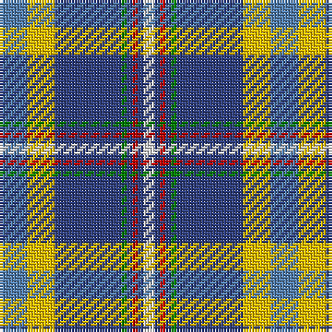

This page is one **sett** — a single exact thread-count. It belongs to the [tartan](/tartans/ba5y5b12g1b1r1b1ln2/)
(the same proportion at any scale), whose colour order is pattern [BYBGBRBW](/stripes/bybgbrbw/).

Sourced from weddslist.  It is a [8 stripe tartan](/stripes/stripes8/).

Original link http://www.weddslist.com/cgi-bin/tartans/pg.pl?source=sts

## Also known as

This cloth is also recorded under:

- Yorkshire, C.C.C.

2 attestations — the source records this cloth was collapsed from (oldest owns this page)

<ul>
<li>undated — Yorkshire, C.C.C. (weddslist, <a href="http://www.weddslist.com/cgi-bin/tartans/pg.pl?source=sts">record</a>)</li>
<li>undated — Yorkshire C.C.C. Corporate Tartan Tartan Number: 670. Earliest known date: 1983 Nothing See products available Copyright © Blair Urquhart, Comrie, 2015 (house-of-tartan, <a href="http://www.house-of-tartan.scotland.net/house/TartanViewjs.asp?colr=Def&tnam=670">record</a>)</li>
</ul>

## Thread count
Ba/10 Y10 B24 G2 B2 R2 B2 LN/4

## Palette
Each colour and the base-6 reference it is a variant of.

| Colour | Shade | Base |
|---|---|---|
| B | <code style="background-color:#304080;">#304080</code> `oklch(39.4% 0.109 270.2)` <small>#304080</small> | B <code style="background-color:#2A418A;">#2A418A</code> |
| Ba | <code style="background-color:#5480B0;">#5480B0</code> `oklch(58.8% 0.089 251.5)` <small>#5480B0</small> | B <code style="background-color:#2A418A;">#2A418A</code> |
| G | <code style="background-color:#008000;">#008000</code> `oklch(52.0% 0.177 142.5)` <small>#008000</small> | G <code style="background-color:#006100;">#006100</code> |
| LN | <code style="background-color:#E0E0E0;">#E0E0E0</code> `oklch(90.7% 0.000 89.9)` <small>#E0E0E0</small> | W <code style="background-color:#F7F7F7;">#F7F7F7</code> |
| R | <code style="background-color:#C00000;">#C00000</code> `oklch(50.7% 0.208 29.2)` <small>#C00000</small> | R <code style="background-color:#CC0000;">#CC0000</code> |
| Y | <code style="background-color:#F0C000;">#F0C000</code> `oklch(82.7% 0.169 90.5)` <small>#F0C000</small> | Y <code style="background-color:#F2BF00;">#F2BF00</code> |

# Sample pattern

## Nearest tartans

The nearest existing variants by ΔTartan distance, with this tartan at the top so the swatches line up against it.

ΔTartan

Tartan

Sett

—

<a href="/ttd/edit/#slug=t5ly5db12g1db1r1db1w2~x2">Yorkshire, C.C.C.</a> <a class="nn-out" href="/setts/s8/t5ly5db12g1db1r1db1w2~x2/" title="open its dictionary page">↗</a>

0.42

<a href="/ttd/edit/#slug=t5ly5db12g1db1r1db1w2~x4">Hodgkinson</a> <a class="nn-out" href="/setts/s8/t5ly5db12g1db1r1db1w2~x4/" title="open its dictionary page">↗</a>

0.93

<a href="/ttd/edit/#slug=r4w4g4ly4db5ly1db1ly1db16p4~x2">Yukon</a> <a class="nn-out" href="/setts/s10/r4w4g4ly4db5ly1db1ly1db16p4~x2/" title="open its dictionary page">↗</a>

1.00

<a href="/ttd/edit/#slug=w3b25m3r3m3r5g10m3k2~x2">Edinburgh District</a> <a class="nn-out" href="/setts/s9/w3b25m3r3m3r5g10m3k2~x2/" title="open its dictionary page">↗</a>

1.01

<a href="/ttd/edit/#slug=b49lb11lo7k16lb5b20lb10k6t5~x2">State Seal of Louisiana (Fashion)</a> <a class="nn-out" href="/setts/s9/b49lb11lo7k16lb5b20lb10k6t5~x2/" title="open its dictionary page">↗</a>

1.03

<a href="/ttd/edit/#slug=r3dt25k6lb20ly2lb2w3~x2">Madras College (Corporate)</a> <a class="nn-out" href="/setts/s7/r3dt25k6lb20ly2lb2w3~x2/" title="open its dictionary page">↗</a>

1.03

<a href="/ttd/edit/#slug=g5r1db10w1r1w1t10w1t10w1ly1~x4">Texas Blue Bonnet</a> <a class="nn-out" href="/setts/s11/g5r1db10w1r1w1t10w1t10w1ly1~x4/" title="open its dictionary page">↗</a>

1.06

<a href="/ttd/edit/#slug=o12g4dp4g4o31dt3db12w4~x2">Yes Scotland (Fashion)</a> <a class="nn-out" href="/setts/s8/o12g4dp4g4o31dt3db12w4~x2/" title="open its dictionary page">↗</a>

1.08

<a href="/ttd/edit/#slug=ly4db24t5g2db3k5t33r2~x2">Los Angeles</a> <a class="nn-out" href="/setts/s8/ly4db24t5g2db3k5t33r2~x2/" title="open its dictionary page">↗</a>

1.09

<a href="/ttd/edit/#slug=p8g31r4y4db17b64w4">Manx National</a> <a class="nn-out" href="/setts/s7/p8g31r4y4db17b64w4/" title="open its dictionary page">↗</a>

1.11

<a href="/ttd/edit/#slug=lb16db6k1ly1k1db1lb4dy4k1r1~x4">Kirk in the Hills</a> <a class="nn-out" href="/setts/s10/lb16db6k1ly1k1db1lb4dy4k1r1~x4/" title="open its dictionary page">↗</a>

## Neighbour map

Every grey dot is one of 14299 variants placed by the first two principal components of the ΔTartan feature space (44% of its variance). Red is this tartan; blue dots are its nearest — click one to open its page.

<svg viewBox="0 0 640 380" role="img" style="max-width:100%;height:auto;border:1px solid #e0e0e0;border-radius:4px;display:block" xmlns="http://www.w3.org/2000/svg"><image href="/nn/cloud.v1.png" width="640" height="380"/><a href="/setts/s8/t5ly5db12g1db1r1db1w2~x4/"><circle cx="203.2" cy="131.8" r="4" fill="#3465a4"><title>Hodgkinson</title></circle></a><a href="/setts/s10/r4w4g4ly4db5ly1db1ly1db16p4~x2/"><circle cx="202.3" cy="118.0" r="4" fill="#3465a4"><title>Yukon</title></circle></a><a href="/setts/s9/w3b25m3r3m3r5g10m3k2~x2/"><circle cx="192.6" cy="129.6" r="4" fill="#3465a4"><title>Edinburgh District</title></circle></a><a href="/setts/s9/b49lb11lo7k16lb5b20lb10k6t5~x2/"><circle cx="213.7" cy="153.0" r="4" fill="#3465a4"><title>State Seal of Louisiana (Fashion)</title></circle></a><a href="/setts/s7/r3dt25k6lb20ly2lb2w3~x2/"><circle cx="172.0" cy="140.0" r="4" fill="#3465a4"><title>Madras College (Corporate)</title></circle></a><a href="/setts/s11/g5r1db10w1r1w1t10w1t10w1ly1~x4/"><circle cx="200.4" cy="138.4" r="4" fill="#3465a4"><title>Texas Blue Bonnet</title></circle></a><a href="/setts/s8/o12g4dp4g4o31dt3db12w4~x2/"><circle cx="266.1" cy="155.2" r="4" fill="#3465a4"><title>Yes Scotland (Fashion)</title></circle></a><a href="/setts/s8/ly4db24t5g2db3k5t33r2~x2/"><circle cx="251.2" cy="128.4" r="4" fill="#3465a4"><title>Los Angeles</title></circle></a><a href="/setts/s7/p8g31r4y4db17b64w4/"><circle cx="209.5" cy="116.3" r="4" fill="#3465a4"><title>Manx National</title></circle></a><a href="/setts/s10/lb16db6k1ly1k1db1lb4dy4k1r1~x4/"><circle cx="256.0" cy="99.1" r="4" fill="#3465a4"><title>Kirk in the Hills</title></circle></a><circle cx="210.7" cy="135.4" r="5" fill="#c00000"/></svg>

ID: /setts/s8/t5ly5db12g1db1r1db1w2~x2/
