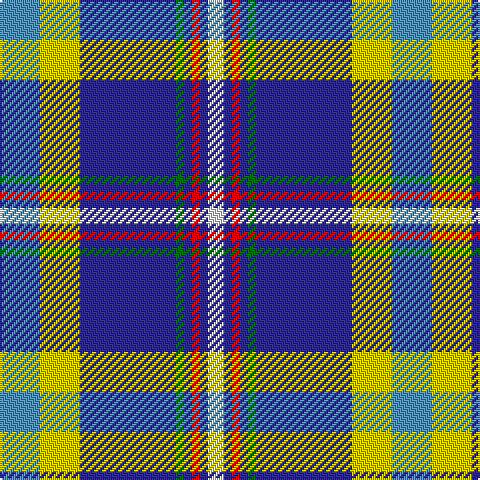

In pattern [BYBGBRBW](/stripes/bybgbrbw/).

This was sourced from register-of-tartans.  It is a [8 stripe tartan](/stripes/stripes8/).

Original link https://www.tartanregister.gov.uk/tartanDetails.aspx?ref=4795

## Attestations

This cloth appears in 2 source records; the oldest owns this page.

- 01/01/2002 — Hodgkinson (register-of-tartans, [record](https://www.tartanregister.gov.uk/tartanDetails.aspx?ref=4795))
- pre 2002 — Hodgkinson (Name) (tartans-authority, [record](http://www.tartansauthority.com/tartan-ferret/display/670/))

## Register references

External register numbers recorded for this tartan.

- Scottish Register of Tartans: [4795](https://www.tartanregister.gov.uk/tartanDetails.aspx?ref=4795)
- Scottish Tartans Authority (ITI): 670
- Scottish Tartans World Register: 670

## Thread count
B/20 Y20 DB48 Ga4 DB4 R4 DB4 LN/8

## Palette
Each colour and its ΔE from the base-6 reference it is a variant of.

| Colour | Shade | Base | ΔE (OKLab) |
|---|---|---|---|
| B | <code style="background-color:#5C8CA8;">#5C8CA8</code> `#5C8CA8` | B <code style="background-color:#2A418A;">#2A418A</code> | 0.23 |
| DB | <code style="background-color:#2C2C80;">#2C2C80</code> `#2C2C80` | B <code style="background-color:#2A418A;">#2A418A</code> | 0.06 |
| G | <code style="background-color:#285800;">#285800</code> `#285800` | G <code style="background-color:#006100;">#006100</code> | 0.03 |
| Ga | <code style="background-color:#006818;">#006818</code> `#006818` | G <code style="background-color:#006100;">#006100</code> | 0.02 |
| LN | <code style="background-color:#E0E0E0;">#E0E0E0</code> `#E0E0E0` | W <code style="background-color:#F7F7F7;">#F7F7F7</code> | 0.07 |
| R | <code style="background-color:#C80000;">#C80000</code> `#C80000` | R <code style="background-color:#CC0000;">#CC0000</code> | 0.01 |
| Y | <code style="background-color:#E8C000;">#E8C000</code> `#E8C000` | Y <code style="background-color:#F2BF00;">#F2BF00</code> | 0.02 |

# Sample pattern

## Nearest tartans

The nearest existing variants by ΔTartan distance.

1. [Yorkshire, C.C.C.](/setts/s8/t5ly5db12g1db1r1db1w2~x2/) — ΔT 0.42
1. [Yukon](/setts/s10/r4w4g4ly4db5ly1db1ly1db16p4~x2/) — ΔT 0.91
1. [Madras College (Corporate)](/setts/s7/r3dt25k6lb20ly2lb2w3~x2/) — ΔT 0.94
1. [Yukon #1906 District Tartan Tartan Number: 1906. Earliest known date: 1984 Nothing See products available Copyright © Blair Urquhart, Comrie, 2015](/setts/s10/dp4db16ly1db1ly1db5ly4g4w4r4~x2/) — ΔT 0.96
1. [Yukon (asymmetric)](/setts/s10/dp4db20ly1db2ly1db4ly4dg4w4r4~x2/) — ΔT 1.07
1. [State Seal of Louisiana (Fashion)](/setts/s9/b49lb11lo7k16lb5b20lb10k6t5~x2/) — ΔT 1.08
1. [Yukon](/setts/s10/r4w4g4ly4db4ly1db2ly1db20p4~x2/) — ΔT 1.09
1. [Scottish Association for N.S. (Corp)](/setts/s9/db46ly4db4ly4db6k16o66w11r6/) — ΔT 1.10
1. [Queen Margaret University](/setts/s9/db4w3db17lb10k1dp5k1lb6dg3~x2/) — ΔT 1.10
1. [Sinclair Dress (Dance)](/setts/s7/db4r2db31k10g4w21g2~x2/) — ΔT 1.12

## Neighbour map

Every grey dot is one of 14299 variants placed by the first two principal components of the ΔTartan feature space (44% of its variance). Red is this tartan; blue dots are its nearest — click one to open its page.

<svg viewBox="0 0 640 380" role="img" style="max-width:100%;height:auto;border:1px solid #e0e0e0;border-radius:4px;display:block" xmlns="http://www.w3.org/2000/svg"><image href="/nn/cloud.v1.png" width="640" height="380"/><a href="/setts/s8/t5ly5db12g1db1r1db1w2~x2/"><circle cx="210.7" cy="135.4" r="4" fill="#3465a4"><title>Yorkshire, C.C.C.</title></circle></a><a href="/setts/s10/r4w4g4ly4db5ly1db1ly1db16p4~x2/"><circle cx="202.3" cy="118.0" r="4" fill="#3465a4"><title>Yukon</title></circle></a><a href="/setts/s7/r3dt25k6lb20ly2lb2w3~x2/"><circle cx="172.0" cy="140.0" r="4" fill="#3465a4"><title>Madras College (Corporate)</title></circle></a><a href="/setts/s10/dp4db16ly1db1ly1db5ly4g4w4r4~x2/"><circle cx="198.9" cy="116.7" r="4" fill="#3465a4"><title>Yukon #1906 District Tartan Tartan Number: 1906. Earliest known date: 1984 Nothing See products available Copyright © Blair Urquhart, Comrie, 2015</title></circle></a><a href="/setts/s10/dp4db20ly1db2ly1db4ly4dg4w4r4~x2/"><circle cx="248.8" cy="104.7" r="4" fill="#3465a4"><title>Yukon (asymmetric)</title></circle></a><a href="/setts/s9/b49lb11lo7k16lb5b20lb10k6t5~x2/"><circle cx="213.7" cy="153.0" r="4" fill="#3465a4"><title>State Seal of Louisiana (Fashion)</title></circle></a><a href="/setts/s10/r4w4g4ly4db4ly1db2ly1db20p4~x2/"><circle cx="249.1" cy="103.3" r="4" fill="#3465a4"><title>Yukon</title></circle></a><a href="/setts/s9/db46ly4db4ly4db6k16o66w11r6/"><circle cx="194.6" cy="111.1" r="4" fill="#3465a4"><title>Scottish Association for N.S. (Corp)</title></circle></a><a href="/setts/s9/db4w3db17lb10k1dp5k1lb6dg3~x2/"><circle cx="169.7" cy="127.5" r="4" fill="#3465a4"><title>Queen Margaret University</title></circle></a><a href="/setts/s7/db4r2db31k10g4w21g2~x2/"><circle cx="213.9" cy="143.1" r="4" fill="#3465a4"><title>Sinclair Dress (Dance)</title></circle></a><circle cx="203.2" cy="131.8" r="5" fill="#c00000"/></svg>

ID: /setts/s8/t5ly5db12g1db1r1db1w2~x4/
