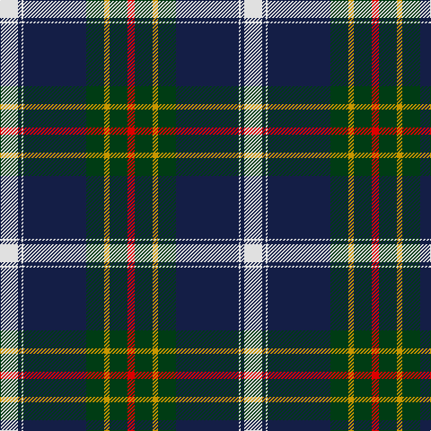

In pattern [RGYGBWBW](/patterns/rgygbwbw/).

This was sourced from register-of-tartans.  It is a [8 stripes tartan](/stripes/stripes8/).

Original link https://www.tartanregister.gov.uk/tartanDetails.aspx?ref=5826

## Register references

External register numbers recorded for this tartan.

- Scottish Register of Tartans: [5826](https://www.tartanregister.gov.uk/tartanDetails.aspx?ref=5826)
- Scottish Tartans World Register: 3153

## Thread count
LN/20 DB4 LN2 DB70 DG20 DY6 DG20 R/8

## Palette
Each colour and its ΔE from the base-6 reference it is a variant of.

| Colour | Shade | Base | ΔE (OKLab) |
|---|---|---|---|
| DB | <code style="background-color:#141E46;">#141E46</code> `#141E46` | B <code style="background-color:#2A418A;">#2A418A</code> | 0.16 |
| DG | <code style="background-color:#003C14;">#003C14</code> `#003C14` | G <code style="background-color:#006100;">#006100</code> | 0.13 |
| DY | <code style="background-color:#C89600;">#C89600</code> `#C89600` | Y <code style="background-color:#F2BF00;">#F2BF00</code> | 0.13 |
| LN | <code style="background-color:#E0E0E0;">#E0E0E0</code> `#E0E0E0` | W <code style="background-color:#F7F7F7;">#F7F7F7</code> | 0.07 |
| R | <code style="background-color:#DC0000;">#DC0000</code> `#DC0000` | R <code style="background-color:#CC0000;">#CC0000</code> | 0.03 |

# Sample pattern

## Nearest tartans

The nearest existing variants by ΔTartan distance.

1. [Sandelin (Personal)](/setts/s8/w10b2w1b35g10y3g10r4~b2c2c80-g006818-rc80000-we0e0e0-ybc8c00~x2/) — ΔT 0.86
1. [Royal College of G.P.s (Corporate)](/setts/s8/y8k50r15g6r6b3r6y2~b2c2c80-g003820-k101010-r888888-yd87c00~x2/) — ΔT 0.98
1. [Ferguson of Athol](/setts/s7/b24k8g8r2g8k1w2~b304080-g008000-k000000-rc00000-we0e0e0~x2/) — ΔT 1.00
1. [Sinclair-Brown](/setts/s8/b64k11r2k4r2k4g32ga4~b304080-g008000-ga908000-k000000-rc00000~x2/) — ΔT 1.00
1. [MacLaren](/setts/s7/b24k8g8r2g8k1y2~b304080-g008000-k000000-rc00000-yf0c000~x2/) — ΔT 1.02
1. [Ballarat](/setts/s10/w5b38g3ba11g1ba11g3b4w5y1~b505050-ba141e46-g808080-wf8f4d0-yd87c00~x2/) — ΔT 1.05
1. [MacFadzean](/setts/s6/b48w2k20g22r3g4~b304080-g008000-k000000-rc00000-we0e0e0~x2/) — ΔT 1.08
1. [Climb, The](/setts/s8/y2g9k16r2b30y3g6w1~b5f749c-g23321b-k000000-rca2625-wf9f5ef-yb7d38b~x2/) — ΔT 1.09
1. [Nynashamn Whisky Society (Corporate)](/setts/s6/y21g26b62w2ga2w2~b2c2c80-g006818-ga003820-we0e0e0-ye8c000/) — ΔT 1.10
1. [Italian American (Corporate)](/setts/s9/r4k2w6k2b40k80g10w6r3~b1474b4-g006818-k101010-rc80000-we0e0e0/) — ΔT 1.12

## Neighbour map

Every grey dot is one of 15726 variants placed by the first two principal components of the ΔTartan feature space (44% of its variance). Red is this tartan; blue dots are its nearest — click one to open its page.

<svg viewBox="0 0 640 380" role="img" style="max-width:100%;height:auto;border:1px solid #e0e0e0;border-radius:4px;display:block" xmlns="http://www.w3.org/2000/svg"><image href="/nn/cloud.v1.png" width="640" height="380"/><a href="/setts/s8/w10b2w1b35g10y3g10r4~b2c2c80-g006818-rc80000-we0e0e0-ybc8c00~x2/"><circle cx="270.7" cy="112.6" r="4" fill="#3465a4"><title>Sandelin (Personal)</title></circle></a><a href="/setts/s8/y8k50r15g6r6b3r6y2~b2c2c80-g003820-k101010-r888888-yd87c00~x2/"><circle cx="294.8" cy="122.0" r="4" fill="#3465a4"><title>Royal College of G.P.s (Corporate)</title></circle></a><a href="/setts/s7/b24k8g8r2g8k1w2~b304080-g008000-k000000-rc00000-we0e0e0~x2/"><circle cx="231.3" cy="146.0" r="4" fill="#3465a4"><title>Ferguson of Athol</title></circle></a><a href="/setts/s8/b64k11r2k4r2k4g32ga4~b304080-g008000-ga908000-k000000-rc00000~x2/"><circle cx="309.6" cy="114.4" r="4" fill="#3465a4"><title>Sinclair-Brown</title></circle></a><a href="/setts/s7/b24k8g8r2g8k1y2~b304080-g008000-k000000-rc00000-yf0c000~x2/"><circle cx="233.1" cy="146.5" r="4" fill="#3465a4"><title>MacLaren</title></circle></a><a href="/setts/s10/w5b38g3ba11g1ba11g3b4w5y1~b505050-ba141e46-g808080-wf8f4d0-yd87c00~x2/"><circle cx="304.3" cy="93.9" r="4" fill="#3465a4"><title>Ballarat</title></circle></a><a href="/setts/s6/b48w2k20g22r3g4~b304080-g008000-k000000-rc00000-we0e0e0~x2/"><circle cx="256.1" cy="154.5" r="4" fill="#3465a4"><title>MacFadzean</title></circle></a><a href="/setts/s8/y2g9k16r2b30y3g6w1~b5f749c-g23321b-k000000-rca2625-wf9f5ef-yb7d38b~x2/"><circle cx="203.3" cy="100.3" r="4" fill="#3465a4"><title>Climb, The</title></circle></a><a href="/setts/s6/y21g26b62w2ga2w2~b2c2c80-g006818-ga003820-we0e0e0-ye8c000/"><circle cx="298.3" cy="129.5" r="4" fill="#3465a4"><title>Nynashamn Whisky Society (Corporate)</title></circle></a><a href="/setts/s9/r4k2w6k2b40k80g10w6r3~b1474b4-g006818-k101010-rc80000-we0e0e0/"><circle cx="325.6" cy="89.5" r="4" fill="#3465a4"><title>Italian American (Corporate)</title></circle></a><circle cx="268.8" cy="114.4" r="5" fill="#c00000"/></svg>

ID: /setts/s8/w10b2w1b35g10y3g10r4~b141e46-g003c14-rdc0000-we0e0e0-yc89600~x2/
