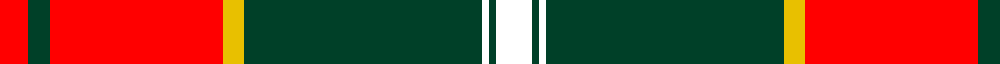

In pattern [RGRYGWGW](/patterns/rgrygwgw/).

This was sourced from register-of-tartans.  It is a [8 stripes tartan](/stripes/stripes8/).

Original link https://www.tartanregister.gov.uk/tartanDetails.aspx?ref=11621

## Thread count
R/8 DG6 R48 Y6 DG66 W2 DG2 W/10

## Palette
Each colour and its ΔE from the base-6 reference it is a variant of.

| Colour | Shade | Base | ΔE (OKLab) |
|---|---|---|---|
| DG | <code style="background-color:#004028;">#004028</code> `#004028` | G <code style="background-color:#006100;">#006100</code> | 0.13 |
| R | <code style="background-color:#FF0000;">#FF0000</code> `#FF0000` | R <code style="background-color:#CC0000;">#CC0000</code> | 0.11 |
| W | <code style="background-color:#FFFFFF;">#FFFFFF</code> `#FFFFFF` | W <code style="background-color:#F7F7F7;">#F7F7F7</code> | 0.02 |
| Y | <code style="background-color:#E8C000;">#E8C000</code> `#E8C000` | Y <code style="background-color:#F2BF00;">#F2BF00</code> | 0.02 |

# Sample pattern

## Nearest tartans

The nearest existing variants by ΔTartan distance.

1. [Citylink Gold (Corporate)](/setts/s8/r50b4r6y4r6b22w26y2-b506878-r880000-wf0e0cc-ybc8c00/) — ΔT 1.10
1. [Sutherland de Albergaria (Personal)](/setts/s8/w10k2w2k66y6r48k5r8-k101010-rc80000-wfcfcfc-ye8c000/) — ΔT 1.17
1. [Spens](/setts/s8/r56w2b6w2g32r11b6w5-b304080-g008000-rc00000-we0e0e0/) — ΔT 1.19
1. [Spens Family Tartan Tartan Number: 1671. Earliest known date: c.1815 The Spens tartan is similar in many respects to the Perthshire District sett, which is in turn, a variation of one of the Drummond tartans. The Perthshire sett was being woven by Wilson's of Bannockburn in the early years of the nineteenth century. The name, Spens, is linked to a specimen preserved in the collection of the Highland Society of London. See products available Copyright © Blair Urquhart, Comrie, 2015](/setts/s8/r56w2b6w2g32r11b6w5-b2c2c80-g006818-rc80000-we0e0e0/) — ΔT 1.20
1. [Scott](/setts/s12/g8r6k2r56g28r8g8w6g8r8g8w6-g006818-k101010-rc80000-wfcfcfc/) — ΔT 1.23
1. [Connaught Irish District Tartan Tartan Number: 2064. Earliest known date: Not known A tartan from the West of Ireland. See products available Copyright © Blair Urquhart, Comrie, 2015](/setts/s10/y64g4r2g4r2g4r64b2r2b8-b441800-g006818-r9c186c-ye8c000/) — ΔT 1.25
1. [FIRES Center of Excelence](/setts/s8/r100y16k4w4k4y16k44r6-k101010-rc80000-wfcfcfc-ye8c000/) — ΔT 1.31
1. [Marjoribanks (Clan)](/setts/s8/w6k6w6k74r80w2r4y6-k101010-rc80000-wfcfcfc-yd09800/) — ΔT 1.31
1. [Chisholm - 1842 (Clan)](/setts/s10/r12w2r48b12g4b2g4b2g24r2-b2c2c80-g00881c-rc80000-wfcfcfc/) — ΔT 1.33
1. [Livingstone, MacLay MacLeay](/setts/s7/r56g8k8g8k8b12y2-b5480b0-g008000-k000000-rc00000-yf0c000/) — ΔT 1.34

## Neighbour map

Every grey dot is one of 15726 variants placed by the first two principal components of the ΔTartan feature space (44% of its variance). Red is this tartan; blue dots are its nearest — click one to open its page.

<svg viewBox="0 0 640 380" role="img" style="max-width:100%;height:auto;border:1px solid #e0e0e0;border-radius:4px;display:block" xmlns="http://www.w3.org/2000/svg"><image href="/nn/cloud.v1.png" width="640" height="380"/><a href="/setts/s8/r50b4r6y4r6b22w26y2-b506878-r880000-wf0e0cc-ybc8c00/"><circle cx="303.4" cy="129.5" r="4" fill="#3465a4"><title>Citylink Gold (Corporate)</title></circle></a><a href="/setts/s8/w10k2w2k66y6r48k5r8-k101010-rc80000-wfcfcfc-ye8c000/"><circle cx="319.2" cy="108.9" r="4" fill="#3465a4"><title>Sutherland de Albergaria (Personal)</title></circle></a><a href="/setts/s8/r56w2b6w2g32r11b6w5-b304080-g008000-rc00000-we0e0e0/"><circle cx="359.3" cy="124.3" r="4" fill="#3465a4"><title>Spens</title></circle></a><a href="/setts/s8/r56w2b6w2g32r11b6w5-b2c2c80-g006818-rc80000-we0e0e0/"><circle cx="359.1" cy="123.3" r="4" fill="#3465a4"><title>Spens Family Tartan Tartan Number: 1671. Earliest known date: c.1815 The Spens tartan is similar in many respects to the Perthshire District sett, which is in turn, a variation of one of the Drummond tartans. The Perthshire sett was being woven by Wilson's of Bannockburn in the early years of the nineteenth century. The name, Spens, is linked to a specimen preserved in the collection of the Highland Society of London. See products available Copyright © Blair Urquhart, Comrie, 2015</title></circle></a><a href="/setts/s12/g8r6k2r56g28r8g8w6g8r8g8w6-g006818-k101010-rc80000-wfcfcfc/"><circle cx="333.2" cy="109.8" r="4" fill="#3465a4"><title>Scott</title></circle></a><a href="/setts/s10/y64g4r2g4r2g4r64b2r2b8-b441800-g006818-r9c186c-ye8c000/"><circle cx="310.3" cy="78.2" r="4" fill="#3465a4"><title>Connaught Irish District Tartan Tartan Number: 2064. Earliest known date: Not known A tartan from the West of Ireland. See products available Copyright © Blair Urquhart, Comrie, 2015</title></circle></a><a href="/setts/s8/r100y16k4w4k4y16k44r6-k101010-rc80000-wfcfcfc-ye8c000/"><circle cx="336.9" cy="110.1" r="4" fill="#3465a4"><title>FIRES Center of Excelence</title></circle></a><a href="/setts/s8/w6k6w6k74r80w2r4y6-k101010-rc80000-wfcfcfc-yd09800/"><circle cx="326.3" cy="95.3" r="4" fill="#3465a4"><title>Marjoribanks (Clan)</title></circle></a><a href="/setts/s10/r12w2r48b12g4b2g4b2g24r2-b2c2c80-g00881c-rc80000-wfcfcfc/"><circle cx="355.3" cy="119.0" r="4" fill="#3465a4"><title>Chisholm - 1842 (Clan)</title></circle></a><a href="/setts/s7/r56g8k8g8k8b12y2-b5480b0-g008000-k000000-rc00000-yf0c000/"><circle cx="308.4" cy="108.6" r="4" fill="#3465a4"><title>Livingstone, MacLay MacLeay</title></circle></a><circle cx="318.3" cy="106.6" r="5" fill="#c00000"/></svg>

ID: /setts/s8/w10g2w2g66y6r48g6r8-g004028-rff0000-wffffff-ye8c000/
