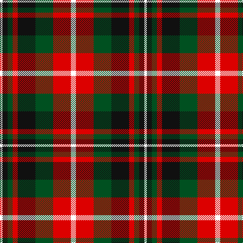

In pattern [WKGRKGRW](/patterns/wkgrkgrw/).

This was sourced from register-of-tartans.  It is a [8 stripes tartan](/stripes/stripes8/).

Original link https://www.tartanregister.gov.uk/tartanDetails.aspx?ref=11618

## Thread count
W/5 K10 G10 R10 K35 G35 R35 W/10

## Palette
Each colour and its ΔE from the base-6 reference it is a variant of.

| Colour | Shade | Base | ΔE (OKLab) |
|---|---|---|---|
| G | <code style="background-color:#005020;">#005020</code> `#005020` | G <code style="background-color:#006100;">#006100</code> | 0.07 |
| K | <code style="background-color:#101010;">#101010</code> `#101010` | K <code style="background-color:#000000;">#000000</code> | 0.17 |
| R | <code style="background-color:#DC0000;">#DC0000</code> `#DC0000` | R <code style="background-color:#CC0000;">#CC0000</code> | 0.03 |
| W | <code style="background-color:#FFFFFF;">#FFFFFF</code> `#FFFFFF` | W <code style="background-color:#F7F7F7;">#F7F7F7</code> | 0.02 |

# Sample pattern

## Nearest tartans

The nearest existing variants by ΔTartan distance.

1. [Holden Brown (Corporate)](/setts/s8/w26k6w6k6w6k30g36r6-g604000-k101010-rc80000-we8ccb8/) — ΔT 0.82
1. [Borthwick](/setts/s9/g24k4r24k6ga24k32ga24k6r12-g008000-ga808080-k000000-r900030/) — ΔT 1.06
1. [Aberlour](/setts/s8/w46k8w8k8w8k44r46y10-k101010-r98481c-we8ccb8-ya08858/) — ΔT 1.08
1. [Chaudhri (Name)](/setts/s8/b26r16w10g48w10r20w10r20-b440044-g285800-r800028-we8ccb8/) — ΔT 1.09
1. [Borthwick Hunting](/setts/s9/g24k4r24k6b24k32b24k6r12-b606060-g004c00-k000000-rc80000/) — ΔT 1.16
1. [Raytheon](/setts/s8/k28w4k6r28wa12ra28k4ra6-k101010-r888888-rac80000-wfcfcfc-wac0c0c0/) — ΔT 1.17
1. [Gordon of Esslemont Family Tartan Tartan Number: 1064. Earliest known date: c.1830 This sett is called 'Gordon of Esslemont' according to Captain Wolrige-Gordon of Esslemont in recent research. It was previously listed as 'Ancient Gordon' before the story of its origin came to light. Apparently the Duke of Gordon was offered tartans with one, two, and three stripes when he applied to Forsythe of Huntly to provide kilts for his troops. He chose the single stripe and called in the Heads of the families to choose from the others. Esslemont took the three stripe version. See products available Copyright © Blair Urquhart, Comrie, 2015](/setts/s7/y12g6y6g44k46b46k8-b780078-g006818-k101010-ye8c000/) — ΔT 1.19
1. [Stevenson (Name)](/setts/s9/r8g48y8r16y8r16y8b48y8-b1c0070-g006818-r880000-yd8b000/) — ΔT 1.20
1. [Montrose](/setts/s9/w2k2r14g15k8w7r14k2w2-g004c00-k000000-rc80000-wd0d0d0/) — ΔT 1.20
1. [Carnegie](/setts/s8/r33g17b50g17r11g17r9k7-b304080-g008000-k000000-rc00000/) — ΔT 1.21

## Neighbour map

Every grey dot is one of 15726 variants placed by the first two principal components of the ΔTartan feature space (44% of its variance). Red is this tartan; blue dots are its nearest — click one to open its page.

<svg viewBox="0 0 640 380" role="img" style="max-width:100%;height:auto;border:1px solid #e0e0e0;border-radius:4px;display:block" xmlns="http://www.w3.org/2000/svg"><image href="/nn/cloud.v1.png" width="640" height="380"/><a href="/setts/s8/w26k6w6k6w6k30g36r6-g604000-k101010-rc80000-we8ccb8/"><circle cx="131.1" cy="197.4" r="4" fill="#3465a4"><title>Holden Brown (Corporate)</title></circle></a><a href="/setts/s9/g24k4r24k6ga24k32ga24k6r12-g008000-ga808080-k000000-r900030/"><circle cx="97.6" cy="214.3" r="4" fill="#3465a4"><title>Borthwick</title></circle></a><a href="/setts/s8/w46k8w8k8w8k44r46y10-k101010-r98481c-we8ccb8-ya08858/"><circle cx="129.4" cy="194.3" r="4" fill="#3465a4"><title>Aberlour</title></circle></a><a href="/setts/s8/b26r16w10g48w10r20w10r20-b440044-g285800-r800028-we8ccb8/"><circle cx="119.2" cy="231.6" r="4" fill="#3465a4"><title>Chaudhri (Name)</title></circle></a><a href="/setts/s9/g24k4r24k6b24k32b24k6r12-b606060-g004c00-k000000-rc80000/"><circle cx="108.6" cy="217.9" r="4" fill="#3465a4"><title>Borthwick Hunting</title></circle></a><a href="/setts/s8/k28w4k6r28wa12ra28k4ra6-k101010-r888888-rac80000-wfcfcfc-wac0c0c0/"><circle cx="105.6" cy="180.5" r="4" fill="#3465a4"><title>Raytheon</title></circle></a><a href="/setts/s7/y12g6y6g44k46b46k8-b780078-g006818-k101010-ye8c000/"><circle cx="140.7" cy="210.2" r="4" fill="#3465a4"><title>Gordon of Esslemont Family Tartan Tartan Number: 1064. Earliest known date: c.1830 This sett is called 'Gordon of Esslemont' according to Captain Wolrige-Gordon of Esslemont in recent research. It was previously listed as 'Ancient Gordon' before the story of its origin came to light. Apparently the Duke of Gordon was offered tartans with one, two, and three stripes when he applied to Forsythe of Huntly to provide kilts for his troops. He chose the single stripe and called in the Heads of the families to choose from the others. Esslemont took the three stripe version. See products available Copyright © Blair Urquhart, Comrie, 2015</title></circle></a><a href="/setts/s9/r8g48y8r16y8r16y8b48y8-b1c0070-g006818-r880000-yd8b000/"><circle cx="111.3" cy="197.0" r="4" fill="#3465a4"><title>Stevenson (Name)</title></circle></a><a href="/setts/s9/w2k2r14g15k8w7r14k2w2-g004c00-k000000-rc80000-wd0d0d0/"><circle cx="158.2" cy="186.5" r="4" fill="#3465a4"><title>Montrose</title></circle></a><a href="/setts/s8/r33g17b50g17r11g17r9k7-b304080-g008000-k000000-rc00000/"><circle cx="156.1" cy="220.0" r="4" fill="#3465a4"><title>Carnegie</title></circle></a><circle cx="109.8" cy="205.2" r="5" fill="#c00000"/></svg>

ID: /setts/s8/w10r35g35k35r10g10k10w5-g005020-k101010-rdc0000-wffffff/
