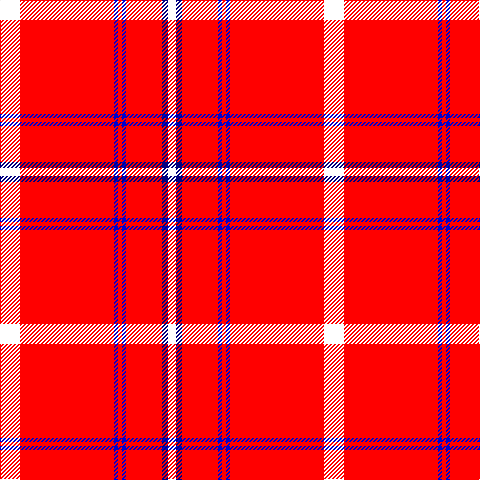

In pattern [WBRBRBRW](/stripes/wbrbrbrw/).

This was sourced from register-of-tartans.  It is a [8 stripe tartan](/stripes/stripes8/).

Original link https://www.tartanregister.gov.uk/tartanDetails.aspx?ref=10491

## Attestations

This cloth appears in 2 source records; the oldest owns this page.

- 01/08/2011 — Swiss National (register-of-tartans, [record](https://www.tartanregister.gov.uk/tartanDetails.aspx?ref=10491))
- 1st Aug. 2011 — Swiss National (Fashion) (tartans-authority, [record](http://www.tartansauthority.com/tartan-ferret/display/10491/))

## Register references

External register numbers recorded for this tartan.

- Scottish Register of Tartans: [10491](https://www.tartanregister.gov.uk/tartanDetails.aspx?ref=10491)

## Thread count
W/20 R94 B4 R4 B4 R36 DB6 W/8

## Palette
Each colour and its ΔE from the base-6 reference it is a variant of.

| Colour | Shade | Base | ΔE (OKLab) |
|---|---|---|---|
| B | <code style="background-color:#0000CD;">#0000CD</code> `#0000CD` | B <code style="background-color:#2A418A;">#2A418A</code> | 0.14 |
| DB | <code style="background-color:#000080;">#000080</code> `#000080` | B <code style="background-color:#2A418A;">#2A418A</code> | 0.14 |
| R | <code style="background-color:#FF0000;">#FF0000</code> `#FF0000` | R <code style="background-color:#CC0000;">#CC0000</code> | 0.11 |
| W | <code style="background-color:#FFFFFF;">#FFFFFF</code> `#FFFFFF` | W <code style="background-color:#F7F7F7;">#F7F7F7</code> | 0.02 |

# Sample pattern

## Nearest tartans

The nearest existing variants by ΔTartan distance.

1. [Valour](/setts/s12/r22k1r4w1r1k1w1r4w4r1w2k1~x4/) — ΔT 1.34
1. [Prince of Denmark](/setts/s10/r51dy2r2dy2r3w3db2w2db2w8~x2/) — ΔT 1.51
1. [Davet (2014)](/setts/s6/lg5k1w11k1r42k1~x2/) — ΔT 1.77
1. [Ferguson the Astronomer](/setts/s7/r48w3k3g2ly6g2r6~x4/) — ΔT 1.78
1. [Virgin](/setts/s8/r51o2r6k10r2k4o3k3~x2/) — ΔT 1.79
1. [Lawers Estate](/setts/s6/dt12k1r70k1g12k1~x2/) — ΔT 1.85
1. [Davet (2014)](/setts/s6/t5k1w11k1r42k1~x2/) — ΔT 1.87
1. [Manchester Reds](/setts/s12/r36ly4r1ly4r4k8r4k2r4w2r1w4~x2/) — ΔT 1.89
1. [Masai Shuka 08 (Artefact)](/setts/s8/r55w20r8w2r8w2r8w2~x2/) — ΔT 1.93
1. [Rose of Kilravock (Personal)](/setts/s9/k2r35db6r5db2r2db2r14w2~x2/) — ΔT 1.96

## Neighbour map

Every grey dot is one of 14299 variants placed by the first two principal components of the ΔTartan feature space (44% of its variance). Red is this tartan; blue dots are its nearest — click one to open its page.

<svg viewBox="0 0 640 380" role="img" style="max-width:100%;height:auto;border:1px solid #e0e0e0;border-radius:4px;display:block" xmlns="http://www.w3.org/2000/svg"><image href="/nn/cloud.v1.png" width="640" height="380"/><a href="/setts/s12/r22k1r4w1r1k1w1r4w4r1w2k1~x4/"><circle cx="500.1" cy="85.5" r="4" fill="#3465a4"><title>Valour</title></circle></a><a href="/setts/s10/r51dy2r2dy2r3w3db2w2db2w8~x2/"><circle cx="506.1" cy="77.2" r="4" fill="#3465a4"><title>Prince of Denmark</title></circle></a><a href="/setts/s6/lg5k1w11k1r42k1~x2/"><circle cx="457.5" cy="85.0" r="4" fill="#3465a4"><title>Davet (2014)</title></circle></a><a href="/setts/s7/r48w3k3g2ly6g2r6~x4/"><circle cx="518.9" cy="98.7" r="4" fill="#3465a4"><title>Ferguson the Astronomer</title></circle></a><a href="/setts/s8/r51o2r6k10r2k4o3k3~x2/"><circle cx="518.4" cy="117.1" r="4" fill="#3465a4"><title>Virgin</title></circle></a><a href="/setts/s6/dt12k1r70k1g12k1~x2/"><circle cx="524.4" cy="91.3" r="4" fill="#3465a4"><title>Lawers Estate</title></circle></a><a href="/setts/s6/t5k1w11k1r42k1~x2/"><circle cx="464.5" cy="90.9" r="4" fill="#3465a4"><title>Davet (2014)</title></circle></a><a href="/setts/s12/r36ly4r1ly4r4k8r4k2r4w2r1w4~x2/"><circle cx="428.6" cy="54.8" r="4" fill="#3465a4"><title>Manchester Reds</title></circle></a><a href="/setts/s8/r55w20r8w2r8w2r8w2~x2/"><circle cx="549.0" cy="140.3" r="4" fill="#3465a4"><title>Masai Shuka 08 (Artefact)</title></circle></a><a href="/setts/s9/k2r35db6r5db2r2db2r14w2~x2/"><circle cx="547.0" cy="133.1" r="4" fill="#3465a4"><title>Rose of Kilravock (Personal)</title></circle></a><circle cx="495.6" cy="99.3" r="5" fill="#c00000"/></svg>

ID: /setts/s8/w10r47db2r2db2r18db3w4~x2/
