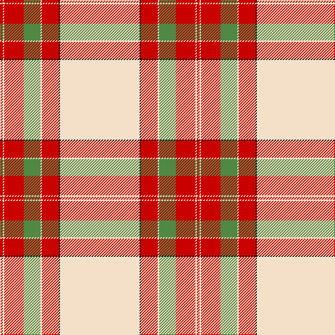

In pattern [RWRGWRKW](/patterns/rwrgwrkw/).

This was sourced from tartans-authority.  It is a [8 stripes tartan](/stripes/stripes8/).

Original link http://www.tartansauthority.com/tartan-ferret/display/7205/

## Thread count
R/4 W2 R28 LG24 W2 R24 K2 W/114

## Palette
Each colour and its ΔE from the base-6 reference it is a variant of.

| Colour | Shade | Base | ΔE (OKLab) |
|---|---|---|---|
| K | <code style="background-color:#101010;">#101010</code> `#101010` | K <code style="background-color:#000000;">#000000</code> | 0.17 |
| LG | <code style="background-color:#508844;">#508844</code> `#508844` | G <code style="background-color:#006400;">#006400</code> | 0.14 |
| R | <code style="background-color:#C80000;">#C80000</code> `#C80000` | R <code style="background-color:#C80000;">#C80000</code> | 0.00 |
| W | <code style="background-color:#F4E0C8;">#F4E0C8</code> `#F4E0C8` | W <code style="background-color:#F4F4F0;">#F4F4F0</code> | 0.06 |

# Sample pattern

ID: /setts/s8/w114k2r24w2g24r28w2r4-g508844-k101010-rc80000-wf4e0c8/
