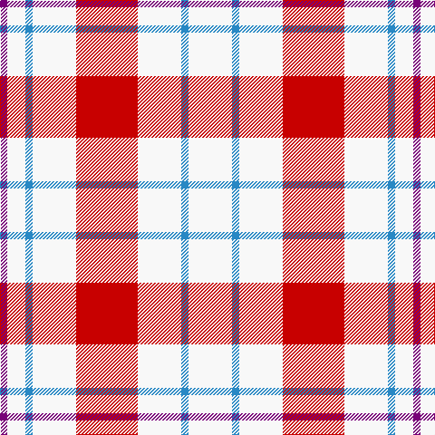

In pattern [BWBWRWBW](/patterns/bwbwrwbw/).

This was sourced from register-of-tartans.  It is a [8 stripes tartan](/stripes/stripes8/).

Original link https://www.tartanregister.gov.uk/tartanDetails.aspx?ref=2958

## Thread count
P/8 W20 B8 W48 R68 W48 B8 W/48

## Palette
Each colour and its ΔE from the base-6 reference it is a variant of.

| Colour | Shade | Base | ΔE (OKLab) |
|---|---|---|---|
| B | <code style="background-color:#2888C4;">#2888C4</code> `#2888C4` | B <code style="background-color:#2A418A;">#2A418A</code> | 0.21 |
| P | <code style="background-color:#780078;">#780078</code> `#780078` | B <code style="background-color:#2A418A;">#2A418A</code> | 0.17 |
| R | <code style="background-color:#C80000;">#C80000</code> `#C80000` | R <code style="background-color:#CC0000;">#CC0000</code> | 0.01 |
| W | <code style="background-color:#F8F8F8;">#F8F8F8</code> `#F8F8F8` | W <code style="background-color:#F7F7F7;">#F7F7F7</code> | 0.00 |

# Sample pattern

## Nearest tartans

The nearest existing variants by ΔTartan distance.

1. [Milne (Personal)](/setts/s8/w12g2w12r17w12g2w5b2~b6840fc-g005448-rd05054-wfcfcfc~x4/) — ΔT 0.44
1. [Milne, dress](/setts/s8/w18b4w18r30w18b4w9ba4~b304080-ba800080-rc00000-we0e0e0/) — ΔT 0.88
1. [Milne Purple Dress (Dance)](/setts/s8/w12b2w12r17w12b2w5ra2~b202060-rb468ac-rac80000-wfcfcfc~x4/) — ΔT 0.88
1. [Milne Dress Family Tartan Tartan Number: 634. Earliest known date: pre 2003 Milnes are usually regarded as being a Sept of the Gordons or of the Ogilvys. See products available Copyright © Blair Urquhart, Comrie, 2015](/setts/s8/w18b4w18r30w18b4w9ba4~b2c2c80-ba780078-rc80000-we0e0e0/) — ΔT 0.88
1. [Milne Dress Fancy Tartan Tartan Number: 6550. Earliest known date: pre 2004 Colour change for #634. Thought to be a Dancers' Fancy. See products available Copyright © Blair Urquhart, Comrie, 2015](/setts/s14/w5b2w12r17w12b2w12b2w12r17w12b2w5ba2~b2888c4-ba780078-rc80000-wf8f8f8~x4/) — ΔT 1.17
1. [Clayton Dress (Dance)](/setts/s8/r14w35k4w35r14w8r14w8~k000000-r880000-wfcfcfc~x2/) — ΔT 1.18
1. [Clayton Dress (Dance)](/setts/s6/w8r14w8r14w35k4~k000000-r880000-wfcfcfc~x2/) — ΔT 1.41
1. [Milne Purple Dress Tartan Tartan Number: 6548. Earliest known date: 1985 See #634 for history. Now a dance tartan from D C Dalgliesh. See products available Copyright © Blair Urquhart, Comrie, 2015](/setts/s14/w5b2w12r17w12b2w12b2w12r17w12b2w5ra2~b202060-rb468ac-rac80000-wfcfcfc~x4/) — ΔT 1.49
1. [Boswell Dress Personal Tartan Tartan Number: 6359. Earliest known date: 2004 A tartan for William Boswell of Balmuto in Fife. See products available Copyright © Blair Urquhart, Comrie, 2015](/setts/s8/w13r3w2k5w2r3w13b8~b2c2c80-k101010-rc80000-we0e0e0~x2/) — ΔT 1.54
1. [Milne, Green (Dance)](/setts/s8/w12r2w12g17w12r2w5b2~b9058d8-g009468-rc80000-wf8f8f8~x4/) — ΔT 1.55

## Neighbour map

Every grey dot is one of 15726 variants placed by the first two principal components of the ΔTartan feature space (44% of its variance). Red is this tartan; blue dots are its nearest — click one to open its page.

<svg viewBox="0 0 640 380" role="img" style="max-width:100%;height:auto;border:1px solid #e0e0e0;border-radius:4px;display:block" xmlns="http://www.w3.org/2000/svg"><image href="/nn/cloud.v1.png" width="640" height="380"/><a href="/setts/s8/w12g2w12r17w12g2w5b2~b6840fc-g005448-rd05054-wfcfcfc~x4/"><circle cx="299.1" cy="189.3" r="4" fill="#3465a4"><title>Milne (Personal)</title></circle></a><a href="/setts/s8/w18b4w18r30w18b4w9ba4~b304080-ba800080-rc00000-we0e0e0/"><circle cx="270.4" cy="196.6" r="4" fill="#3465a4"><title>Milne, dress</title></circle></a><a href="/setts/s8/w12b2w12r17w12b2w5ra2~b202060-rb468ac-rac80000-wfcfcfc~x4/"><circle cx="297.2" cy="189.9" r="4" fill="#3465a4"><title>Milne Purple Dress (Dance)</title></circle></a><a href="/setts/s8/w18b4w18r30w18b4w9ba4~b2c2c80-ba780078-rc80000-we0e0e0/"><circle cx="269.3" cy="195.9" r="4" fill="#3465a4"><title>Milne Dress Family Tartan Tartan Number: 634. Earliest known date: pre 2003 Milnes are usually regarded as being a Sept of the Gordons or of the Ogilvys. See products available Copyright © Blair Urquhart, Comrie, 2015</title></circle></a><a href="/setts/s14/w5b2w12r17w12b2w12b2w12r17w12b2w5ba2~b2888c4-ba780078-rc80000-wf8f8f8~x4/"><circle cx="271.8" cy="162.5" r="4" fill="#3465a4"><title>Milne Dress Fancy Tartan Tartan Number: 6550. Earliest known date: pre 2004 Colour change for #634. Thought to be a Dancers' Fancy. See products available Copyright © Blair Urquhart, Comrie, 2015</title></circle></a><a href="/setts/s8/r14w35k4w35r14w8r14w8~k000000-r880000-wfcfcfc~x2/"><circle cx="317.2" cy="202.2" r="4" fill="#3465a4"><title>Clayton Dress (Dance)</title></circle></a><a href="/setts/s6/w8r14w8r14w35k4~k000000-r880000-wfcfcfc~x2/"><circle cx="302.9" cy="208.5" r="4" fill="#3465a4"><title>Clayton Dress (Dance)</title></circle></a><a href="/setts/s14/w5b2w12r17w12b2w12b2w12r17w12b2w5ra2~b202060-rb468ac-rac80000-wfcfcfc~x4/"><circle cx="270.9" cy="165.9" r="4" fill="#3465a4"><title>Milne Purple Dress Tartan Tartan Number: 6548. Earliest known date: 1985 See #634 for history. Now a dance tartan from D C Dalgliesh. See products available Copyright © Blair Urquhart, Comrie, 2015</title></circle></a><a href="/setts/s8/w13r3w2k5w2r3w13b8~b2c2c80-k101010-rc80000-we0e0e0~x2/"><circle cx="245.1" cy="197.4" r="4" fill="#3465a4"><title>Boswell Dress Personal Tartan Tartan Number: 6359. Earliest known date: 2004 A tartan for William Boswell of Balmuto in Fife. See products available Copyright © Blair Urquhart, Comrie, 2015</title></circle></a><a href="/setts/s8/w12r2w12g17w12r2w5b2~b9058d8-g009468-rc80000-wf8f8f8~x4/"><circle cx="298.1" cy="197.5" r="4" fill="#3465a4"><title>Milne, Green (Dance)</title></circle></a><circle cx="296.9" cy="186.9" r="5" fill="#c00000"/></svg>

ID: /setts/s8/w12b2w12r17w12b2w5ba2~b2888c4-ba780078-rc80000-wf8f8f8~x4/
