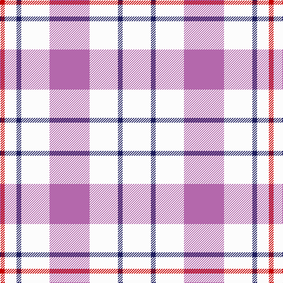

**Bands:** [RWBWRWBW](/stripes/rwbwrwbw/) · **Stripes:** [R W DB W M W DB W](/stripes/stripes8/) R W DB W M W DB W

This was sourced from register-of-tartans.  It is a [8 band tartan](/bands/bands8/).

Original link https://www.tartanregister.gov.uk/tartanDetails.aspx?ref=2956

## Register references

External register numbers recorded for this tartan.

- Scottish Register of Tartans: [2956](https://www.tartanregister.gov.uk/tartanDetails.aspx?ref=2956)
- Scottish Tartans Authority (ITI): 6548

## Thread count
R/8 W20 DB8 W48 P68 W48 DB8 W/48

## Palette
Each colour and its ΔE from the base-6 reference it is a variant of.

| Colour | Shade | Base | ΔE (OKLab) |
|---|---|---|---|
| DB | <code style="background-color:#202060;">#202060</code> `#202060` | B <code style="background-color:#2A418A;">#2A418A</code> | 0.11 |
| P | <code style="background-color:#B468AC;">#B468AC</code> `#B468AC` | R <code style="background-color:#CC0000;">#CC0000</code> | 0.21 |
| R | <code style="background-color:#C80000;">#C80000</code> `#C80000` | R <code style="background-color:#CC0000;">#CC0000</code> | 0.01 |
| W | <code style="background-color:#FCFCFC;">#FCFCFC</code> `#FCFCFC` | W <code style="background-color:#F7F7F7;">#F7F7F7</code> | 0.01 |

# Sample pattern

## Nearest tartans

The nearest existing variants by ΔTartan distance.

1. [Milne (Personal)](/setts/s8/w12dg2w12r17w12dg2w5b2~x4/) — ΔT 0.59
1. [Milne, Dress (Dance)](/setts/s8/w12t2w12r17w12t2w5dp2~x4/) — ΔT 0.88
1. [Milne Purple Dress Tartan Tartan Number: 6548. Earliest known date: 1985 See #634 for history. Now a dance tartan from D C Dalgliesh. See products available Copyright © Blair Urquhart, Comrie, 2015](/setts/s14/w5db2w12m17w12db2w12db2w12m17w12db2w5r2~x4/) — ΔT 1.17
1. [Milne, dress](/setts/s8/w18db4w18r30w18db4w9p4/) — ΔT 1.34
1. [Milne Dress Family Tartan Tartan Number: 634. Earliest known date: pre 2003 Milnes are usually regarded as being a Sept of the Gordons or of the Ogilvys. See products available Copyright © Blair Urquhart, Comrie, 2015](/setts/s8/w18db4w18r30w18db4w9dp4/) — ΔT 1.34
1. [Milne Royal Blue Dress Fashion Tartan Tartan Number: 6547. Earliest known date: 01/01/2005 A Dance version of #634 (original Scottish Tartans Authority reference) reputed to be a personal tartan./Threadcount and colours aren't 100% original. Generated manually./ See products available Copyright © Blair Urquhart, Comrie, 2015](/setts/s8/w24n5w24db36w28n6w12r6/) — ΔT 1.36
1. [Milne, Green (Dance)](/setts/s8/w12r2w12g17w12r2w5p2~x4/) — ΔT 1.38
1. [Milne Royal Blue Dress (Dance)](/setts/s8/w12t2w12db17w12t2w5r2~x4/) — ΔT 1.51
1. [Justus dress](/setts/s7/db1w4ly1w1r1w4db1~x12/) — ΔT 1.52
1. [Milne Dress Fancy Tartan Tartan Number: 6550. Earliest known date: pre 2004 Colour change for #634. Thought to be a Dancers' Fancy. See products available Copyright © Blair Urquhart, Comrie, 2015](/setts/s14/w5t2w12r17w12t2w12t2w12r17w12t2w5dp2~x4/) — ΔT 1.53

## Neighbour map

Every grey dot is one of 14313 variants placed by the first two principal components of the ΔTartan feature space (44% of its variance). Red is this tartan; blue dots are its nearest — click one to open its page.

<svg viewBox="0 0 640 380" role="img" style="max-width:100%;height:auto;border:1px solid #e0e0e0;border-radius:4px;display:block" xmlns="http://www.w3.org/2000/svg"><image href="/nn/cloud.v1.png" width="640" height="380"/><a href="/setts/s8/w12dg2w12r17w12dg2w5b2~x4/"><circle cx="300.0" cy="182.6" r="4" fill="#3465a4"><title>Milne (Personal)</title></circle></a><a href="/setts/s8/w12t2w12r17w12t2w5dp2~x4/"><circle cx="297.6" cy="179.3" r="4" fill="#3465a4"><title>Milne, Dress (Dance)</title></circle></a><a href="/setts/s14/w5db2w12m17w12db2w12db2w12m17w12db2w5r2~x4/"><circle cx="272.2" cy="160.4" r="4" fill="#3465a4"><title>Milne Purple Dress Tartan Tartan Number: 6548. Earliest known date: 1985 See #634 for history. Now a dance tartan from D C Dalgliesh. See products available Copyright © Blair Urquhart, Comrie, 2015</title></circle></a><a href="/setts/s8/w18db4w18r30w18db4w9p4/"><circle cx="271.2" cy="190.1" r="4" fill="#3465a4"><title>Milne, dress</title></circle></a><a href="/setts/s8/w18db4w18r30w18db4w9dp4/"><circle cx="270.1" cy="189.2" r="4" fill="#3465a4"><title>Milne Dress Family Tartan Tartan Number: 634. Earliest known date: pre 2003 Milnes are usually regarded as being a Sept of the Gordons or of the Ogilvys. See products available Copyright © Blair Urquhart, Comrie, 2015</title></circle></a><a href="/setts/s8/w24n5w24db36w28n6w12r6/"><circle cx="262.8" cy="202.0" r="4" fill="#3465a4"><title>Milne Royal Blue Dress Fashion Tartan Tartan Number: 6547. Earliest known date: 01/01/2005 A Dance version of #634 (original Scottish Tartans Authority reference) reputed to be a personal tartan./Threadcount and colours aren't 100% original. Generated manually./ See products available Copyright © Blair Urquhart, Comrie, 2015</title></circle></a><a href="/setts/s8/w12r2w12g17w12r2w5p2~x4/"><circle cx="299.7" cy="192.7" r="4" fill="#3465a4"><title>Milne, Green (Dance)</title></circle></a><a href="/setts/s8/w12t2w12db17w12t2w5r2~x4/"><circle cx="282.0" cy="188.4" r="4" fill="#3465a4"><title>Milne Royal Blue Dress (Dance)</title></circle></a><a href="/setts/s7/db1w4ly1w1r1w4db1~x12/"><circle cx="309.7" cy="220.6" r="4" fill="#3465a4"><title>Justus dress</title></circle></a><a href="/setts/s14/w5t2w12r17w12t2w12t2w12r17w12t2w5dp2~x4/"><circle cx="272.5" cy="155.9" r="4" fill="#3465a4"><title>Milne Dress Fancy Tartan Tartan Number: 6550. Earliest known date: pre 2004 Colour change for #634. Thought to be a Dancers' Fancy. See products available Copyright © Blair Urquhart, Comrie, 2015</title></circle></a><circle cx="298.4" cy="183.4" r="5" fill="#c00000"/></svg>

ID: /setts/s8/w12db2w12m17w12db2w5r2~x4/
