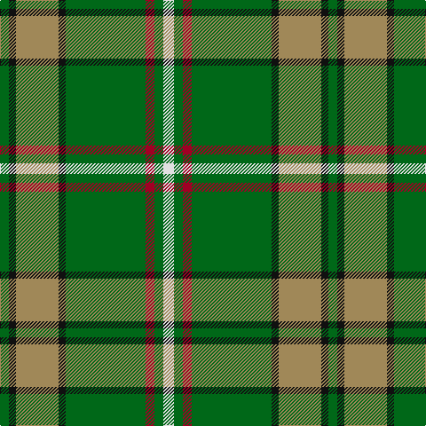

In pattern [GKYKGRGW](/patterns/gkykgrgw/).

This was sourced from tartans-authority.  It is a [8 stripes tartan](/stripes/stripes8/).

Original link http://www.tartansauthority.com/tartan-ferret/display/2663/

## Attestations

This cloth appears in 2 source records; the oldest owns this page.

- 1999 — O'Neill (Name) (tartans-authority, [record](http://www.tartansauthority.com/tartan-ferret/display/2663/))
- 01/01/2000 — O'Neill (register-of-tartans, [record](https://www.tartanregister.gov.uk/tartanDetails.aspx?ref=4824))

## Thread count
G/10 K8 LT48 K8 G90 DR10 G10 LN/12

## Palette
Each colour and its ΔE from the base-6 reference it is a variant of.

| Colour | Shade | Base | ΔE (OKLab) |
|---|---|---|---|
| DR | <code style="background-color:#A00024;">#A00024</code> `#A00024` | R <code style="background-color:#C80000;">#C80000</code> | 0.09 |
| G | <code style="background-color:#006818;">#006818</code> `#006818` | G <code style="background-color:#006400;">#006400</code> | 0.02 |
| K | <code style="background-color:#101010;">#101010</code> `#101010` | K <code style="background-color:#000000;">#000000</code> | 0.17 |
| LN | <code style="background-color:#E0E0E0;">#E0E0E0</code> `#E0E0E0` | W <code style="background-color:#F4F4F0;">#F4F4F0</code> | 0.06 |
| LT | <code style="background-color:#A08858;">#A08858</code> `#A08858` | Y <code style="background-color:#E8C000;">#E8C000</code> | 0.21 |

# Sample pattern

ID: /setts/s8/w12g10r10g90k8y48k8g10-g006818-k101010-ra00024-we0e0e0-ya08858/
