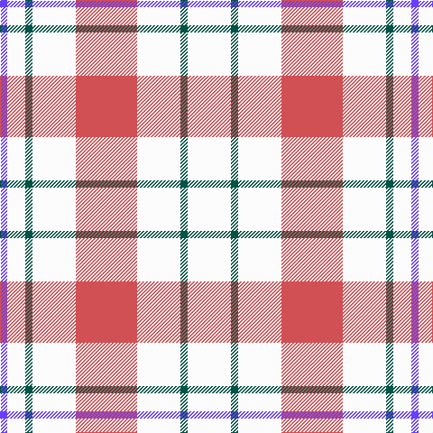

In pattern [BWGWRWGW](/patterns/bwgwrwgw/).

This was sourced from tartans-authority.  It is a [8 stripes tartan](/stripes/stripes8/).

Original link http://www.tartansauthority.com/tartan-ferret/display/634/

## Attestations

This cloth appears in 2 source records; the oldest owns this page.

- 1985 — Milne (Personal) (tartans-authority, [record](http://www.tartansauthority.com/tartan-ferret/display/634/))
- 01/01/2003 — Milne (Personal) (register-of-tartans, [record](https://www.tartanregister.gov.uk/tartanDetails.aspx?ref=2953))

## Thread count
P/8 W20 G8 W48 DO68 W48 G8 W/48

## Palette
Each colour and its ΔE from the base-6 reference it is a variant of.

| Colour | Shade | Base | ΔE (OKLab) |
|---|---|---|---|
| DO | <code style="background-color:#D05054;">#D05054</code> `#D05054` | R <code style="background-color:#CC0000;">#CC0000</code> | 0.09 |
| G | <code style="background-color:#005448;">#005448</code> `#005448` | G <code style="background-color:#006100;">#006100</code> | 0.10 |
| P | <code style="background-color:#6840FC;">#6840FC</code> `#6840FC` | B <code style="background-color:#2A418A;">#2A418A</code> | 0.20 |
| W | <code style="background-color:#FCFCFC;">#FCFCFC</code> `#FCFCFC` | W <code style="background-color:#F7F7F7;">#F7F7F7</code> | 0.01 |

# Sample pattern

## Nearest tartans

The nearest existing variants by ΔTartan distance.

1. [Milne, Dress (Dance)](/setts/s8/w12b2w12r17w12b2w5ba2~b2888c4-ba780078-rc80000-wf8f8f8~x4/) — ΔT 0.44
1. [Milne Purple Dress (Dance)](/setts/s8/w12b2w12r17w12b2w5ra2~b202060-rb468ac-rac80000-wfcfcfc~x4/) — ΔT 0.59
1. [Milne, dress](/setts/s8/w18b4w18r30w18b4w9ba4~b304080-ba800080-rc00000-we0e0e0/) — ΔT 1.11
1. [Milne Dress Family Tartan Tartan Number: 634. Earliest known date: pre 2003 Milnes are usually regarded as being a Sept of the Gordons or of the Ogilvys. See products available Copyright © Blair Urquhart, Comrie, 2015](/setts/s8/w18b4w18r30w18b4w9ba4~b2c2c80-ba780078-rc80000-we0e0e0/) — ΔT 1.13
1. [Milne, Green (Dance)](/setts/s8/w12r2w12g17w12r2w5b2~b9058d8-g009468-rc80000-wf8f8f8~x4/) — ΔT 1.21
1. [Milne Dress Fancy Tartan Tartan Number: 6550. Earliest known date: pre 2004 Colour change for #634. Thought to be a Dancers' Fancy. See products available Copyright © Blair Urquhart, Comrie, 2015](/setts/s14/w5b2w12r17w12b2w12b2w12r17w12b2w5ba2~b2888c4-ba780078-rc80000-wf8f8f8~x4/) — ΔT 1.29
1. [Milne Purple Dress Tartan Tartan Number: 6548. Earliest known date: 1985 See #634 for history. Now a dance tartan from D C Dalgliesh. See products available Copyright © Blair Urquhart, Comrie, 2015](/setts/s14/w5b2w12r17w12b2w12b2w12r17w12b2w5ra2~b202060-rb468ac-rac80000-wfcfcfc~x4/) — ΔT 1.36
1. [Clayton Dress (Dance)](/setts/s8/r14w35k4w35r14w8r14w8~k000000-r880000-wfcfcfc~x2/) — ΔT 1.38
1. [Justus dress](/setts/s7/b1w4r1w1y1w4b1~b304080-rc00000-we0e0e0-yf0c000~x12/) — ΔT 1.43
1. [Clackson Arisaid (Name?)](/setts/s7/w24g2w8b5y4b5y4~b2c2c80-g006818-we0e0e0-ye8c000~x2/) — ΔT 1.55

## Neighbour map

Every grey dot is one of 15726 variants placed by the first two principal components of the ΔTartan feature space (44% of its variance). Red is this tartan; blue dots are its nearest — click one to open its page.

<svg viewBox="0 0 640 380" role="img" style="max-width:100%;height:auto;border:1px solid #e0e0e0;border-radius:4px;display:block" xmlns="http://www.w3.org/2000/svg"><image href="/nn/cloud.v1.png" width="640" height="380"/><a href="/setts/s8/w12b2w12r17w12b2w5ba2~b2888c4-ba780078-rc80000-wf8f8f8~x4/"><circle cx="296.9" cy="186.9" r="4" fill="#3465a4"><title>Milne, Dress (Dance)</title></circle></a><a href="/setts/s8/w12b2w12r17w12b2w5ra2~b202060-rb468ac-rac80000-wfcfcfc~x4/"><circle cx="297.2" cy="189.9" r="4" fill="#3465a4"><title>Milne Purple Dress (Dance)</title></circle></a><a href="/setts/s8/w18b4w18r30w18b4w9ba4~b304080-ba800080-rc00000-we0e0e0/"><circle cx="270.4" cy="196.6" r="4" fill="#3465a4"><title>Milne, dress</title></circle></a><a href="/setts/s8/w18b4w18r30w18b4w9ba4~b2c2c80-ba780078-rc80000-we0e0e0/"><circle cx="269.3" cy="195.9" r="4" fill="#3465a4"><title>Milne Dress Family Tartan Tartan Number: 634. Earliest known date: pre 2003 Milnes are usually regarded as being a Sept of the Gordons or of the Ogilvys. See products available Copyright © Blair Urquhart, Comrie, 2015</title></circle></a><a href="/setts/s8/w12r2w12g17w12r2w5b2~b9058d8-g009468-rc80000-wf8f8f8~x4/"><circle cx="298.1" cy="197.5" r="4" fill="#3465a4"><title>Milne, Green (Dance)</title></circle></a><a href="/setts/s14/w5b2w12r17w12b2w12b2w12r17w12b2w5ba2~b2888c4-ba780078-rc80000-wf8f8f8~x4/"><circle cx="271.8" cy="162.5" r="4" fill="#3465a4"><title>Milne Dress Fancy Tartan Tartan Number: 6550. Earliest known date: pre 2004 Colour change for #634. Thought to be a Dancers' Fancy. See products available Copyright © Blair Urquhart, Comrie, 2015</title></circle></a><a href="/setts/s14/w5b2w12r17w12b2w12b2w12r17w12b2w5ra2~b202060-rb468ac-rac80000-wfcfcfc~x4/"><circle cx="270.9" cy="165.9" r="4" fill="#3465a4"><title>Milne Purple Dress Tartan Tartan Number: 6548. Earliest known date: 1985 See #634 for history. Now a dance tartan from D C Dalgliesh. See products available Copyright © Blair Urquhart, Comrie, 2015</title></circle></a><a href="/setts/s8/r14w35k4w35r14w8r14w8~k000000-r880000-wfcfcfc~x2/"><circle cx="317.2" cy="202.2" r="4" fill="#3465a4"><title>Clayton Dress (Dance)</title></circle></a><a href="/setts/s7/b1w4r1w1y1w4b1~b304080-rc00000-we0e0e0-yf0c000~x12/"><circle cx="308.6" cy="226.8" r="4" fill="#3465a4"><title>Justus dress</title></circle></a><a href="/setts/s7/w24g2w8b5y4b5y4~b2c2c80-g006818-we0e0e0-ye8c000~x2/"><circle cx="303.1" cy="167.1" r="4" fill="#3465a4"><title>Clackson Arisaid (Name?)</title></circle></a><circle cx="299.1" cy="189.3" r="5" fill="#c00000"/></svg>

ID: /setts/s8/w12g2w12r17w12g2w5b2~b6840fc-g005448-rd05054-wfcfcfc~x4/
