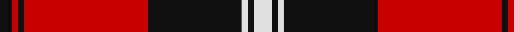
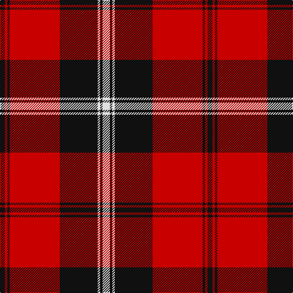

In pattern [KRKRKWKW](/patterns/krkrkwkw/).

This was sourced from register-of-tartans.  It is a [8 stripes tartan](/stripes/stripes8/).

Original link https://www.tartanregister.gov.uk/tartanDetails.aspx?ref=4404

## Attestations

This cloth appears in 3 source records; the oldest owns this page.

- 01/06/2006 — University of Nebraska Alumni Association (register-of-tartans, [record](https://www.tartanregister.gov.uk/tartanDetails.aspx?ref=4404))
- 2006 June — University of Nebraska (Corporate) (tartans-authority, [record](http://www.tartansauthority.com/tartan-ferret/display/6955/))
- undated — Nebraska, University of American Corporate Tartan Tartan Number: 6955. Earliest known date: 2006 June This tartan weas designed by Strikke Designs of Hastings Nebraska and Lochcarron of Scotland to be used to support the Alumni Association. Colours are those of the University of Nebraska. Woven by Lochcarron. See products available Copyright © Blair Urquhart, Comrie, 2015 (house-of-tartan, [record](http://www.house-of-tartan.scotland.net/house/TartanViewjs.asp?colr=Def&tnam=6955))

## Thread count
K/8 R4 K4 R82 K62 LN4 K4 LN/12

## Palette
Each colour and its ΔE from the base-6 reference it is a variant of.

| Colour | Shade | Base | ΔE (OKLab) |
|---|---|---|---|
| K | <code style="background-color:#101010;">#101010</code> `#101010` | K <code style="background-color:#000000;">#000000</code> | 0.17 |
| LN | <code style="background-color:#E0E0E0;">#E0E0E0</code> `#E0E0E0` | W <code style="background-color:#F4F4F0;">#F4F4F0</code> | 0.06 |
| R | <code style="background-color:#C80000;">#C80000</code> `#C80000` | R <code style="background-color:#C80000;">#C80000</code> | 0.00 |

# Sample pattern

## Nearest tartans

The nearest existing variants by ΔTartan distance.

1. [Cunningham](/setts/s7/k6r2k60r56k2r2w6-k101010-rdc0000-we0e0e0/) — ΔT 0.78
1. [Cunningham #2](/setts/s7/k6r4k60r56k4r4w6-k101010-rc80000-we0e0e0/) — ΔT 0.82
1. [Las Vegas Fire Fighters](/setts/s8/r2k6w4k56r60k2r4w2-k101010-rc80000-wc0c0c0/) — ΔT 0.83
1. [Harry/Parry](/setts/s10/k6r3k3r15ra7k7ra5k17ra46r4-k000028-rbe7832-rac80028/) — ΔT 1.07
1. [Ramsay of Dalhousie](/setts/s6/k8w4k56r60k2r6-k101010-rdc0000-we0e0e0/) — ΔT 1.08
1. [Cunningham #3](/setts/s7/k6r2k60r56b2r2w6-b2c4084-k101010-rdc0000-we0e0e0/) — ΔT 1.09
1. [Dunbar Ancient](/setts/s6/k26w4k8r56k8w4-k101010-rcc4438-we0e0e0/) — ΔT 1.15
1. [Cunningham (VS) Clan Tartan Tartan Number: 1200. Earliest known date: 1842 The origin of the name comes from the district of Cunningham in Ayrshire. Alexander de Cunningham was created 1st Earl of Glencairn in 1488. The family is now widespread throughout Scotland. Cunningham was one of the names adopted by the MacGregors when their own was proscribed. There is a similarity with the MacGregor tartan but the true origin is unknown as the claims of antiquity made in the Vestiarium Scoticum, where the Cunningham tartan was first recorded, are unreliable. See products available Copyright © Blair Urquhart, Comrie, 2015](/setts/s7/k6r2k60r56b2r2w6-b2c2c80-k101010-rc80000-we0e0e0/) — ΔT 1.16
1. [Smeaton 1985 (Name)](/setts/s10/k12r8w6r88k64r6k6y6k4r6-k101010-rc80000-wc0c0c0-yd09800/) — ΔT 1.18
1. [Barbecue Plaid](/setts/s8/r45k2r2k28w16r4k4y2-k000000-rc80000-wfcfcfc-yc88c00/) — ΔT 1.22

## Neighbour map

Every grey dot is one of 15726 variants placed by the first two principal components of the ΔTartan feature space (44% of its variance). Red is this tartan; blue dots are its nearest — click one to open its page.

<svg viewBox="0 0 640 380" role="img" style="max-width:100%;height:auto;border:1px solid #e0e0e0;border-radius:4px;display:block" xmlns="http://www.w3.org/2000/svg"><image href="/nn/cloud.v1.png" width="640" height="380"/><a href="/setts/s7/k6r2k60r56k2r2w6-k101010-rdc0000-we0e0e0/"><circle cx="376.2" cy="135.4" r="4" fill="#3465a4"><title>Cunningham</title></circle></a><a href="/setts/s7/k6r4k60r56k4r4w6-k101010-rc80000-we0e0e0/"><circle cx="350.4" cy="168.5" r="4" fill="#3465a4"><title>Cunningham #2</title></circle></a><a href="/setts/s8/r2k6w4k56r60k2r4w2-k101010-rc80000-wc0c0c0/"><circle cx="381.3" cy="128.5" r="4" fill="#3465a4"><title>Las Vegas Fire Fighters</title></circle></a><a href="/setts/s10/k6r3k3r15ra7k7ra5k17ra46r4-k000028-rbe7832-rac80028/"><circle cx="314.8" cy="150.8" r="4" fill="#3465a4"><title>Harry/Parry</title></circle></a><a href="/setts/s6/k8w4k56r60k2r6-k101010-rdc0000-we0e0e0/"><circle cx="370.5" cy="152.9" r="4" fill="#3465a4"><title>Ramsay of Dalhousie</title></circle></a><a href="/setts/s7/k6r2k60r56b2r2w6-b2c4084-k101010-rdc0000-we0e0e0/"><circle cx="348.6" cy="119.5" r="4" fill="#3465a4"><title>Cunningham #3</title></circle></a><a href="/setts/s6/k26w4k8r56k8w4-k101010-rcc4438-we0e0e0/"><circle cx="334.6" cy="179.4" r="4" fill="#3465a4"><title>Dunbar Ancient</title></circle></a><a href="/setts/s7/k6r2k60r56b2r2w6-b2c2c80-k101010-rc80000-we0e0e0/"><circle cx="353.8" cy="123.6" r="4" fill="#3465a4"><title>Cunningham (VS) Clan Tartan Tartan Number: 1200. Earliest known date: 1842 The origin of the name comes from the district of Cunningham in Ayrshire. Alexander de Cunningham was created 1st Earl of Glencairn in 1488. The family is now widespread throughout Scotland. Cunningham was one of the names adopted by the MacGregors when their own was proscribed. There is a similarity with the MacGregor tartan but the true origin is unknown as the claims of antiquity made in the Vestiarium Scoticum, where the Cunningham tartan was first recorded, are unreliable. See products available Copyright © Blair Urquhart, Comrie, 2015</title></circle></a><a href="/setts/s10/k12r8w6r88k64r6k6y6k4r6-k101010-rc80000-wc0c0c0-yd09800/"><circle cx="358.1" cy="113.8" r="4" fill="#3465a4"><title>Smeaton 1985 (Name)</title></circle></a><a href="/setts/s8/r45k2r2k28w16r4k4y2-k000000-rc80000-wfcfcfc-yc88c00/"><circle cx="282.5" cy="117.6" r="4" fill="#3465a4"><title>Barbecue Plaid</title></circle></a><circle cx="334.8" cy="139.7" r="5" fill="#c00000"/></svg>

ID: /setts/s8/w12k4w4k62r82k4r4k8-k101010-rc80000-we0e0e0/
