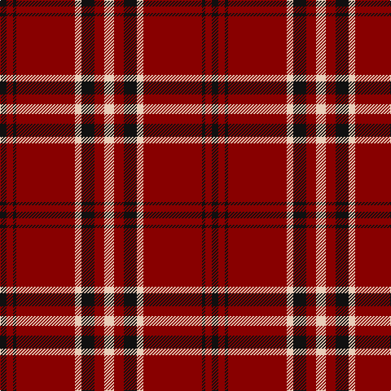

In pattern [KRKRWKRW](/patterns/krkrwkrw/).

This was sourced from register-of-tartans.  It is a [8 stripes tartan](/stripes/stripes8/).

Original link https://www.tartanregister.gov.uk/tartanDetails.aspx?ref=2228

## Attestations

This cloth appears in 2 source records; the oldest owns this page.

- 01/01/2003 — Lougheed (register-of-tartans, [record](https://www.tartanregister.gov.uk/tartanDetails.aspx?ref=2228))
- pre 2003 — Lougheed (Name?) (tartans-authority, [record](http://www.tartansauthority.com/tartan-ferret/display/5932/))

## Thread count
K/8 DR8 K4 DR72 LR8 K16 DR12 LR/12

## Palette
Each colour and its ΔE from the base-6 reference it is a variant of.

| Colour | Shade | Base | ΔE (OKLab) |
|---|---|---|---|
| DR | <code style="background-color:#880000;">#880000</code> `#880000` | R <code style="background-color:#C80000;">#C80000</code> | 0.14 |
| K | <code style="background-color:#101010;">#101010</code> `#101010` | K <code style="background-color:#000000;">#000000</code> | 0.17 |
| LR | <code style="background-color:#E8CCB8;">#E8CCB8</code> `#E8CCB8` | W <code style="background-color:#F4F4F0;">#F4F4F0</code> | 0.11 |

# Sample pattern

## Nearest tartans

The nearest existing variants by ΔTartan distance.

1. [University of South Carolina (Corp)](/setts/s10/r4k4r3k8w3r3k20r40w2r4-k101010-ra00000-wfcfcfc/) — ΔT 0.79
1. [Forget Family (Red)](/setts/s6/r84k4w4k36w4k10-k101010-rc80000-wffffff/) — ΔT 0.98
1. [Stuart of Bute](/setts/s9/r24g12k2g4k2g2k12r48y4-g11450d-k000000-raa0000-yaaaaaa/) — ΔT 1.07
1. [Maxwell](/setts/s7/r3g16r4k6r28g1r3-g004c00-k000000-rc80000/) — ΔT 1.08
1. [MacKintosh D](/setts/s6/r44b10r4g22r6b2-b000064-g004c00-rc80000/) — ΔT 1.09
1. [Anthony Plaid Red](/setts/s9/r72k4y12k4ya4r12k8r8ya8-k101010-r880000-ye8c000-yab8b8b8/) — ΔT 1.13
1. [Auld Reekie](/setts/s6/b8r6b6r44g16r4-b000050-g003000-rc00000/) — ΔT 1.15
1. [South Carolina, University of](/setts/s10/r4w4r3k8w3r3k20r40w2r4-k101010-r800028-wffffff/) — ΔT 1.16
1. [Stuart of Bute](/setts/s9/r12g6k1g2k1g1k6r24w2-g004c00-k000000-rc80000-wd0d0d0/) — ΔT 1.17
1. [Highlands of Wyomissing (Corporate)](/setts/s8/r70w6r16y4g22y4r16w6-g003820-r880000-we8ccb8-ye8c000/) — ΔT 1.19

## Neighbour map

Every grey dot is one of 15726 variants placed by the first two principal components of the ΔTartan feature space (44% of its variance). Red is this tartan; blue dots are its nearest — click one to open its page.

<svg viewBox="0 0 640 380" role="img" style="max-width:100%;height:auto;border:1px solid #e0e0e0;border-radius:4px;display:block" xmlns="http://www.w3.org/2000/svg"><image href="/nn/cloud.v1.png" width="640" height="380"/><a href="/setts/s10/r4k4r3k8w3r3k20r40w2r4-k101010-ra00000-wfcfcfc/"><circle cx="402.3" cy="142.6" r="4" fill="#3465a4"><title>University of South Carolina (Corp)</title></circle></a><a href="/setts/s6/r84k4w4k36w4k10-k101010-rc80000-wffffff/"><circle cx="402.1" cy="153.9" r="4" fill="#3465a4"><title>Forget Family (Red)</title></circle></a><a href="/setts/s9/r24g12k2g4k2g2k12r48y4-g11450d-k000000-raa0000-yaaaaaa/"><circle cx="413.9" cy="130.7" r="4" fill="#3465a4"><title>Stuart of Bute</title></circle></a><a href="/setts/s7/r3g16r4k6r28g1r3-g004c00-k000000-rc80000/"><circle cx="419.9" cy="157.0" r="4" fill="#3465a4"><title>Maxwell</title></circle></a><a href="/setts/s6/r44b10r4g22r6b2-b000064-g004c00-rc80000/"><circle cx="409.4" cy="178.4" r="4" fill="#3465a4"><title>MacKintosh D</title></circle></a><a href="/setts/s9/r72k4y12k4ya4r12k8r8ya8-k101010-r880000-ye8c000-yab8b8b8/"><circle cx="442.5" cy="127.5" r="4" fill="#3465a4"><title>Anthony Plaid Red</title></circle></a><a href="/setts/s6/b8r6b6r44g16r4-b000050-g003000-rc00000/"><circle cx="401.5" cy="203.4" r="4" fill="#3465a4"><title>Auld Reekie</title></circle></a><a href="/setts/s10/r4w4r3k8w3r3k20r40w2r4-k101010-r800028-wffffff/"><circle cx="382.8" cy="139.8" r="4" fill="#3465a4"><title>South Carolina, University of</title></circle></a><a href="/setts/s9/r12g6k1g2k1g1k6r24w2-g004c00-k000000-rc80000-wd0d0d0/"><circle cx="400.5" cy="120.8" r="4" fill="#3465a4"><title>Stuart of Bute</title></circle></a><a href="/setts/s8/r70w6r16y4g22y4r16w6-g003820-r880000-we8ccb8-ye8c000/"><circle cx="449.1" cy="152.2" r="4" fill="#3465a4"><title>Highlands of Wyomissing (Corporate)</title></circle></a><circle cx="424.0" cy="157.4" r="5" fill="#c00000"/></svg>

ID: /setts/s8/w12r12k16w8r72k4r8k8-k101010-r880000-we8ccb8/
