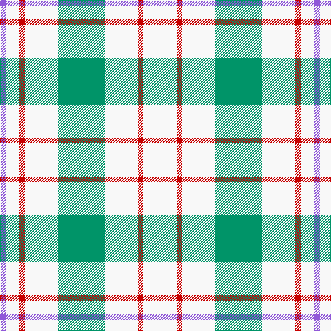

In pattern [BWRWGWRW](/patterns/bwrwgwrw/).

This was sourced from tartans-authority.  It is a [8 stripes tartan](/stripes/stripes8/).

Original link http://www.tartansauthority.com/tartan-ferret/display/6549/

## Thread count
P/8 W20 R8 W48 B68 W48 R8 W/48

## Palette
Each colour and its ΔE from the base-6 reference it is a variant of.

| Colour | Shade | Base | ΔE (OKLab) |
|---|---|---|---|
| B | <code style="background-color:#009468;">#009468</code> `#009468` | G <code style="background-color:#006100;">#006100</code> | 0.17 |
| P | <code style="background-color:#9058D8;">#9058D8</code> `#9058D8` | B <code style="background-color:#2A418A;">#2A418A</code> | 0.21 |
| R | <code style="background-color:#C80000;">#C80000</code> `#C80000` | R <code style="background-color:#CC0000;">#CC0000</code> | 0.01 |
| W | <code style="background-color:#F8F8F8;">#F8F8F8</code> `#F8F8F8` | W <code style="background-color:#F7F7F7;">#F7F7F7</code> | 0.00 |

# Sample pattern

## Nearest tartans

The nearest existing variants by ΔTartan distance.

1. [Milne Green (Dance)](/setts/s14/w5r2w12g17w12r2w12r2w12g17w12r2w5b2~b9058d8-g009468-rc80000-wf8f8f8~x4/) — ΔT 1.18
1. [Milne (Personal)](/setts/s8/w12g2w12r17w12g2w5b2~b6840fc-g005448-rd05054-wfcfcfc~x4/) — ΔT 1.21
1. [Clackson Arisaid (Name?)](/setts/s7/w24g2w8b5y4b5y4~b2c2c80-g006818-we0e0e0-ye8c000~x2/) — ΔT 1.36
1. [Milne Purple Dress (Dance)](/setts/s8/w12b2w12r17w12b2w5ra2~b202060-rb468ac-rac80000-wfcfcfc~x4/) — ΔT 1.37
1. [Justus dress](/setts/s7/b1w4r1w1y1w4b1~b304080-rc00000-we0e0e0-yf0c000~x12/) — ΔT 1.49
1. [Milne, Dress (Dance)](/setts/s8/w12b2w12r17w12b2w5ba2~b2888c4-ba780078-rc80000-wf8f8f8~x4/) — ΔT 1.55
1. [O'Neill](/setts/s9/w2g1w2r6w10g6w2r1w2~g008000-r806050-we0e0e0~x2/) — ΔT 1.68
1. [Milne Royal Blue Dress Fashion Tartan Tartan Number: 6547. Earliest known date: 01/01/2005 A Dance version of #634 (original Scottish Tartans Authority reference) reputed to be a personal tartan./Threadcount and colours aren't 100% original. Generated manually./ See products available Copyright © Blair Urquhart, Comrie, 2015](/setts/s8/w24b5w24ba36w28b6w12r6~b20608c-ba2c2c80-rc80000-we0e0e0/) — ΔT 1.70
1. [London Fog Camel 2 (Fashion)](/setts/s10/y3w2y18b9y18w2y18k9y18w2~b2888c4-k101010-wd4d4c4-yccc0a4/) — ΔT 1.74
1. [O'Neill Pipe Band 1999/ Oliver dress](/setts/s9/w2g1w2r6w10g6w2r1w2~g289c18-rc80028-we0e0e0~x4/) — ΔT 1.77

## Neighbour map

Every grey dot is one of 15726 variants placed by the first two principal components of the ΔTartan feature space (44% of its variance). Red is this tartan; blue dots are its nearest — click one to open its page.

<svg viewBox="0 0 640 380" role="img" style="max-width:100%;height:auto;border:1px solid #e0e0e0;border-radius:4px;display:block" xmlns="http://www.w3.org/2000/svg"><image href="/nn/cloud.v1.png" width="640" height="380"/><a href="/setts/s14/w5r2w12g17w12r2w12r2w12g17w12r2w5b2~b9058d8-g009468-rc80000-wf8f8f8~x4/"><circle cx="271.0" cy="173.6" r="4" fill="#3465a4"><title>Milne Green (Dance)</title></circle></a><a href="/setts/s8/w12g2w12r17w12g2w5b2~b6840fc-g005448-rd05054-wfcfcfc~x4/"><circle cx="299.1" cy="189.3" r="4" fill="#3465a4"><title>Milne (Personal)</title></circle></a><a href="/setts/s7/w24g2w8b5y4b5y4~b2c2c80-g006818-we0e0e0-ye8c000~x2/"><circle cx="303.1" cy="167.1" r="4" fill="#3465a4"><title>Clackson Arisaid (Name?)</title></circle></a><a href="/setts/s8/w12b2w12r17w12b2w5ra2~b202060-rb468ac-rac80000-wfcfcfc~x4/"><circle cx="297.2" cy="189.9" r="4" fill="#3465a4"><title>Milne Purple Dress (Dance)</title></circle></a><a href="/setts/s7/b1w4r1w1y1w4b1~b304080-rc00000-we0e0e0-yf0c000~x12/"><circle cx="308.6" cy="226.8" r="4" fill="#3465a4"><title>Justus dress</title></circle></a><a href="/setts/s8/w12b2w12r17w12b2w5ba2~b2888c4-ba780078-rc80000-wf8f8f8~x4/"><circle cx="296.9" cy="186.9" r="4" fill="#3465a4"><title>Milne, Dress (Dance)</title></circle></a><a href="/setts/s9/w2g1w2r6w10g6w2r1w2~g008000-r806050-we0e0e0~x2/"><circle cx="284.9" cy="195.1" r="4" fill="#3465a4"><title>O'Neill</title></circle></a><a href="/setts/s8/w24b5w24ba36w28b6w12r6~b20608c-ba2c2c80-rc80000-we0e0e0/"><circle cx="260.8" cy="207.7" r="4" fill="#3465a4"><title>Milne Royal Blue Dress Fashion Tartan Tartan Number: 6547. Earliest known date: 01/01/2005 A Dance version of #634 (original Scottish Tartans Authority reference) reputed to be a personal tartan./Threadcount and colours aren't 100% original. Generated manually./ See products available Copyright © Blair Urquhart, Comrie, 2015</title></circle></a><a href="/setts/s10/y3w2y18b9y18w2y18k9y18w2~b2888c4-k101010-wd4d4c4-yccc0a4/"><circle cx="393.7" cy="198.5" r="4" fill="#3465a4"><title>London Fog Camel 2 (Fashion)</title></circle></a><a href="/setts/s9/w2g1w2r6w10g6w2r1w2~g289c18-rc80028-we0e0e0~x4/"><circle cx="286.4" cy="188.8" r="4" fill="#3465a4"><title>O'Neill Pipe Band 1999/ Oliver dress</title></circle></a><circle cx="298.1" cy="197.5" r="5" fill="#c00000"/></svg>

ID: /setts/s8/w12r2w12g17w12r2w5b2~b9058d8-g009468-rc80000-wf8f8f8~x4/
