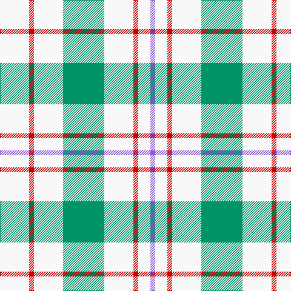

This page is one **sett** — a single exact thread-count. It belongs to the [tartan](/tartans/w12r2w12g17w12r2w5p2/)
(the same proportion at any scale), whose colour order is pattern [BWRWGWRW](/stripes/bwrwgwrw/).

Sourced from tartans-authority.  It is a [8 stripe tartan](/stripes/stripes8/).

Original link http://www.tartansauthority.com/tartan-ferret/display/6549/

## Register references

External register numbers recorded for this tartan.

- Scottish Tartans Authority (ITI): 6549

## Thread count
W/48 R8 W48 B68 W48 R8 W20 P/8

## Palette

Palette: <strong>Tartan Register</strong> <small style="color:#888">(3 of 4 colours)</small>
<table><thead><tr><th>Colour</th><th>Threads</th><th>Shade</th><th>Base</th><th>OKLCh</th></tr></thead><tbody><tr><td>W/</td><td style="text-align:right;font-variant-numeric:tabular-nums">48</td><td><code style="background-color:#F8F8F8;">#F8F8F8</code> <small style="color:#888">#F8F8F8</small></td><td>W <code style="background-color:#F7F7F7;">#F7F7F7</code></td><td><small style="color:#888">oklch(97.9% 0.000 89.9)</small></td></tr><tr><td>R</td><td style="text-align:right;font-variant-numeric:tabular-nums">8</td><td><code style="background-color:#C80000;">#C80000</code> <small style="color:#888">#C80000</small></td><td>R <code style="background-color:#CC0000;">#CC0000</code></td><td><small style="color:#888">oklch(52.3% 0.215 29.2)</small></td></tr><tr><td>W</td><td style="text-align:right;font-variant-numeric:tabular-nums">48</td><td><code style="background-color:#F8F8F8;">#F8F8F8</code> <small style="color:#888">#F8F8F8</small></td><td>W <code style="background-color:#F7F7F7;">#F7F7F7</code></td><td><small style="color:#888">oklch(97.9% 0.000 89.9)</small></td></tr><tr><td>B</td><td style="text-align:right;font-variant-numeric:tabular-nums">68</td><td><code style="background-color:#009468;">#009468</code> <small style="color:#888">#009468</small></td><td>G <code style="background-color:#006100;">#006100</code></td><td><small style="color:#888">oklch(59.0% 0.126 163.6)</small></td></tr><tr><td>W</td><td style="text-align:right;font-variant-numeric:tabular-nums">48</td><td><code style="background-color:#F8F8F8;">#F8F8F8</code> <small style="color:#888">#F8F8F8</small></td><td>W <code style="background-color:#F7F7F7;">#F7F7F7</code></td><td><small style="color:#888">oklch(97.9% 0.000 89.9)</small></td></tr><tr><td>R</td><td style="text-align:right;font-variant-numeric:tabular-nums">8</td><td><code style="background-color:#C80000;">#C80000</code> <small style="color:#888">#C80000</small></td><td>R <code style="background-color:#CC0000;">#CC0000</code></td><td><small style="color:#888">oklch(52.3% 0.215 29.2)</small></td></tr><tr><td>W</td><td style="text-align:right;font-variant-numeric:tabular-nums">20</td><td><code style="background-color:#F8F8F8;">#F8F8F8</code> <small style="color:#888">#F8F8F8</small></td><td>W <code style="background-color:#F7F7F7;">#F7F7F7</code></td><td><small style="color:#888">oklch(97.9% 0.000 89.9)</small></td></tr><tr><td>P/</td><td style="text-align:right;font-variant-numeric:tabular-nums">8</td><td><code style="background-color:#9058D8;">#9058D8</code> <small style="color:#888">#9058D8</small></td><td>B <code style="background-color:#2A418A;">#2A418A</code></td><td><small style="color:#888">oklch(58.4% 0.190 300.8)</small></td></tr></tbody></table>

# Sample pattern

## Nearest tartans

The nearest existing variants by ΔTartan distance, with this tartan at the top so the swatches line up against it.

ΔTartan

Tartan

Sett

—

<a href="/ttd/edit/#slug=w12r2w12g17w12r2w5p2~x4">Milne, Green (Dance)</a> <a class="nn-out" href="/setts/s8/w12r2w12g17w12r2w5p2~x4/" title="open its dictionary page">↗</a>

1.17

<a href="/ttd/edit/#slug=w5r2w12g17w12r2w12r2w12g17w12r2w5p2~x4">Milne Green (Dance)</a> <a class="nn-out" href="/setts/s14/w5r2w12g17w12r2w12r2w12g17w12r2w5p2~x4/" title="open its dictionary page">↗</a>

1.21

<a href="/ttd/edit/#slug=w12dg2w12r17w12dg2w5b2~x4">Milne (Personal)</a> <a class="nn-out" href="/setts/s8/w12dg2w12r17w12dg2w5b2~x4/" title="open its dictionary page">↗</a>

1.37

<a href="/ttd/edit/#slug=w24g2w8db5ly4db5ly4~x2">Clackson Arisaid (Name?)</a> <a class="nn-out" href="/setts/s7/w24g2w8db5ly4db5ly4~x2/" title="open its dictionary page">↗</a>

1.38

<a href="/ttd/edit/#slug=w12db2w12m17w12db2w5r2~x4">Milne Purple Dress (Dance)</a> <a class="nn-out" href="/setts/s8/w12db2w12m17w12db2w5r2~x4/" title="open its dictionary page">↗</a>

1.50

<a href="/ttd/edit/#slug=db1w4r1w1ly1w4db1~x12">Justus dress</a> <a class="nn-out" href="/setts/s7/db1w4r1w1ly1w4db1~x12/" title="open its dictionary page">↗</a>

1.55

<a href="/ttd/edit/#slug=w12t2w12r17w12t2w5dp2~x4">Milne, Dress (Dance)</a> <a class="nn-out" href="/setts/s8/w12t2w12r17w12t2w5dp2~x4/" title="open its dictionary page">↗</a>

1.68

<a href="/ttd/edit/#slug=w2o1w2g6w10o6w2g1w2~x2">O'Neill</a> <a class="nn-out" href="/setts/s9/w2o1w2g6w10o6w2g1w2~x2/" title="open its dictionary page">↗</a>

1.70

<a href="/ttd/edit/#slug=w24n5w24db36w28n6w12r6">Milne Royal Blue Dress Fashion Tartan Tartan Number: 6547. Earliest known date: 01/01/2005 A Dance version of #634 (original Scottish Tartans Authority reference) reputed to be a personal tartan./Threadcount and colours aren't 100% original. Generated manually./ See products available Copyright © Blair Urquhart, Comrie, 2015</a> <a class="nn-out" href="/setts/s8/w24n5w24db36w28n6w12r6/" title="open its dictionary page">↗</a>

1.74

<a href="/ttd/edit/#slug=lr3lb2lr18t9lr18lb2lr18k9lr18lb2">London Fog Camel 2 (Fashion)</a> <a class="nn-out" href="/setts/s10/lr3lb2lr18t9lr18lb2lr18k9lr18lb2/" title="open its dictionary page">↗</a>

1.77

<a href="/ttd/edit/#slug=w2r1w2g6w10r6w2g1w2~x4">O'Neill Pipe Band 1999/ Oliver dress</a> <a class="nn-out" href="/setts/s9/w2r1w2g6w10r6w2g1w2~x4/" title="open its dictionary page">↗</a>

## Neighbour map

Every grey dot is one of 14359 variants placed by the first two principal components of the ΔTartan feature space (44% of its variance). Red is this tartan; blue dots are its nearest — click one to open its page.

<svg viewBox="0 0 640 380" role="img" style="max-width:100%;height:auto;border:1px solid #e0e0e0;border-radius:4px;display:block" xmlns="http://www.w3.org/2000/svg"><image href="/nn/cloud.v1.png" width="640" height="380"/><a href="/setts/s14/w5r2w12g17w12r2w12r2w12g17w12r2w5p2~x4/"><circle cx="271.0" cy="170.2" r="4" fill="#3465a4"><title>Milne Green (Dance)</title></circle></a><a href="/setts/s8/w12dg2w12r17w12dg2w5b2~x4/"><circle cx="297.9" cy="183.0" r="4" fill="#3465a4"><title>Milne (Personal)</title></circle></a><a href="/setts/s7/w24g2w8db5ly4db5ly4~x2/"><circle cx="303.2" cy="162.2" r="4" fill="#3465a4"><title>Clackson Arisaid (Name?)</title></circle></a><a href="/setts/s8/w12db2w12m17w12db2w5r2~x4/"><circle cx="296.4" cy="183.9" r="4" fill="#3465a4"><title>Milne Purple Dress (Dance)</title></circle></a><a href="/setts/s7/db1w4r1w1ly1w4db1~x12/"><circle cx="307.9" cy="221.2" r="4" fill="#3465a4"><title>Justus dress</title></circle></a><a href="/setts/s8/w12t2w12r17w12t2w5dp2~x4/"><circle cx="295.5" cy="179.8" r="4" fill="#3465a4"><title>Milne, Dress (Dance)</title></circle></a><a href="/setts/s9/w2o1w2g6w10o6w2g1w2~x2/"><circle cx="285.4" cy="192.4" r="4" fill="#3465a4"><title>O'Neill</title></circle></a><a href="/setts/s8/w24n5w24db36w28n6w12r6/"><circle cx="261.3" cy="202.7" r="4" fill="#3465a4"><title>Milne Royal Blue Dress Fashion Tartan Tartan Number: 6547. Earliest known date: 01/01/2005 A Dance version of #634 (original Scottish Tartans Authority reference) reputed to be a personal tartan./Threadcount and colours aren't 100% original. Generated manually./ See products available Copyright © Blair Urquhart, Comrie, 2015</title></circle></a><a href="/setts/s10/lr3lb2lr18t9lr18lb2lr18k9lr18lb2/"><circle cx="392.7" cy="194.0" r="4" fill="#3465a4"><title>London Fog Camel 2 (Fashion)</title></circle></a><a href="/setts/s9/w2r1w2g6w10r6w2g1w2~x4/"><circle cx="286.0" cy="184.8" r="4" fill="#3465a4"><title>O'Neill Pipe Band 1999/ Oliver dress</title></circle></a><circle cx="297.8" cy="193.1" r="5" fill="#c00000"/></svg>

ID: /setts/s8/w12r2w12g17w12r2w5p2~x4/
