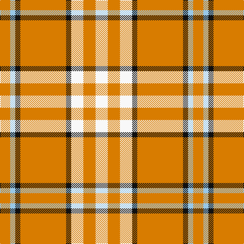

In pattern [WYWKYKWY](/patterns/wywkykwy/).

This was sourced from register-of-tartans.  It is a [8 stripes tartan](/stripes/stripes8/).

Original link https://www.tartanregister.gov.uk/tartanDetails.aspx?ref=4093

## Attestations

This cloth appears in 2 source records; the oldest owns this page.

- 01/04/2004 — Tennessee Volunteer (register-of-tartans, [record](https://www.tartanregister.gov.uk/tartanDetails.aspx?ref=4093))
- April 2004 — Tennessee Volunteer (Corporate) (tartans-authority, [record](http://www.tartansauthority.com/tartan-ferret/display/6356/))

## Thread count
O/20 LB10 K10 O90 K10 W24 O24 W/24

## Palette
Each colour and its ΔE from the base-6 reference it is a variant of.

| Colour | Shade | Base | ΔE (OKLab) |
|---|---|---|---|
| K | <code style="background-color:#101010;">#101010</code> `#101010` | K <code style="background-color:#000000;">#000000</code> | 0.17 |
| LB | <code style="background-color:#98C8E8;">#98C8E8</code> `#98C8E8` | W <code style="background-color:#F7F7F7;">#F7F7F7</code> | 0.18 |
| O | <code style="background-color:#D87C00;">#D87C00</code> `#D87C00` | Y <code style="background-color:#F2BF00;">#F2BF00</code> | 0.17 |
| W | <code style="background-color:#F8F8F8;">#F8F8F8</code> `#F8F8F8` | W <code style="background-color:#F7F7F7;">#F7F7F7</code> | 0.00 |

# Sample pattern

## Nearest tartans

The nearest existing variants by ΔTartan distance.

1. [Braken Tartan Tartan Number: 1449. Earliest known date: pre 1992 Originally spelt 'Braken'. See products available Copyright © Blair Urquhart, Comrie, 2015](/setts/s9/y20b27r6b15y8b11y78ba10r12~b202060-ba2c2c80-rc80000-ye8c000/) — ΔT 1.49
1. [Lister (Misty Mountain)](/setts/s7/g8y29g8ya3g8y8ya3~g5d321f-yccbaaf-yae0a126~x2/) — ΔT 1.58
1. [Bracken](/setts/s9/y5b9r3b5y2b4y26ba3r4~b202060-ba5c8ca8-rc80000-ye8c000~x2/) — ΔT 1.60
1. [MacPherson, Red](/setts/s7/w5b3w26r20w3r8y3~b800080-rc00000-we0e0e0-yf0c000~x2/) — ΔT 1.61
1. [MacPherson Dress Red (Dance)](/setts/s7/w5b3w26r20w3r8y3~b780078-rc80000-we0e0e0-ye8c000~x2/) — ΔT 1.62
1. [Gary (Personal)](/setts/s12/b2r1y4w2y12w8y12w2y2y2w1y2~b6c0070-rc80000-wfcfcfc-yd87c00~x4/) — ΔT 1.63
1. [MacPherson Dress Burgandy Clan Tartan Tartan Number: 1832. Earliest known date: pre 2003 Examined by D.C.S. 1947 See products available Copyright © Blair Urquhart, Comrie, 2015](/setts/s7/w4k2w25r21w3r8y3~k101010-rc80000-we0e0e0-ye8c000~x2/) — ΔT 1.66
1. [MacPherson, dress red](/setts/s7/w4r2w25ra21w3ra8y3~r800000-rac00000-we0e0e0-yf0c000~x2/) — ΔT 1.67
1. [MacPherson, Burgundy dress](/setts/s7/w4k2w25r21w3r8y3~k000000-rc00000-we0e0e0-yf0c000~x2/) — ΔT 1.68
1. [O'Neill Pipe Band 1999/ Oliver dress](/setts/s9/w2g1w2r6w10g6w2r1w2~g289c18-rc80028-we0e0e0~x4/) — ΔT 1.71

## Neighbour map

Every grey dot is one of 15726 variants placed by the first two principal components of the ΔTartan feature space (44% of its variance). Red is this tartan; blue dots are its nearest — click one to open its page.

<svg viewBox="0 0 640 380" role="img" style="max-width:100%;height:auto;border:1px solid #e0e0e0;border-radius:4px;display:block" xmlns="http://www.w3.org/2000/svg"><image href="/nn/cloud.v1.png" width="640" height="380"/><a href="/setts/s9/y20b27r6b15y8b11y78ba10r12~b202060-ba2c2c80-rc80000-ye8c000/"><circle cx="280.6" cy="147.3" r="4" fill="#3465a4"><title>Braken Tartan Tartan Number: 1449. Earliest known date: pre 1992 Originally spelt 'Braken'. See products available Copyright © Blair Urquhart, Comrie, 2015</title></circle></a><a href="/setts/s7/g8y29g8ya3g8y8ya3~g5d321f-yccbaaf-yae0a126~x2/"><circle cx="311.4" cy="204.9" r="4" fill="#3465a4"><title>Lister (Misty Mountain)</title></circle></a><a href="/setts/s9/y5b9r3b5y2b4y26ba3r4~b202060-ba5c8ca8-rc80000-ye8c000~x2/"><circle cx="268.8" cy="145.0" r="4" fill="#3465a4"><title>Bracken</title></circle></a><a href="/setts/s7/w5b3w26r20w3r8y3~b800080-rc00000-we0e0e0-yf0c000~x2/"><circle cx="265.2" cy="175.0" r="4" fill="#3465a4"><title>MacPherson, Red</title></circle></a><a href="/setts/s7/w5b3w26r20w3r8y3~b780078-rc80000-we0e0e0-ye8c000~x2/"><circle cx="266.7" cy="175.1" r="4" fill="#3465a4"><title>MacPherson Dress Red (Dance)</title></circle></a><a href="/setts/s12/b2r1y4w2y12w8y12w2y2y2w1y2~b6c0070-rc80000-wfcfcfc-yd87c00~x4/"><circle cx="344.4" cy="135.1" r="4" fill="#3465a4"><title>Gary (Personal)</title></circle></a><a href="/setts/s7/w4k2w25r21w3r8y3~k101010-rc80000-we0e0e0-ye8c000~x2/"><circle cx="277.8" cy="158.7" r="4" fill="#3465a4"><title>MacPherson Dress Burgandy Clan Tartan Tartan Number: 1832. Earliest known date: pre 2003 Examined by D.C.S. 1947 See products available Copyright © Blair Urquhart, Comrie, 2015</title></circle></a><a href="/setts/s7/w4r2w25ra21w3ra8y3~r800000-rac00000-we0e0e0-yf0c000~x2/"><circle cx="281.2" cy="159.6" r="4" fill="#3465a4"><title>MacPherson, dress red</title></circle></a><a href="/setts/s7/w4k2w25r21w3r8y3~k000000-rc00000-we0e0e0-yf0c000~x2/"><circle cx="272.1" cy="157.5" r="4" fill="#3465a4"><title>MacPherson, Burgundy dress</title></circle></a><a href="/setts/s9/w2g1w2r6w10g6w2r1w2~g289c18-rc80028-we0e0e0~x4/"><circle cx="286.4" cy="188.8" r="4" fill="#3465a4"><title>O'Neill Pipe Band 1999/ Oliver dress</title></circle></a><circle cx="321.2" cy="171.8" r="5" fill="#c00000"/></svg>

ID: /setts/s8/w12y12w12k5y45k5wa5y10~k101010-wf8f8f8-wa98c8e8-yd87c00~x2/
