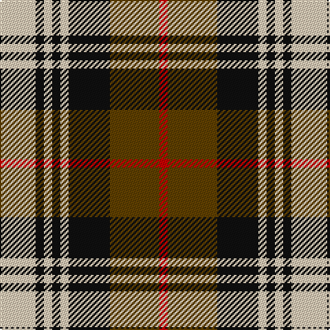

In pattern [RGKWKWKW](/patterns/rgkwkwkw/).

This was sourced from tartans-authority.  It is a [8 stripes tartan](/stripes/stripes8/).

Original link http://www.tartansauthority.com/tartan-ferret/display/8679/

## Thread count
LR/26 K6 LR6 K6 LR6 K30 T36 R/6

## Palette
Each colour and its ΔE from the base-6 reference it is a variant of.

| Colour | Shade | Base | ΔE (OKLab) |
|---|---|---|---|
| K | <code style="background-color:#101010;">#101010</code> `#101010` | K <code style="background-color:#000000;">#000000</code> | 0.17 |
| LR | <code style="background-color:#E8CCB8;">#E8CCB8</code> `#E8CCB8` | W <code style="background-color:#F7F7F7;">#F7F7F7</code> | 0.12 |
| R | <code style="background-color:#C80000;">#C80000</code> `#C80000` | R <code style="background-color:#CC0000;">#CC0000</code> | 0.01 |
| T | <code style="background-color:#604000;">#604000</code> `#604000` | G <code style="background-color:#006100;">#006100</code> | 0.14 |

# Sample pattern

## Nearest tartans

The nearest existing variants by ΔTartan distance.

1. [Aberlour](/setts/s8/w23k4w4k4w4k22r23y5x2~k101010-r98481c-we8ccb8-ya08858/) — ΔT 0.47
1. [Holden Beige (Corporate)](/setts/s8/w13k3w3k3w3k15y18r3x2~k101010-rc80000-we8ccb8-ya08858/) — ΔT 0.60
1. [Al Suwaidi of Abu Dhabi (Personal)](/setts/s8/w2r7g7k7r2g2k2w1x5~g005020-k101010-rdc0000-wffffff/) — ΔT 0.82
1. [Daks](/setts/s8/r3k7r2w2ra12k2ra2r3x2~k000000-r806050-ra906030-we0e0e0/) — ΔT 0.90
1. [Daks (Brown)](/setts/s8/g3k7g2w2y12k2y2g3x2~g604000-k101010-wfcfcfc-ya08858/) — ΔT 0.94
1. [Stevenson (Name)](/setts/s9/r1g6y1r2y1r2y1b6y1x8~b1c0070-g006818-r880000-yd8b000/) — ΔT 1.08
1. [Edinburgh, City of](/setts/s10/w10k3wa3k3wa3k3w10r6k15r3x2~k101010-rc80000-wc0c0c0-wafcfcfc/) — ΔT 1.10
1. [Thompson Grey Dress](/setts/s6/r1ra6k1w3k3r1x8~k101010-r880000-ra888888-we0e0e0/) — ΔT 1.14
1. [Borthwick Dress](/setts/s9/g12k2r12k3w7k16w7k3w6x2~g006818-k101010-r880000-wfcfcfc/) — ΔT 1.15
1. [Meg Merrilees Fancy Tartan Tartan Number: 1602. Earliest known date: 1831 Miss McDougall, Inverness library, says in her notes:The first mention I had of this tartan was in an advertisment by D MacDougall, Draper, 27 High St., Inverness in 1831 . . . Meg Merrilees and other winter shawls. From Dalgety Archives. STS notes that it was sold by Forsyth's in Glasgow in 1840. Meg Merrilees was a character in one of Scotts novels, Guy Mannering. BU See products available Copyright © Blair Urquhart, Comrie, 2015](/setts/s6/w23b6w6r5k35r10x2~b2c2c80-k101010-rc80000-we0e0e0/) — ΔT 1.15

## Neighbour map

Every grey dot is one of 15726 variants placed by the first two principal components of the ΔTartan feature space (44% of its variance). Red is this tartan; blue dots are its nearest — click one to open its page.

<svg viewBox="0 0 640 380" role="img" style="max-width:100%;height:auto;border:1px solid #e0e0e0;border-radius:4px;display:block" xmlns="http://www.w3.org/2000/svg"><image href="/nn/cloud.v1.png" width="640" height="380"/><a href="/setts/s8/w23k4w4k4w4k22r23y5x2~k101010-r98481c-we8ccb8-ya08858/"><circle cx="128.8" cy="195.5" r="4" fill="#3465a4"><title>Aberlour</title></circle></a><a href="/setts/s8/w13k3w3k3w3k15y18r3x2~k101010-rc80000-we8ccb8-ya08858/"><circle cx="126.5" cy="194.6" r="4" fill="#3465a4"><title>Holden Beige (Corporate)</title></circle></a><a href="/setts/s8/w2r7g7k7r2g2k2w1x5~g005020-k101010-rdc0000-wffffff/"><circle cx="109.3" cy="205.9" r="4" fill="#3465a4"><title>Al Suwaidi of Abu Dhabi (Personal)</title></circle></a><a href="/setts/s8/r3k7r2w2ra12k2ra2r3x2~k000000-r806050-ra906030-we0e0e0/"><circle cx="172.5" cy="204.8" r="4" fill="#3465a4"><title>Daks</title></circle></a><a href="/setts/s8/g3k7g2w2y12k2y2g3x2~g604000-k101010-wfcfcfc-ya08858/"><circle cx="177.2" cy="205.8" r="4" fill="#3465a4"><title>Daks (Brown)</title></circle></a><a href="/setts/s9/r1g6y1r2y1r2y1b6y1x8~b1c0070-g006818-r880000-yd8b000/"><circle cx="111.6" cy="196.9" r="4" fill="#3465a4"><title>Stevenson (Name)</title></circle></a><a href="/setts/s10/w10k3wa3k3wa3k3w10r6k15r3x2~k101010-rc80000-wc0c0c0-wafcfcfc/"><circle cx="123.7" cy="200.0" r="4" fill="#3465a4"><title>Edinburgh, City of</title></circle></a><a href="/setts/s6/r1ra6k1w3k3r1x8~k101010-r880000-ra888888-we0e0e0/"><circle cx="142.4" cy="217.2" r="4" fill="#3465a4"><title>Thompson Grey Dress</title></circle></a><a href="/setts/s9/g12k2r12k3w7k16w7k3w6x2~g006818-k101010-r880000-wfcfcfc/"><circle cx="96.7" cy="198.0" r="4" fill="#3465a4"><title>Borthwick Dress</title></circle></a><a href="/setts/s6/w23b6w6r5k35r10x2~b2c2c80-k101010-rc80000-we0e0e0/"><circle cx="160.4" cy="202.6" r="4" fill="#3465a4"><title>Meg Merrilees Fancy Tartan Tartan Number: 1602. Earliest known date: 1831 Miss McDougall, Inverness library, says in her notes:The first mention I had of this tartan was in an advertisment by D MacDougall, Draper, 27 High St., Inverness in 1831 . . . Meg Merrilees and other winter shawls. From Dalgety Archives. STS notes that it was sold by Forsyth's in Glasgow in 1840. Meg Merrilees was a character in one of Scotts novels, Guy Mannering. BU See products available Copyright © Blair Urquhart, Comrie, 2015</title></circle></a><circle cx="130.5" cy="198.6" r="5" fill="#c00000"/></svg>

ID: /setts/s8/w13k3w3k3w3k15g18r3x2~g604000-k101010-rc80000-we8ccb8/
